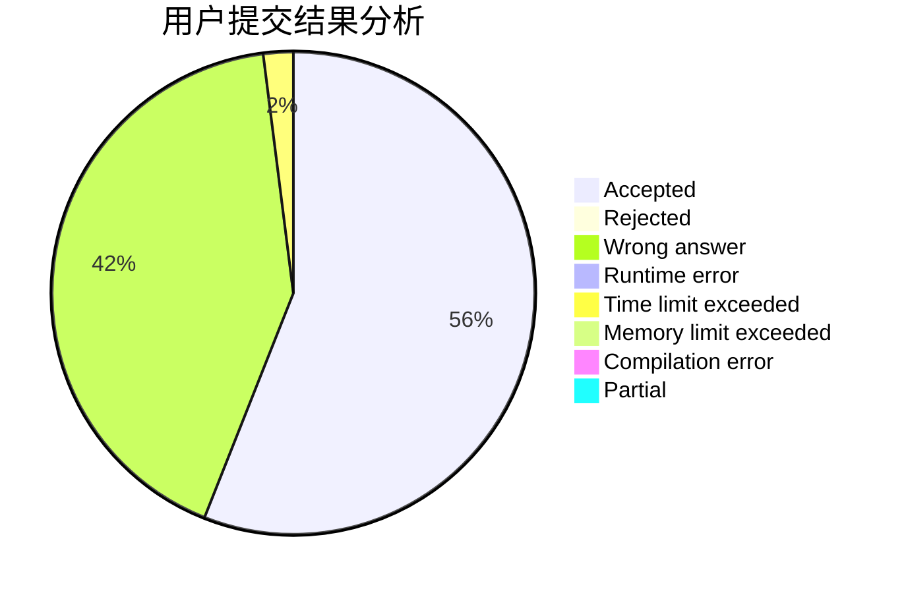
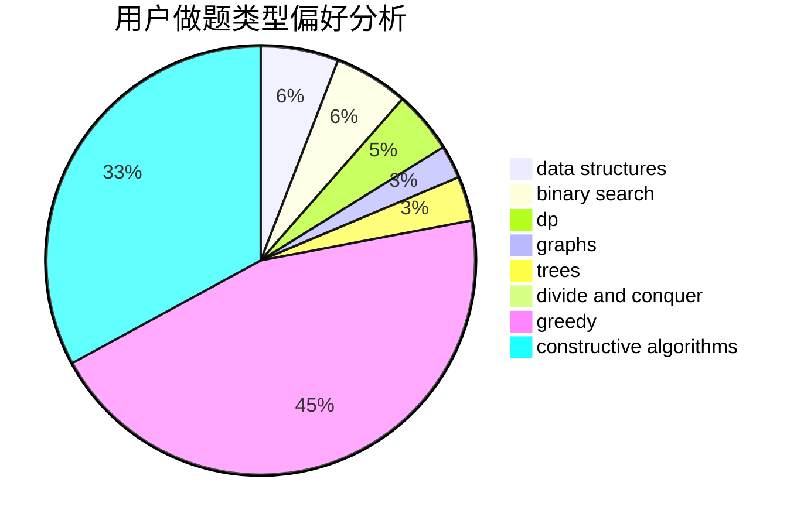

# li_z

<!-- tabs:start -->

#### **用户提交结果分析**

#### **用户做题类型偏好分析**

#### **用户错题知识点分析**

<!-- tabs:end -->
# 推荐题目
[1250C](https://codeforces.com/contest/1250/problem/C)		data structures		  
[1369E](https://codeforces.com/contest/1369/problem/E)		data structures,
                        dfs and similar,
                        greedy,
                        implementation,
                        sortings		  
[28C](https://codeforces.com/contest/28/problem/C)		combinatorics,
                        dp,
                        probabilities		  
[95E](https://codeforces.com/contest/95/problem/E)		dp,
                        dsu,
                        graphs		  
[1415F](https://codeforces.com/contest/1415/problem/F)		dp		  
[414B](https://codeforces.com/contest/414/problem/B)		combinatorics,
                        dp,
                        number theory		  
[512B](https://codeforces.com/contest/512/problem/B)		dsu,graphs,sortings,trees		  
[430A](https://codeforces.com/contest/430/problem/A)		constructive algorithms,
                        sortings		  
[770B](https://codeforces.com/contest/770/problem/B)		*special problem,
                        implementation,
                        math		  
[1070C](https://codeforces.com/contest/1070/problem/C)		data structures,
                        greedy		  
