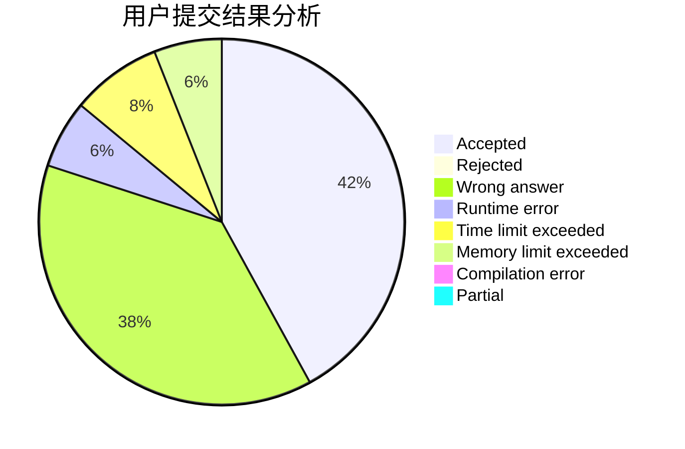
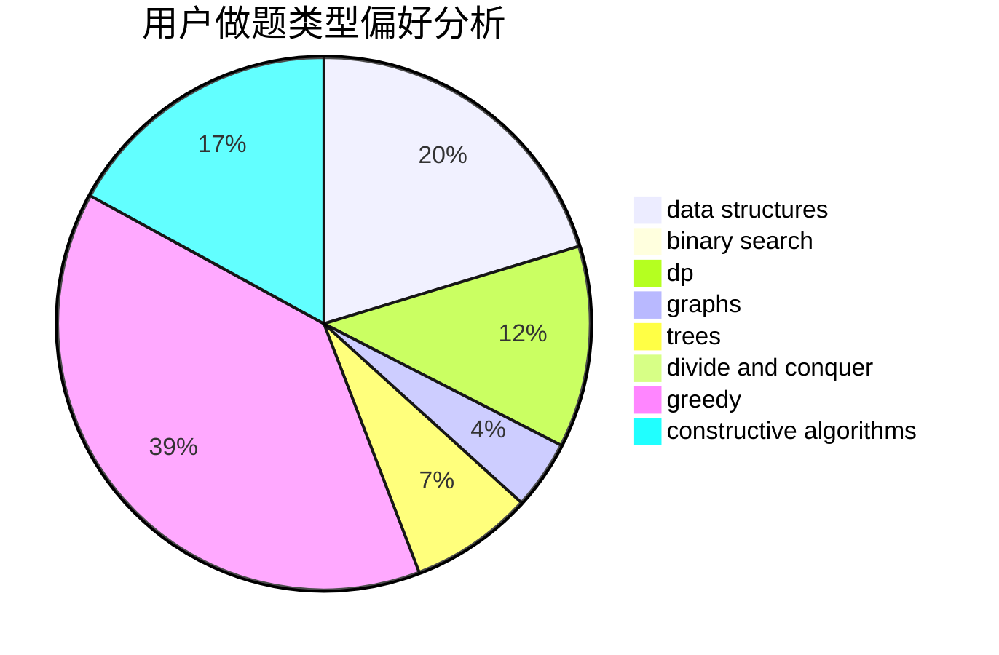
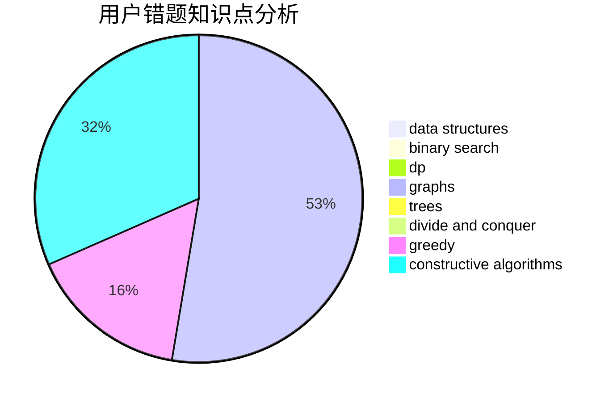

# liangjiawen2007

<!-- tabs:start -->

#### **用户提交结果分析**

#### **用户做题类型偏好分析**

#### **用户错题知识点分析**

<!-- tabs:end -->
# 推荐题目
[1485A](https://codeforces.com/contest/1485/problem/A)		brute force,
                        greedy,
                        math,
                        number theory		  
[1357A3](https://codeforces.com/contest/1357A/problem/3)		nan		  
[1422D](https://codeforces.com/contest/1422/problem/D)		graphs,
                        shortest paths,
                        sortings		  
[1300C](https://codeforces.com/contest/1300/problem/C)		dsu,graphs,sortings,trees		  
[571A](https://codeforces.com/contest/571/problem/A)		combinatorics,
                        implementation,
                        math		  
[1368D](https://codeforces.com/contest/1368/problem/D)		bitmasks,
                        greedy,
                        math		  
[900B](https://codeforces.com/contest/900/problem/B)		math,
                        number theory		  
[587A](https://codeforces.com/contest/587/problem/A)		greedy		  
[1148H](https://codeforces.com/contest/1148/problem/H)		data structures		  
[1137D](https://codeforces.com/contest/1137/problem/D)		constructive algorithms,
                        interactive,
                        number theory		  
