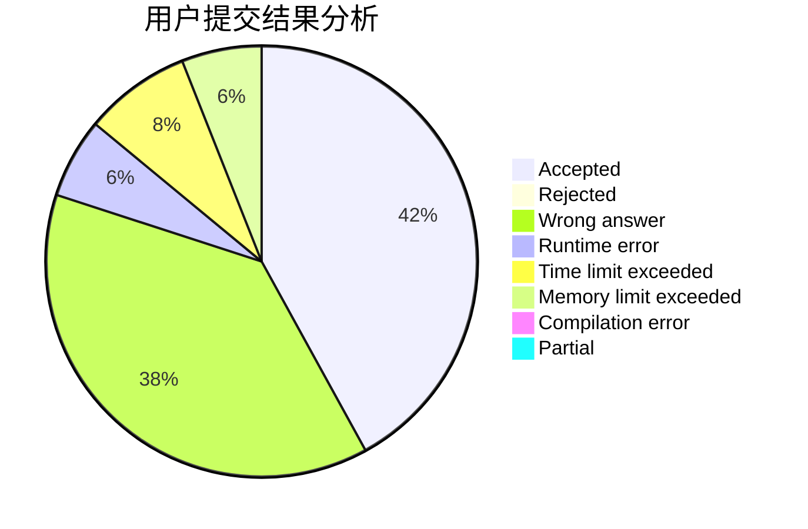
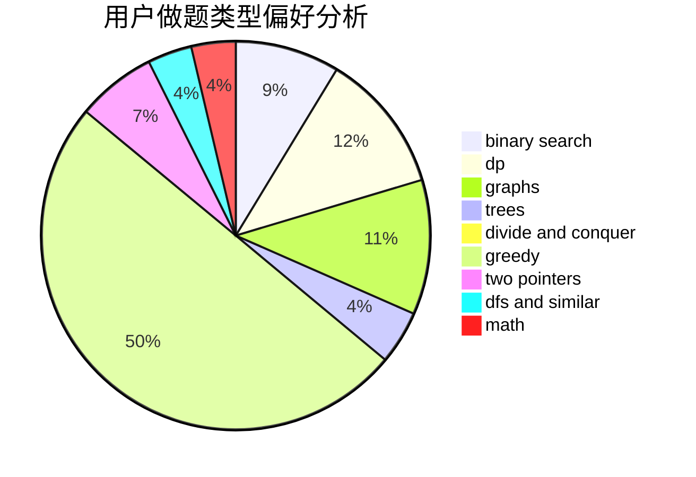

# liangjiawen2007

<!-- tabs:start -->

#### **用户提交结果分析**

#### **用户做题类型偏好分析**

<!-- tabs:end -->
# 推荐题目
[1492B](https://codeforces.com/contest/1492/problem/B)
[1363E](https://codeforces.com/contest/1363/problem/E)
[1430B](https://codeforces.com/contest/1430/problem/B)
[1310A](https://codeforces.com/contest/1310/problem/A)
[591C](https://codeforces.com/contest/591/problem/C)
[1375C](https://codeforces.com/contest/1375/problem/C)
[916E](https://codeforces.com/contest/916/problem/E)
[607B](https://codeforces.com/contest/607/problem/B)
[1150C](https://codeforces.com/contest/1150/problem/C)
[1139E](https://codeforces.com/contest/1139/problem/E)
