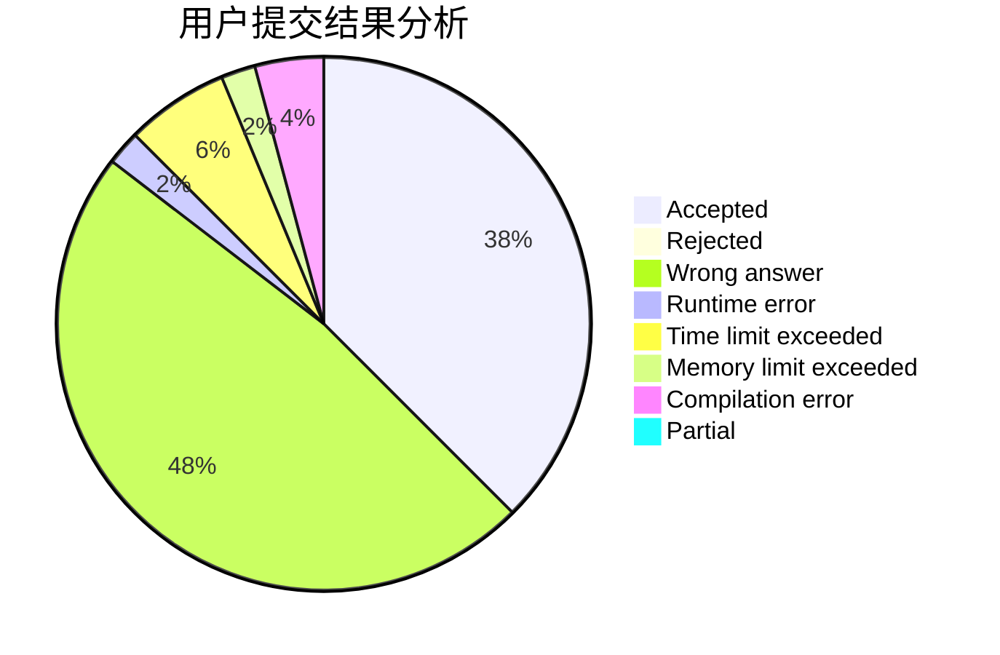
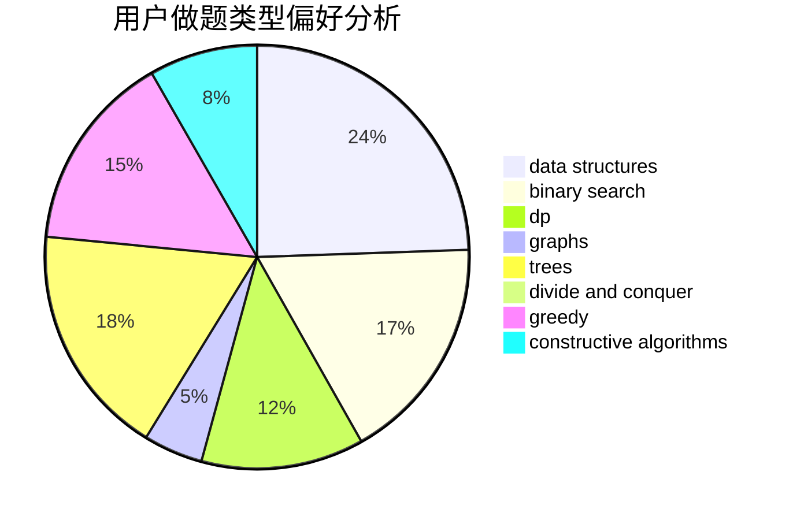
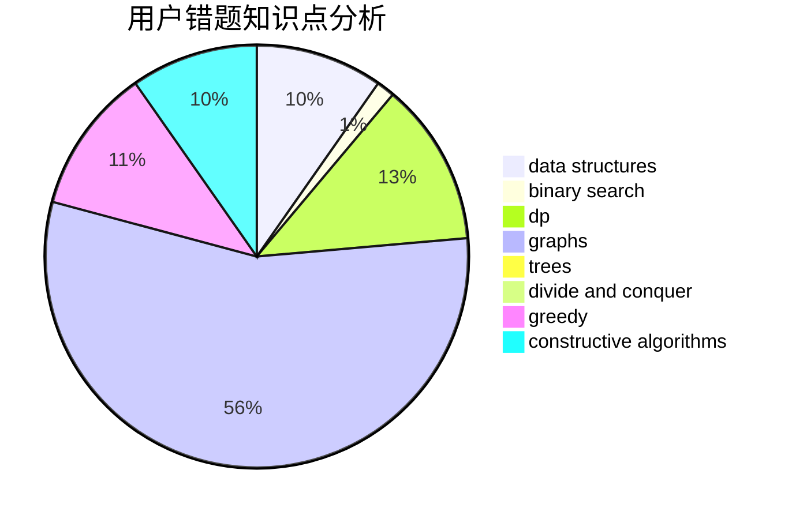

# liangs333

<!-- tabs:start -->

#### **用户提交结果分析**

#### **用户做题类型偏好分析**

#### **用户错题知识点分析**

<!-- tabs:end -->
# 推荐题目
[1200E](https://codeforces.com/contest/1200/problem/E)		brute force,
                        hashing,
                        implementation,
                        string suffix structures,
                        strings		  
[985E](https://codeforces.com/contest/985/problem/E)		binary search,
                        data structures,
                        dp,
                        greedy,
                        two pointers		  
[1298D](https://codeforces.com/contest/1298/problem/D)		dsu,graphs,sortings,trees		  
[1431D](https://codeforces.com/contest/1431/problem/D)		*special problem,
                        greedy		  
[425E](https://codeforces.com/contest/425/problem/E)		dp		  
[484E](https://codeforces.com/contest/484/problem/E)		binary search,
                        constructive algorithms,
                        data structures		  
[344A](https://codeforces.com/contest/344/problem/A)		implementation		  
[810C](https://codeforces.com/contest/810/problem/C)		dsu,graphs,sortings,trees		  
[498A](https://codeforces.com/contest/498/problem/A)		geometry		  
[354D](https://codeforces.com/contest/354/problem/D)		dp		  
