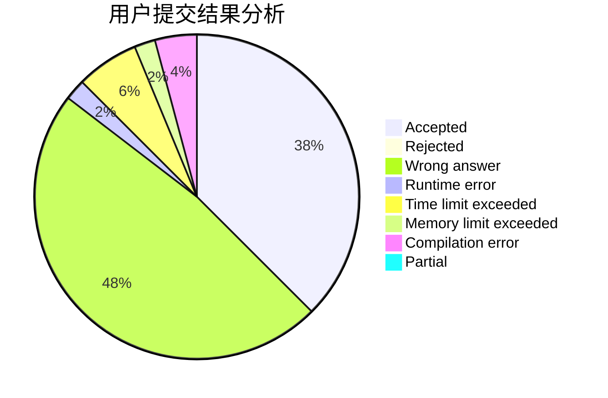
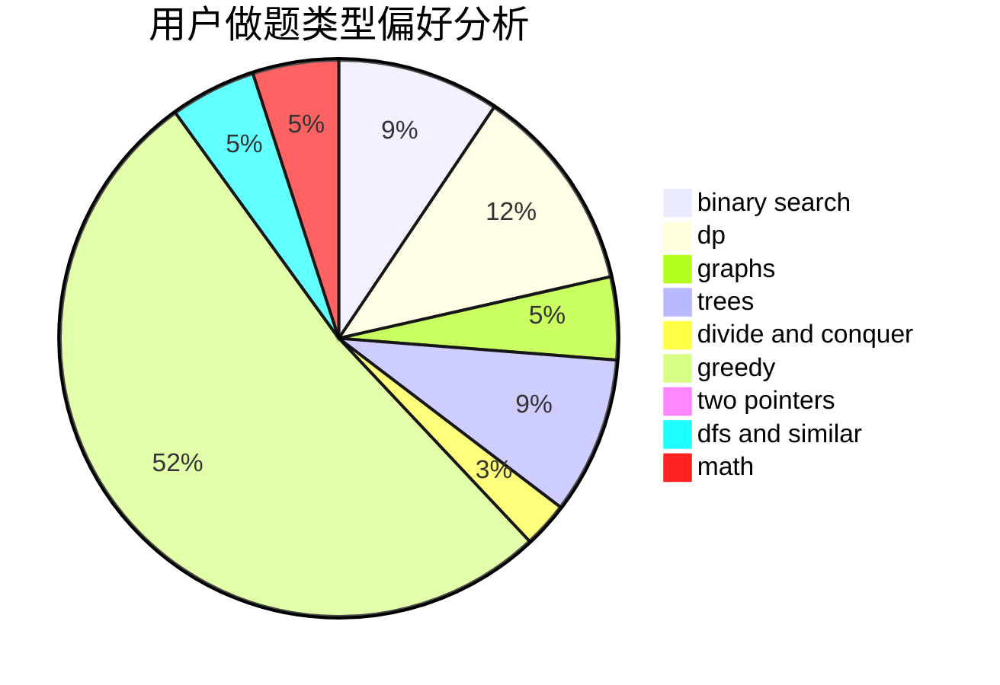

# liangs333

<!-- tabs:start -->

#### **用户提交结果分析**

#### **用户做题类型偏好分析**

<!-- tabs:end -->
# 推荐题目
[1200E](https://codeforces.com/contest/1200/problem/E)
[985E](https://codeforces.com/contest/985/problem/E)
[1298D](https://codeforces.com/contest/1298/problem/D)
[1431D](https://codeforces.com/contest/1431/problem/D)
[425E](https://codeforces.com/contest/425/problem/E)
[484E](https://codeforces.com/contest/484/problem/E)
[344A](https://codeforces.com/contest/344/problem/A)
[810C](https://codeforces.com/contest/810/problem/C)
[498A](https://codeforces.com/contest/498/problem/A)
[354D](https://codeforces.com/contest/354/problem/D)
