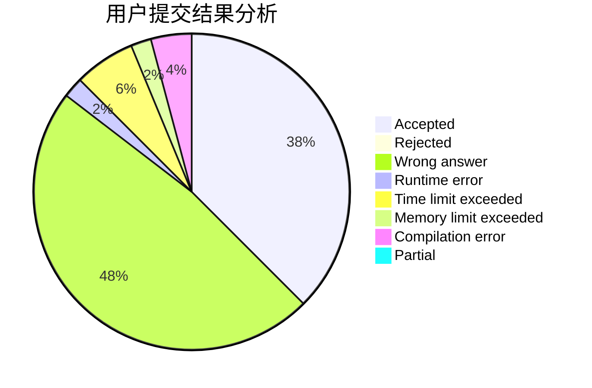
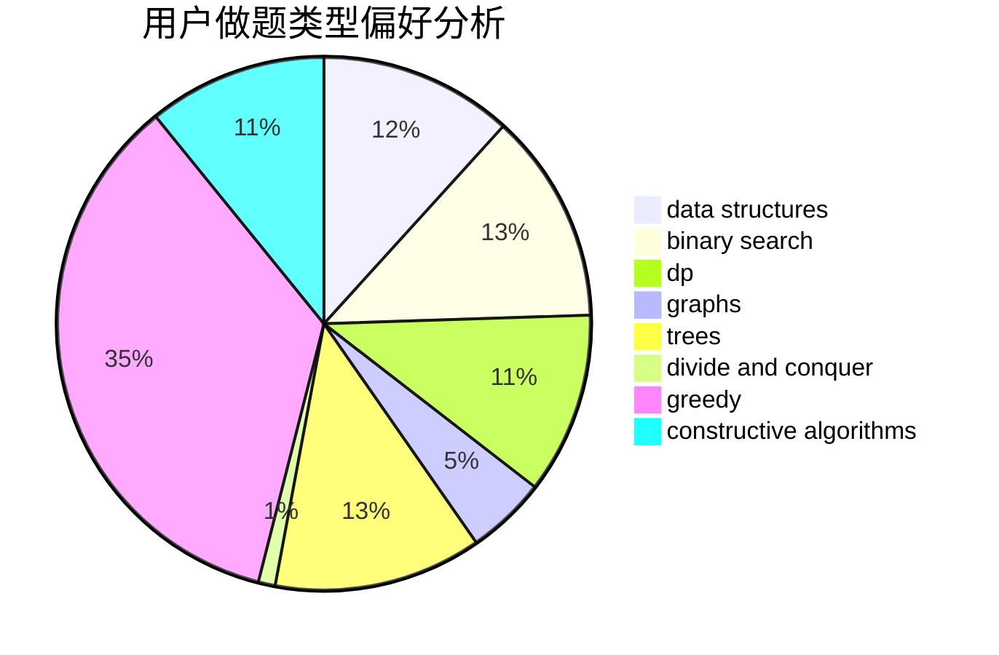
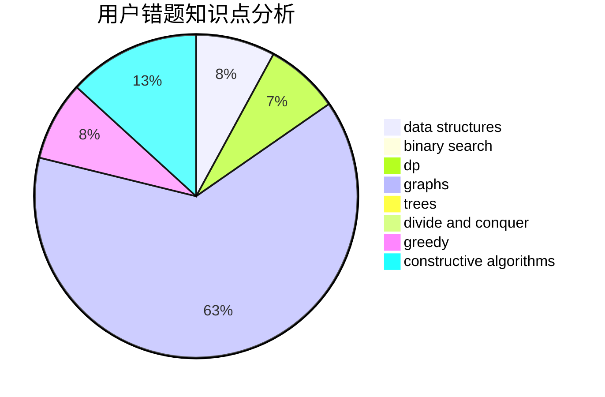

# liangs333

<!-- tabs:start -->

#### **用户提交结果分析**

#### **用户做题类型偏好分析**

#### **用户错题知识点分析**

<!-- tabs:end -->
# 推荐题目
[1197C](https://codeforces.com/contest/1197/problem/C)		greedy,
                        sortings		  
[962G](https://codeforces.com/contest/962/problem/G)		data structures,
                        dsu,
                        geometry,
                        trees		  
[1291E](https://codeforces.com/contest/1291/problem/E)		dsu,graphs,sortings,trees		  
[1423I](https://codeforces.com/contest/1423/problem/I)		bitmasks		  
[39C](https://codeforces.com/contest/39/problem/C)		dp,
                        sortings		  
[465D](https://codeforces.com/contest/465/problem/D)		dsu,graphs,sortings,trees		  
[316G1](https://codeforces.com/contest/316G/problem/1)		hashing,
                        strings		  
[796B](https://codeforces.com/contest/796/problem/B)		implementation		  
[478A](https://codeforces.com/contest/478/problem/A)		implementation		  
[325C](https://codeforces.com/contest/325/problem/C)		dfs and similar,
                        graphs,
                        shortest paths		  
