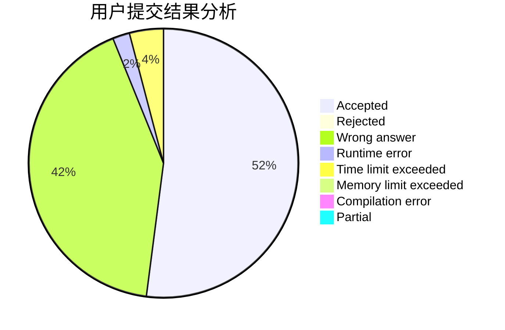
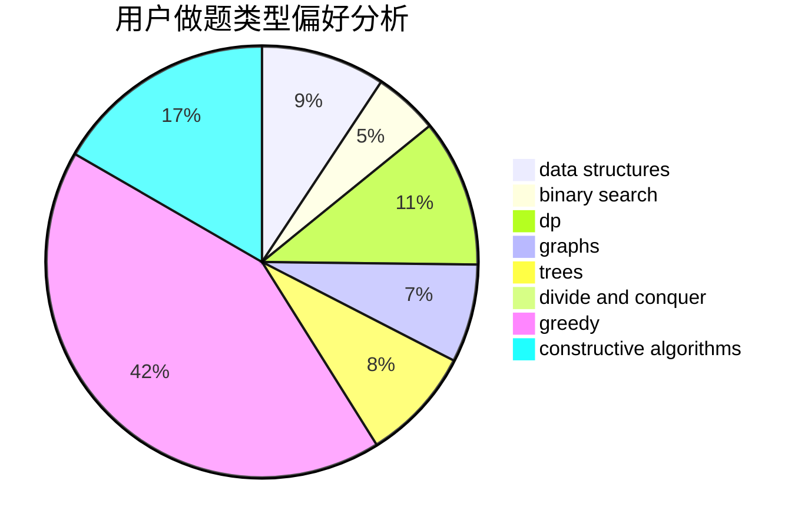
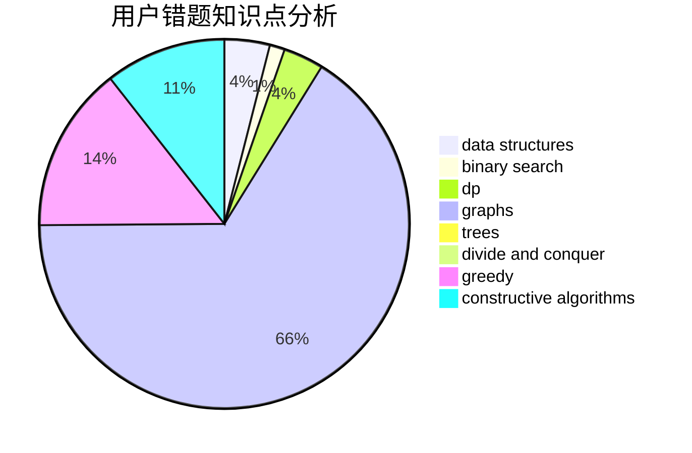

# liberShip
<!-- tabs:start -->
#### **用户提交结果分析**

#### **用户做题类型偏好分析**

#### **用户错题知识点分析**

<!-- tabs:end -->
# 推荐题目
[Permutation Forgery](http://codeforces.com/problemset/problem/1405/A)		constructive algorithms		  
[Stepan and Vowels](https://codeforces.com/contest/795/problem/K)		*special problem,
                        implementation,
                        strings		  
[Mystic Carvings](http://codeforces.com/problemset/problem/297/E)		data structures		  
[Malek Dance Club](http://codeforces.com/problemset/problem/319/A)		combinatorics,
                        math		  
[Minimizing Difference](http://codeforces.com/problemset/problem/1244/E)		binary search,
                        constructive algorithms,
                        greedy,
                        sortings,
                        ternary search,
                        two pointers		  
[Euler tour](http://codeforces.com/problemset/problem/1053/E)		constructive algorithms,
                        trees		  
[Industrial Nim](http://codeforces.com/problemset/problem/15/C)		games		  
[Maximum Subsequence](http://codeforces.com/problemset/problem/888/E)		bitmasks,
                        divide and conquer,
                        meet-in-the-middle		  
[Parametric Circulation](http://codeforces.com/problemset/problem/925/F)		binary search,
                        flows		  
[A Colourful Prospect](https://codeforces.com/contest/934/problem/E)		geometry,
                        graphs		  
<!-- tabs:start -->
#### **data structures**
[Permutation Forgery](http://codeforces.com/problemset/problem/297/E)		data structures		  
[Stepan and Vowels](http://codeforces.com/problemset/problem/571/D)		binary search,
                        data structures,
                        dsu,
                        trees		  
[Mystic Carvings](http://codeforces.com/problemset/problem/1216/F)		data structures,
                        dp,
                        greedy		  
[Malek Dance Club](http://codeforces.com/problemset/problem/1141/F2)		data structures,
                        greedy		  
[Minimizing Difference](http://codeforces.com/problemset/problem/1131/G)		data structures,
                        dp,
                        two pointers		  
[Euler tour](http://codeforces.com/problemset/problem/69/E)		data structures,
                        implementation		  
[Industrial Nim](http://codeforces.com/problemset/problem/1418/G)		data structures,
                        divide and conquer,
                        hashing,
                        two pointers		  
[Maximum Subsequence](http://codeforces.com/problemset/problem/1371/F)		data structures,
                        divide and conquer,
                        implementation		  
[Parametric Circulation](http://codeforces.com/problemset/problem/1492/C)		binary search,
                        data structures,
                        dp,
                        greedy,
                        two pointers		  
[A Colourful Prospect](http://codeforces.com/problemset/problem/1490/G)		binary search,
                        data structures,
                        math		  
#### **binary search**
[Permutation Forgery](http://codeforces.com/problemset/problem/1244/E)		binary search,
                        constructive algorithms,
                        greedy,
                        sortings,
                        ternary search,
                        two pointers		  
[Stepan and Vowels](http://codeforces.com/problemset/problem/925/F)		binary search,
                        flows		  
[Mystic Carvings](http://codeforces.com/problemset/problem/571/D)		binary search,
                        data structures,
                        dsu,
                        trees		  
[Malek Dance Club](http://codeforces.com/problemset/problem/887/E)		binary search,
                        geometry,
                        sortings		  
[Minimizing Difference](http://codeforces.com/problemset/problem/862/D)		binary search,
                        divide and conquer,
                        interactive		  
[Euler tour](http://codeforces.com/problemset/problem/1010/A)		binary search,
                        math		  
[Industrial Nim](http://codeforces.com/problemset/problem/1492/C)		binary search,
                        data structures,
                        dp,
                        greedy,
                        two pointers		  
[Maximum Subsequence](http://codeforces.com/problemset/problem/1463/D)		binary search,
                        constructive algorithms,
                        greedy,
                        two pointers		  
[Parametric Circulation](http://codeforces.com/problemset/problem/1490/G)		binary search,
                        data structures,
                        math		  
[A Colourful Prospect](http://codeforces.com/problemset/problem/1479/D)		binary search,
                        bitmasks,
                        brute force,
                        data structures,
                        probabilities,
                        trees		  
#### **dp**
[Permutation Forgery](http://codeforces.com/problemset/problem/1216/F)		data structures,
                        dp,
                        greedy		  
[Stepan and Vowels](http://codeforces.com/problemset/problem/1131/G)		data structures,
                        dp,
                        two pointers		  
[Mystic Carvings](https://codeforces.com/contest/816/problem/E)		brute force,
                        dp,
                        trees		  
[Malek Dance Club](http://codeforces.com/problemset/problem/234/C)		dp,
                        implementation		  
[Minimizing Difference](http://codeforces.com/problemset/problem/643/E)		dp,
                        math,
                        probabilities,
                        trees		  
[Euler tour](http://codeforces.com/problemset/problem/977/F)		dp		  
[Industrial Nim](http://codeforces.com/problemset/problem/598/E)		brute force,
                        dp		  
[Maximum Subsequence](http://codeforces.com/problemset/problem/356/E)		dp,
                        hashing,
                        implementation,
                        string suffix structures,
                        strings		  
[Parametric Circulation](https://codeforces.com/contest/918/problem/C)		dp,
                        greedy,
                        implementation,
                        math		  
[A Colourful Prospect](https://codeforces.com/contest/1173/problem/D)		combinatorics,
                        dfs and similar,
                        dp,
                        trees		  
#### **graph**
[Permutation Forgery](https://codeforces.com/contest/934/problem/E)		geometry,
                        graphs		  
[Stepan and Vowels](http://codeforces.com/problemset/problem/1067/B)		dfs and similar,
                        graphs,
                        shortest paths		  
[Mystic Carvings](http://codeforces.com/problemset/problem/1510/B)		flows,
                        graph matchings,
                        graphs		  
[Malek Dance Club](http://codeforces.com/problemset/problem/1487/C)		brute force,
                        constructive algorithms,
                        dfs and similar,
                        graphs,
                        greedy,
                        implementation,
                        math		  
[Minimizing Difference](http://codeforces.com/problemset/problem/1437/C)		dp,
                        flows,
                        graph matchings,
                        greedy,
                        math,
                        sortings		  
[Euler tour](http://codeforces.com/problemset/problem/1470/D)		constructive algorithms,
                        dfs and similar,
                        graph matchings,
                        graphs,
                        greedy		  
[Industrial Nim](http://codeforces.com/problemset/problem/1476/C)		dp,
                        graphs,
                        greedy		  
[Maximum Subsequence](http://codeforces.com/problemset/problem/1304/D)		constructive algorithms,
                        graphs,
                        greedy,
                        two pointers		  
[Parametric Circulation](http://codeforces.com/problemset/problem/1475/C)		combinatorics,
                        graphs,
                        math		  
[A Colourful Prospect](http://codeforces.com/problemset/problem/553/E)		dp,
                        fft,
                        graphs,
                        math,
                        probabilities		  
#### **trees**
[Permutation Forgery](http://codeforces.com/problemset/problem/1053/E)		constructive algorithms,
                        trees		  
[Stepan and Vowels](http://codeforces.com/problemset/problem/571/D)		binary search,
                        data structures,
                        dsu,
                        trees		  
[Mystic Carvings](https://codeforces.com/contest/816/problem/E)		brute force,
                        dp,
                        trees		  
[Malek Dance Club](http://codeforces.com/problemset/problem/643/E)		dp,
                        math,
                        probabilities,
                        trees		  
[Minimizing Difference](http://codeforces.com/problemset/problem/715/C)		dfs and similar,
                        divide and conquer,
                        dsu,
                        trees		  
[Euler tour](https://codeforces.com/contest/1173/problem/D)		combinatorics,
                        dfs and similar,
                        dp,
                        trees		  
[Industrial Nim](http://codeforces.com/problemset/problem/1479/D)		binary search,
                        bitmasks,
                        brute force,
                        data structures,
                        probabilities,
                        trees		  
[Maximum Subsequence](http://codeforces.com/problemset/problem/1511/C)		brute force,
                        data structures,
                        implementation,
                        trees		  
[Parametric Circulation](http://codeforces.com/problemset/problem/1499/F)		combinatorics,
                        dfs and similar,
                        dp,
                        trees		  
[A Colourful Prospect](http://codeforces.com/problemset/problem/1491/E)		brute force,
                        dfs and similar,
                        divide and conquer,
                        number theory,
                        trees		  
#### **divide and conquer**
[Permutation Forgery](http://codeforces.com/problemset/problem/888/E)		bitmasks,
                        divide and conquer,
                        meet-in-the-middle		  
[Stepan and Vowels](http://codeforces.com/problemset/problem/1418/G)		data structures,
                        divide and conquer,
                        hashing,
                        two pointers		  
[Mystic Carvings](http://codeforces.com/problemset/problem/862/D)		binary search,
                        divide and conquer,
                        interactive		  
[Malek Dance Club](http://codeforces.com/problemset/problem/715/C)		dfs and similar,
                        divide and conquer,
                        dsu,
                        trees		  
[Minimizing Difference](http://codeforces.com/problemset/problem/1371/F)		data structures,
                        divide and conquer,
                        implementation		  
[Euler tour](http://codeforces.com/problemset/problem/1461/D)		binary search,
                        brute force,
                        data structures,
                        divide and conquer,
                        implementation,
                        sortings		  
[Industrial Nim](http://codeforces.com/problemset/problem/1466/G)		combinatorics,
                        divide and conquer,
                        hashing,
                        math,
                        string suffix structures,
                        strings		  
[Maximum Subsequence](http://codeforces.com/problemset/problem/1490/D)		dfs and similar,
                        divide and conquer,
                        implementation		  
[Parametric Circulation](https://codeforces.com/contest/1483/problem/C)		data structures,
                        divide and conquer,
                        dp		  
[A Colourful Prospect](http://codeforces.com/problemset/problem/1491/E)		brute force,
                        dfs and similar,
                        divide and conquer,
                        number theory,
                        trees		  
#### **greedy**
[Permutation Forgery](http://codeforces.com/problemset/problem/1244/E)		binary search,
                        constructive algorithms,
                        greedy,
                        sortings,
                        ternary search,
                        two pointers		  
[Stepan and Vowels](https://codeforces.com/contest/1504/problem/C)		constructive algorithms,
                        greedy		  
[Mystic Carvings](http://codeforces.com/problemset/problem/605/A)		constructive algorithms,
                        greedy		  
[Malek Dance Club](http://codeforces.com/problemset/problem/1216/F)		data structures,
                        dp,
                        greedy		  
[Minimizing Difference](http://codeforces.com/problemset/problem/1141/F2)		data structures,
                        greedy		  
[Euler tour](http://codeforces.com/problemset/problem/1294/E)		greedy,
                        implementation,
                        math		  
[Industrial Nim](http://codeforces.com/problemset/problem/1455/E)		brute force,
                        constructive algorithms,
                        flows,
                        geometry,
                        greedy,
                        implementation,
                        math,
                        ternary search		  
[Maximum Subsequence](http://codeforces.com/problemset/problem/1216/B)		greedy,
                        implementation,
                        sortings		  
[Parametric Circulation](https://codeforces.com/contest/956/problem/A)		greedy,
                        implementation		  
[A Colourful Prospect](https://codeforces.com/contest/918/problem/C)		dp,
                        greedy,
                        implementation,
                        math		  
#### **constructive algorithms**
[Permutation Forgery](http://codeforces.com/problemset/problem/1405/A)		constructive algorithms		  
[Stepan and Vowels](http://codeforces.com/problemset/problem/1244/E)		binary search,
                        constructive algorithms,
                        greedy,
                        sortings,
                        ternary search,
                        two pointers		  
[Mystic Carvings](http://codeforces.com/problemset/problem/1053/E)		constructive algorithms,
                        trees		  
[Malek Dance Club](https://codeforces.com/contest/1504/problem/C)		constructive algorithms,
                        greedy		  
[Minimizing Difference](http://codeforces.com/problemset/problem/605/A)		constructive algorithms,
                        greedy		  
[Euler tour](http://codeforces.com/problemset/problem/1455/E)		brute force,
                        constructive algorithms,
                        flows,
                        geometry,
                        greedy,
                        implementation,
                        math,
                        ternary search		  
[Industrial Nim](http://codeforces.com/problemset/problem/1166/E)		bitmasks,
                        brute force,
                        constructive algorithms,
                        math,
                        number theory		  
[Maximum Subsequence](http://codeforces.com/problemset/problem/652/F)		constructive algorithms,
                        math		  
[Parametric Circulation](http://codeforces.com/problemset/problem/1366/D)		constructive algorithms,
                        math,
                        number theory		  
[A Colourful Prospect](http://codeforces.com/problemset/problem/128/B)		brute force,
                        constructive algorithms,
                        hashing,
                        implementation,
                        string suffix structures,
                        strings		  
#### **sortings**
[Permutation Forgery](http://codeforces.com/problemset/problem/1244/E)		binary search,
                        constructive algorithms,
                        greedy,
                        sortings,
                        ternary search,
                        two pointers		  
[Stepan and Vowels](http://codeforces.com/problemset/problem/887/E)		binary search,
                        geometry,
                        sortings		  
[Mystic Carvings](http://codeforces.com/problemset/problem/1216/B)		greedy,
                        implementation,
                        sortings		  
[Malek Dance Club](http://codeforces.com/problemset/problem/1339/B)		constructive algorithms,
                        sortings		  
[Minimizing Difference](https://codeforces.com/contest/1496/problem/C)		geometry,
                        greedy,
                        math,
                        sortings		  
[Euler tour](http://codeforces.com/problemset/problem/1495/A)		geometry,
                        greedy,
                        math,
                        sortings		  
[Industrial Nim](http://codeforces.com/problemset/problem/1497/A)		brute force,
                        data structures,
                        greedy,
                        sortings		  
[Maximum Subsequence](http://codeforces.com/problemset/problem/1427/A)		math,
                        sortings		  
[Parametric Circulation](http://codeforces.com/problemset/problem/1461/D)		binary search,
                        brute force,
                        data structures,
                        divide and conquer,
                        implementation,
                        sortings		  
[A Colourful Prospect](http://codeforces.com/problemset/problem/1437/C)		dp,
                        flows,
                        graph matchings,
                        greedy,
                        math,
                        sortings		  
<!-- tabs:end -->
