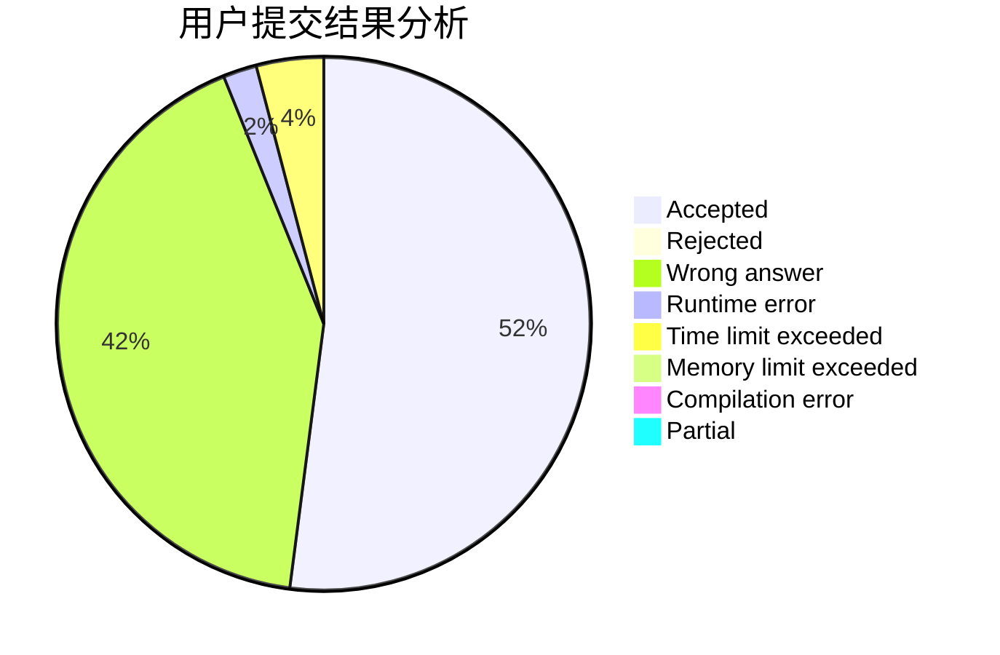
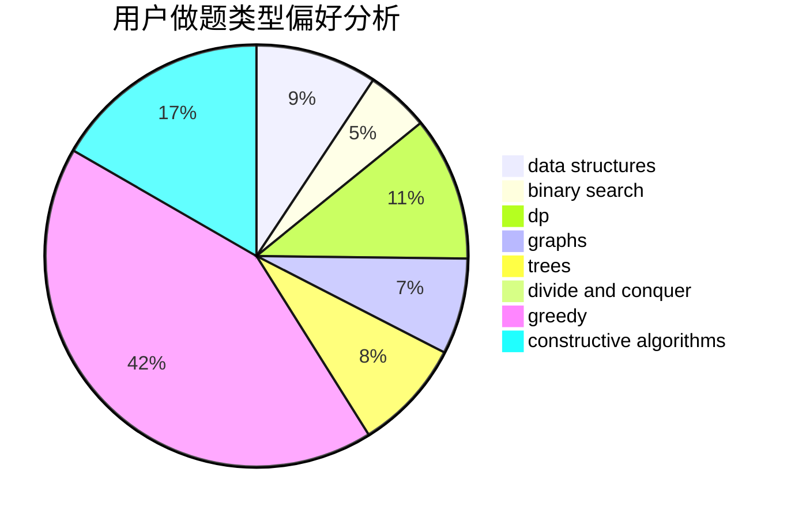
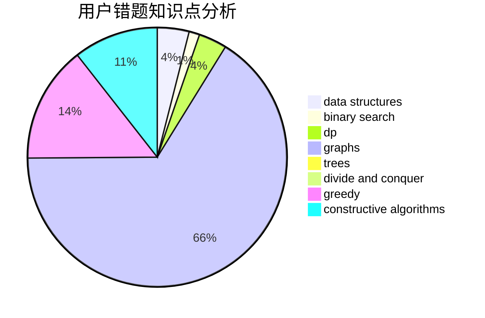

# liberShip

<!-- tabs:start -->

#### **用户提交结果分析**

#### **用户做题类型偏好分析**

#### **用户错题知识点分析**

<!-- tabs:end -->
# 推荐题目
[1504C](https://codeforces.com/contest/1504/problem/C)		dsu,graphs,sortings,trees		  
[1405A](https://codeforces.com/contest/1405/problem/A)		constructive algorithms		  
[15C](https://codeforces.com/contest/15/problem/C)		games		  
[319A](https://codeforces.com/contest/319/problem/A)		combinatorics,
                        math		  
[795K](https://codeforces.com/contest/795/problem/K)		dsu,graphs,sortings,trees		  
[571D](https://codeforces.com/contest/571/problem/D)		binary search,
                        data structures,
                        dsu,
                        trees		  
[888E](https://codeforces.com/contest/888/problem/E)		bitmasks,
                        divide and conquer,
                        meet-in-the-middle		  
[1244E](https://codeforces.com/contest/1244/problem/E)		binary search,
                        constructive algorithms,
                        greedy,
                        sortings,
                        ternary search,
                        two pointers		  
[1053E](https://codeforces.com/contest/1053/problem/E)		constructive algorithms,
                        trees		  
[774G](https://codeforces.com/contest/774/problem/G)		*special problem,
                        number theory		  
