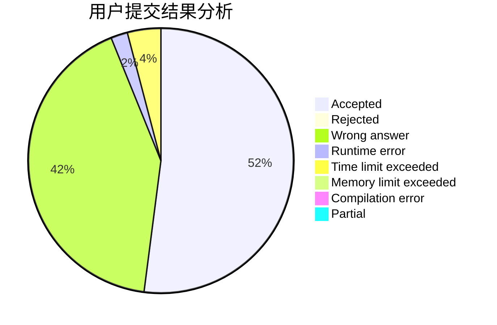
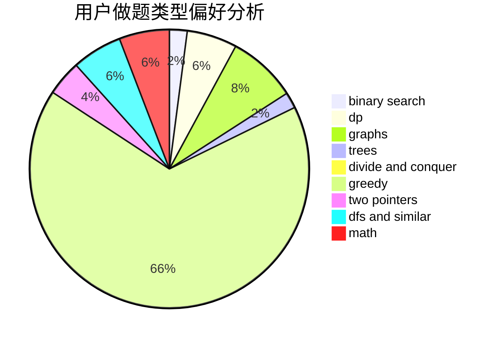

# liberShip

<!-- tabs:start -->

#### **用户提交结果分析**

#### **用户做题类型偏好分析**

<!-- tabs:end -->
# 推荐题目
[1513B](https://codeforces.com/contest/1513/problem/B)
[1416B](https://codeforces.com/contest/1416/problem/B)
[182D](https://codeforces.com/contest/182/problem/D)
[349B](https://codeforces.com/contest/349/problem/B)
[810A](https://codeforces.com/contest/810/problem/A)
[592A](https://codeforces.com/contest/592/problem/A)
[908C](https://codeforces.com/contest/908/problem/C)
[124A](https://codeforces.com/contest/124/problem/A)
[1054C](https://codeforces.com/contest/1054/problem/C)
[793F](https://codeforces.com/contest/793/problem/F)
