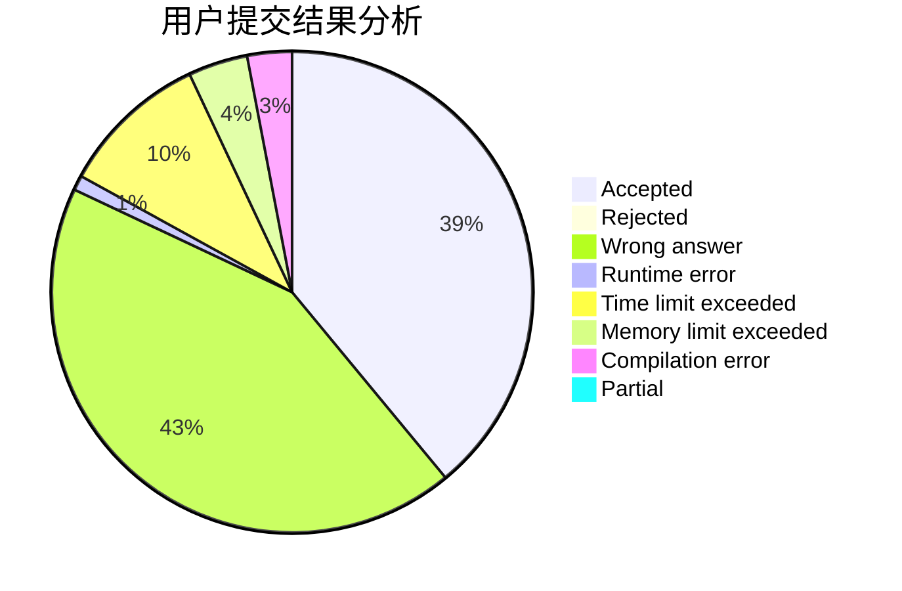
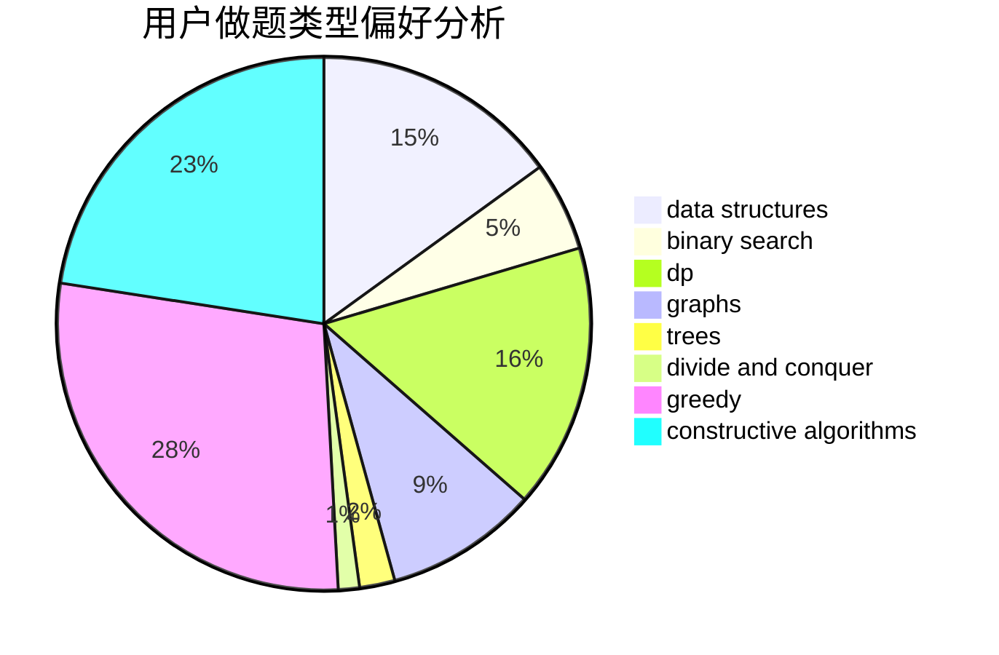
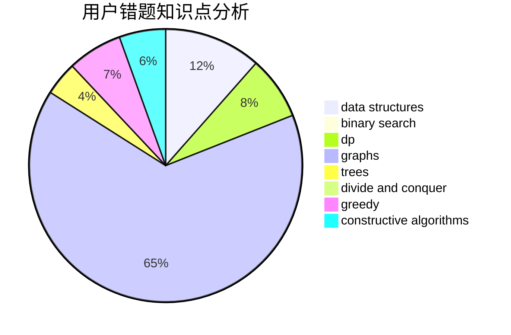

# lichenlong

<!-- tabs:start -->

#### **用户提交结果分析**

#### **用户做题类型偏好分析**

#### **用户错题知识点分析**

<!-- tabs:end -->
# 推荐题目
[1430C](https://codeforces.com/contest/1430/problem/C)		constructive algorithms,
                        data structures,
                        greedy,
                        implementation,
                        math		  
[1480E](https://codeforces.com/contest/1480/problem/E)		dsu,graphs,sortings,trees		  
[659E](https://codeforces.com/contest/659/problem/E)		data structures,
                        dfs and similar,
                        dsu,
                        graphs,
                        greedy		  
[1321E](https://codeforces.com/contest/1321/problem/E)		dsu,graphs,sortings,trees		  
[1311F](https://codeforces.com/contest/1311/problem/F)		data structures,
                        divide and conquer,
                        implementation,
                        sortings		  
[699B](https://codeforces.com/contest/699/problem/B)		implementation		  
[665D](https://codeforces.com/contest/665/problem/D)		constructive algorithms,
                        greedy,
                        number theory		  
[498E](https://codeforces.com/contest/498/problem/E)		dp,
                        matrices		  
[542F](https://codeforces.com/contest/542/problem/F)		dp,
                        greedy		  
[1166F](https://codeforces.com/contest/1166/problem/F)		data structures,
                        dsu,
                        graphs,
                        hashing		  
