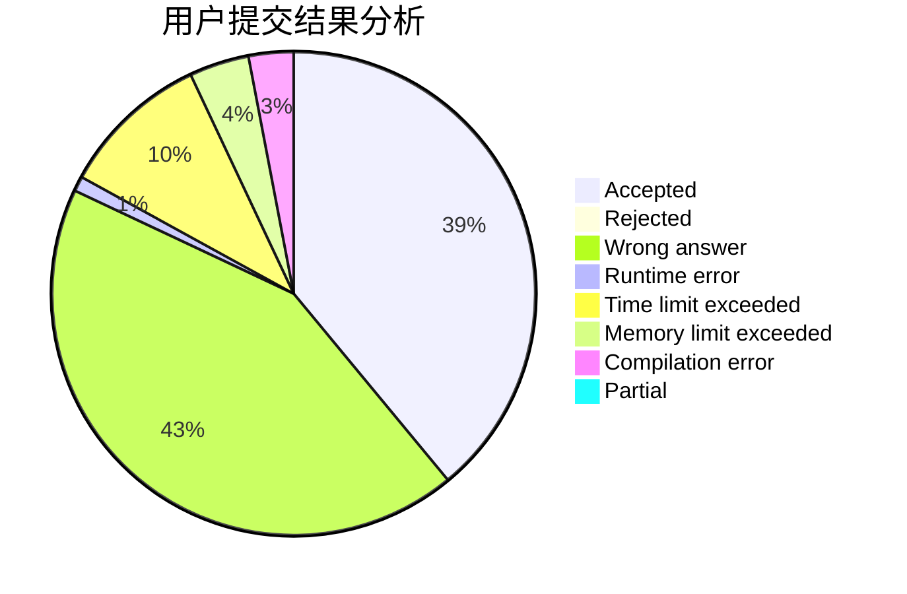
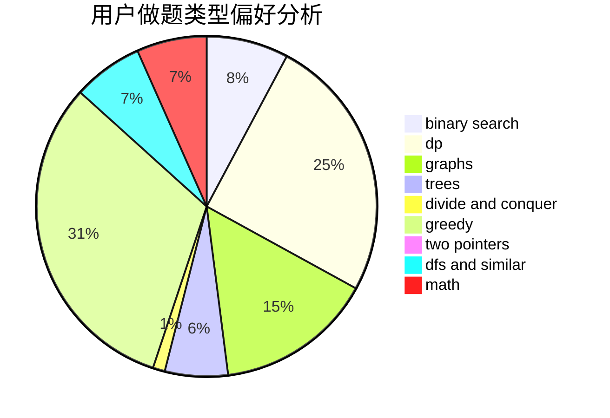

# lichenlong

<!-- tabs:start -->

#### **用户提交结果分析**

#### **用户做题类型偏好分析**

<!-- tabs:end -->
# 推荐题目
[14392](https://codeforces.com/contest/1439/problem/2)
[1489B](https://codeforces.com/contest/1489/problem/B)
[679E](https://codeforces.com/contest/679/problem/E)
[1328D](https://codeforces.com/contest/1328/problem/D)
[1321B](https://codeforces.com/contest/1321/problem/B)
[716A](https://codeforces.com/contest/716/problem/A)
[686B](https://codeforces.com/contest/686/problem/B)
[519E](https://codeforces.com/contest/519/problem/E)
[567B](https://codeforces.com/contest/567/problem/B)
[116C](https://codeforces.com/contest/116/problem/C)
