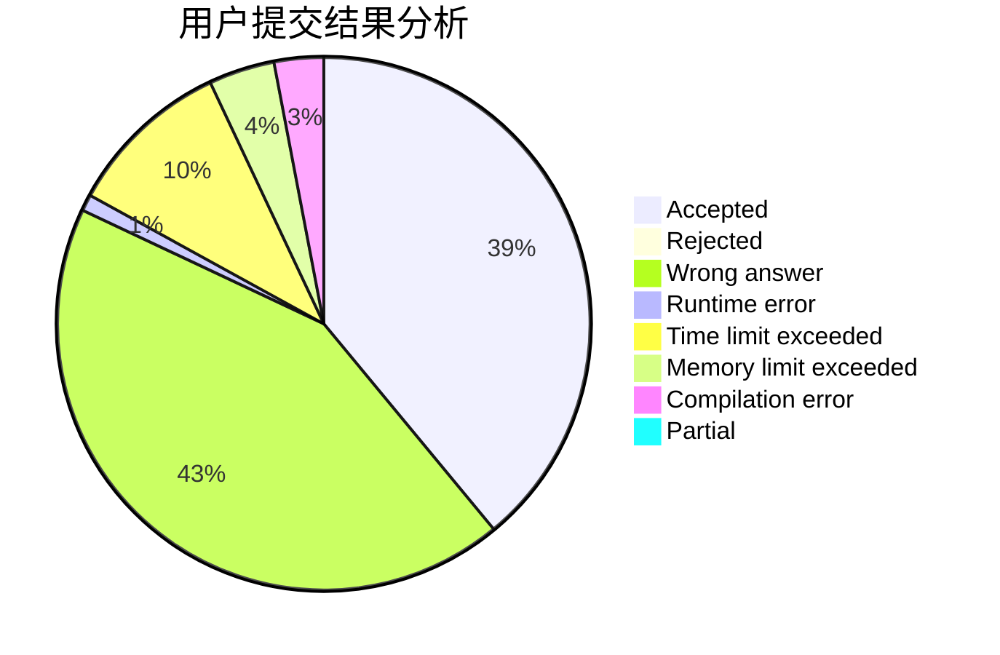
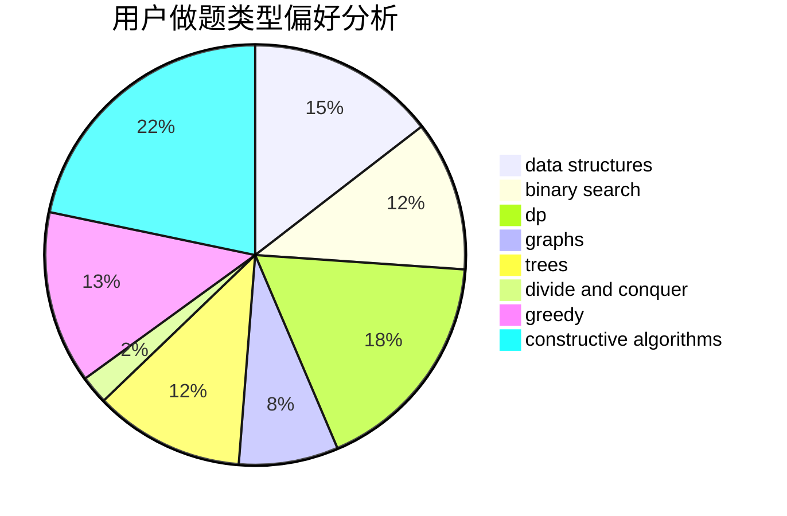
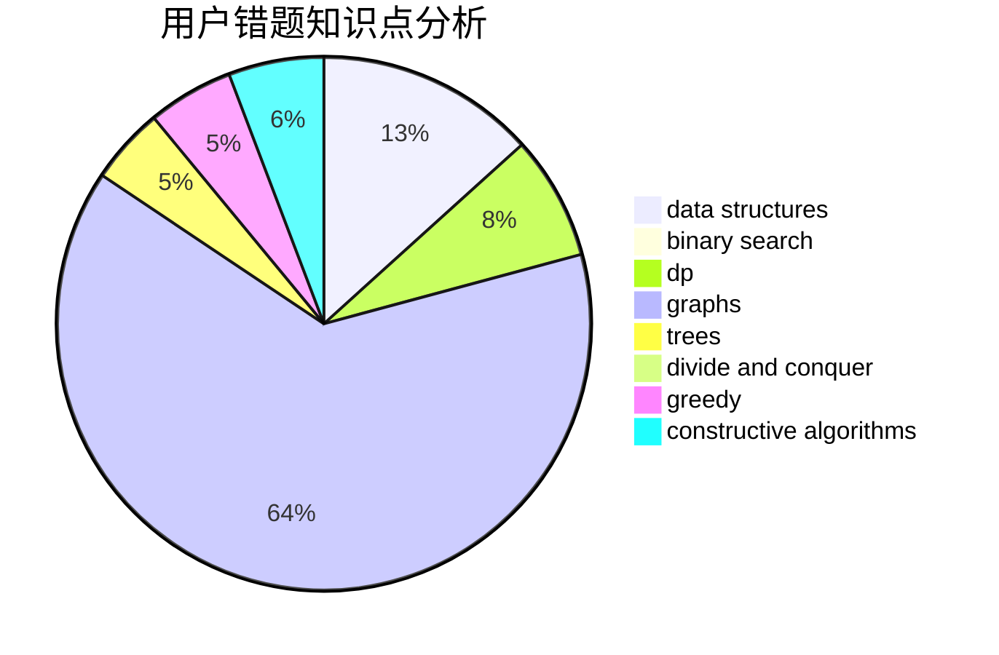

# lichenlong

<!-- tabs:start -->

#### **用户提交结果分析**

#### **用户做题类型偏好分析**

#### **用户错题知识点分析**

<!-- tabs:end -->
# 推荐题目
[14392](https://codeforces.com/contest/1439/problem/2)		dsu,graphs,sortings,trees		  
[1489B](https://codeforces.com/contest/1489/problem/B)		dsu,graphs,sortings,trees		  
[679E](https://codeforces.com/contest/679/problem/E)		data structures		  
[1328D](https://codeforces.com/contest/1328/problem/D)		constructive algorithms,
                        dp,
                        graphs,
                        greedy,
                        math		  
[1321B](https://codeforces.com/contest/1321/problem/B)		dsu,graphs,sortings,trees		  
[716A](https://codeforces.com/contest/716/problem/A)		implementation		  
[686B](https://codeforces.com/contest/686/problem/B)		constructive algorithms,
                        implementation,
                        sortings		  
[519E](https://codeforces.com/contest/519/problem/E)		binary search,
                        data structures,
                        dfs and similar,
                        dp,
                        trees		  
[567B](https://codeforces.com/contest/567/problem/B)		implementation		  
[116C](https://codeforces.com/contest/116/problem/C)		dsu,graphs,sortings,trees		  
