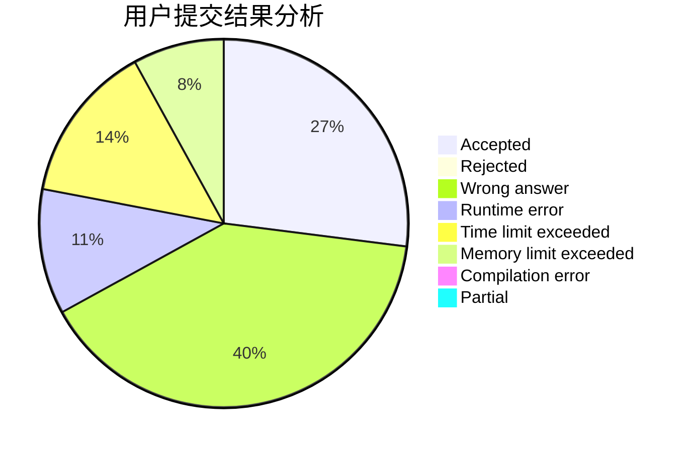
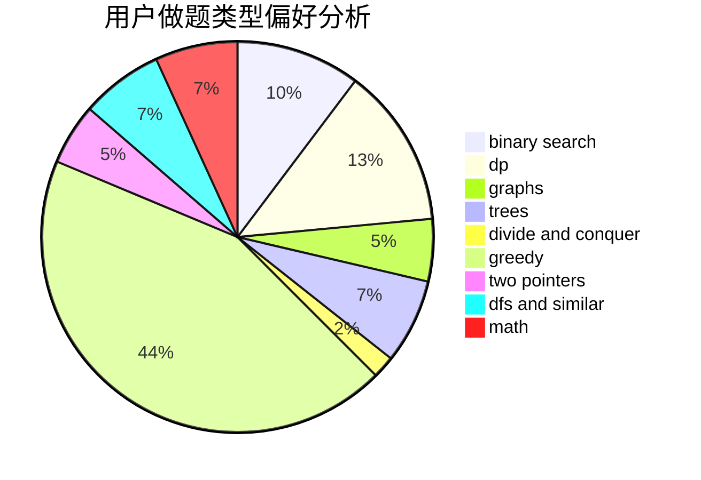

# lijiayi123

<!-- tabs:start -->

#### **用户提交结果分析**

#### **用户做题类型偏好分析**

<!-- tabs:end -->
# 推荐题目
[1100A](https://codeforces.com/contest/1100/problem/A)
[814C](https://codeforces.com/contest/814/problem/C)
[1250B](https://codeforces.com/contest/1250/problem/B)
[1023C](https://codeforces.com/contest/1023/problem/C)
[1033E](https://codeforces.com/contest/1033/problem/E)
[380A](https://codeforces.com/contest/380/problem/A)
[875F](https://codeforces.com/contest/875/problem/F)
[1129B](https://codeforces.com/contest/1129/problem/B)
[614D](https://codeforces.com/contest/614/problem/D)
[935F](https://codeforces.com/contest/935/problem/F)
