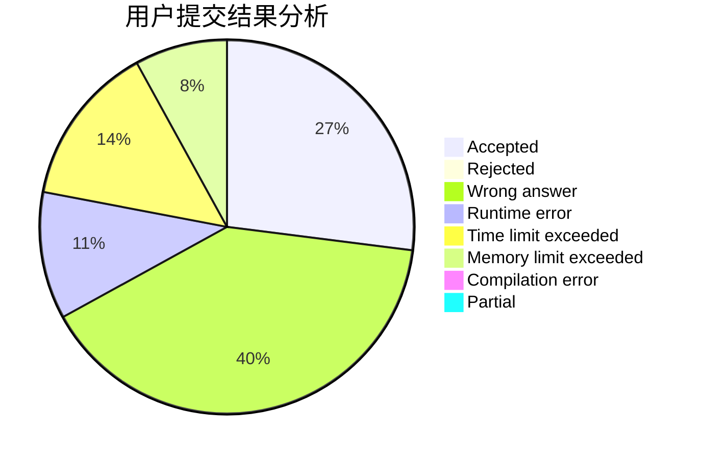
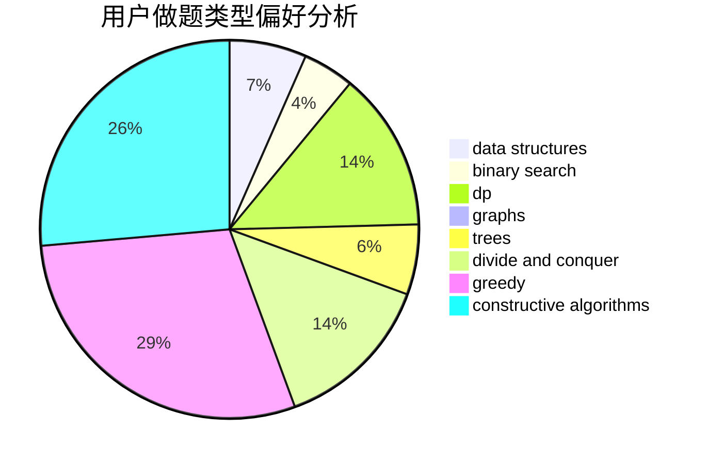

# lijiayi123

<!-- tabs:start -->

#### **用户提交结果分析**

#### **用户做题类型偏好分析**

#### **用户错题知识点分析**

<!-- tabs:end -->
# 推荐题目
[10C](https://codeforces.com/contest/10/problem/C)		number theory		  
[7B](https://codeforces.com/contest/7/problem/B)		implementation		  
[1244G](https://codeforces.com/contest/1244/problem/G)		constructive algorithms,
                        greedy,
                        math		  
[1020E](https://codeforces.com/contest/1020/problem/E)		dsu,graphs,sortings,trees		  
[1033B](https://codeforces.com/contest/1033/problem/B)		math,
                        number theory		  
[354B](https://codeforces.com/contest/354/problem/B)		bitmasks,
                        dp,
                        games		  
[856F](https://codeforces.com/contest/856/problem/F)		greedy		  
[1119F](https://codeforces.com/contest/1119/problem/F)		data structures,
                        dp,
                        trees		  
[597C](https://codeforces.com/contest/597/problem/C)		data structures,
                        dp		  
[915G](https://codeforces.com/contest/915/problem/G)		math,
                        number theory		  
