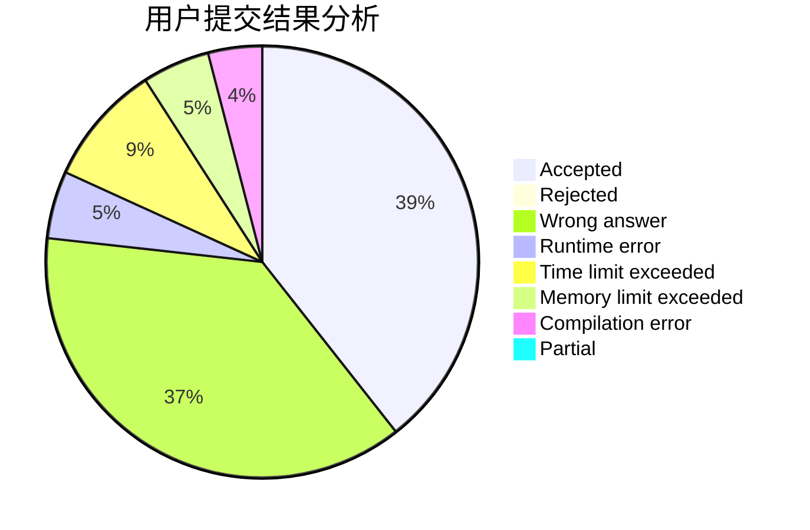
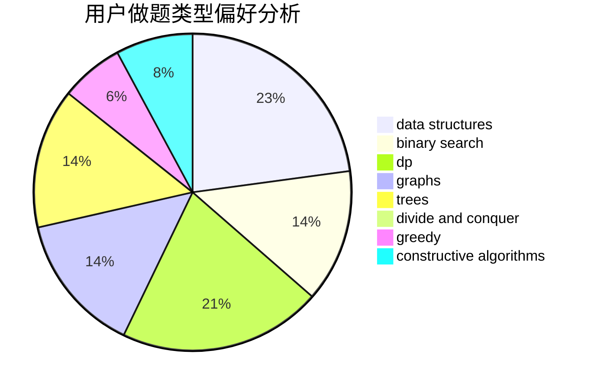
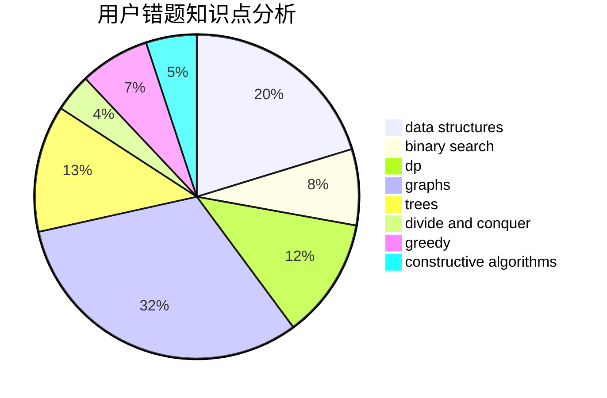

# lijunhan

<!-- tabs:start -->

#### **用户提交结果分析**

#### **用户做题类型偏好分析**

#### **用户错题知识点分析**

<!-- tabs:end -->
# 推荐题目
[553C](https://codeforces.com/contest/553/problem/C)		dfs and similar,
                        dsu,
                        graphs		  
[1455E](https://codeforces.com/contest/1455/problem/E)		brute force,
                        constructive algorithms,
                        flows,
                        geometry,
                        greedy,
                        implementation,
                        math,
                        ternary search		  
[1372A](https://codeforces.com/contest/1372/problem/A)		constructive algorithms,
                        implementation		  
[1304F2](https://codeforces.com/contest/1304F/problem/2)		data structures,
                        dp,
                        greedy		  
[7A](https://codeforces.com/contest/7/problem/A)		brute force,
                        constructive algorithms		  
[1087C](https://codeforces.com/contest/1087/problem/C)		dsu,graphs,sortings,trees		  
[1090A](https://codeforces.com/contest/1090/problem/A)		greedy		  
[962A](https://codeforces.com/contest/962/problem/A)		implementation		  
[884D](https://codeforces.com/contest/884/problem/D)		data structures,
                        greedy		  
[652B](https://codeforces.com/contest/652/problem/B)		sortings		  
