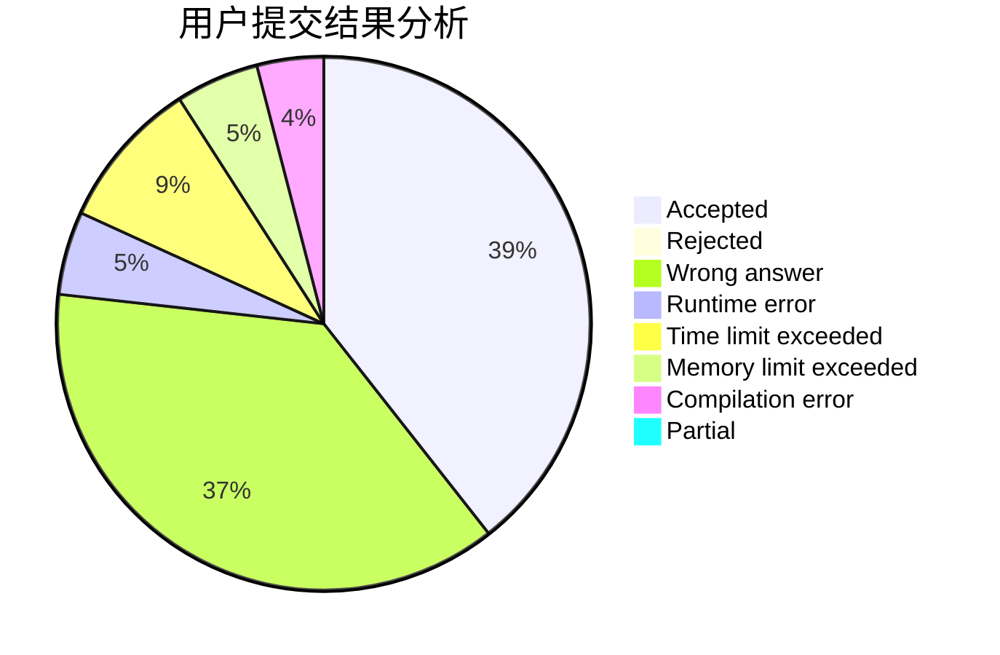
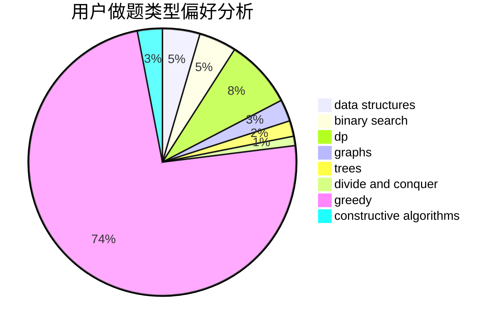
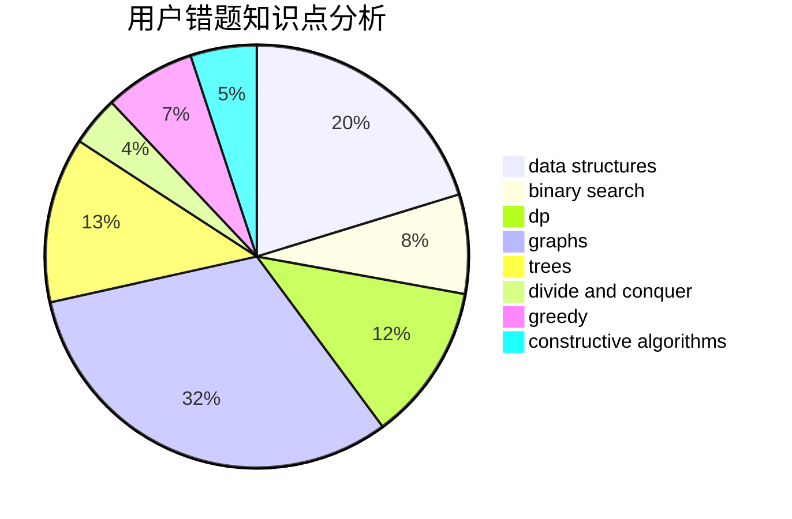

# lijunhan

<!-- tabs:start -->

#### **用户提交结果分析**

#### **用户做题类型偏好分析**

#### **用户错题知识点分析**

<!-- tabs:end -->
# 推荐题目
[578E](https://codeforces.com/contest/578/problem/E)		constructive algorithms,
                        greedy		  
[1465B](https://codeforces.com/contest/1465/problem/B)		dsu,graphs,sortings,trees		  
[1380F](https://codeforces.com/contest/1380/problem/F)		data structures,
                        dp,
                        matrices		  
[1313D](https://codeforces.com/contest/1313/problem/D)		bitmasks,
                        dp,
                        implementation		  
[814B](https://codeforces.com/contest/814/problem/B)		constructive algorithms		  
[1087F](https://codeforces.com/contest/1087/problem/F)		dsu,graphs,sortings,trees		  
[1090F](https://codeforces.com/contest/1090/problem/F)		constructive algorithms,
                        interactive		  
[984D](https://codeforces.com/contest/984/problem/D)		dsu,graphs,sortings,trees		  
[903A](https://codeforces.com/contest/903/problem/A)		greedy,
                        implementation		  
[676A](https://codeforces.com/contest/676/problem/A)		constructive algorithms,
                        implementation		  
