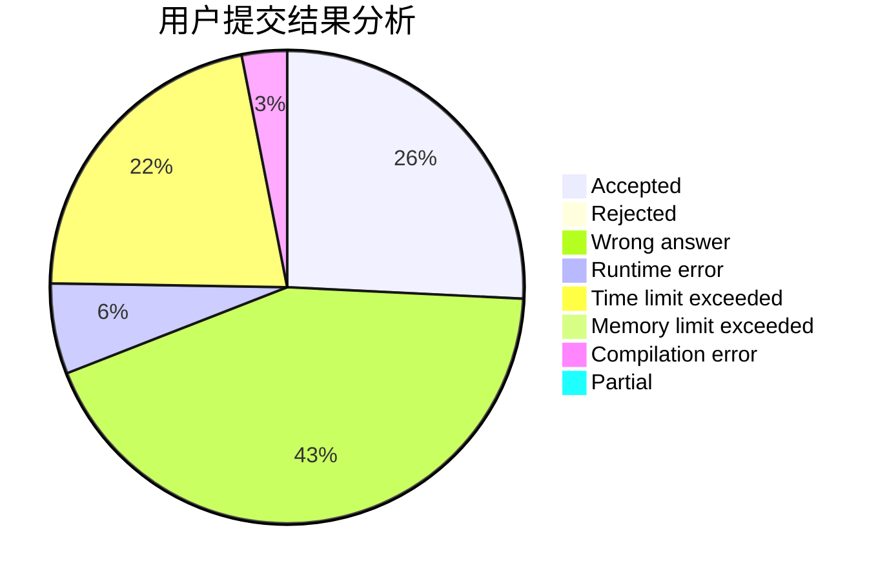
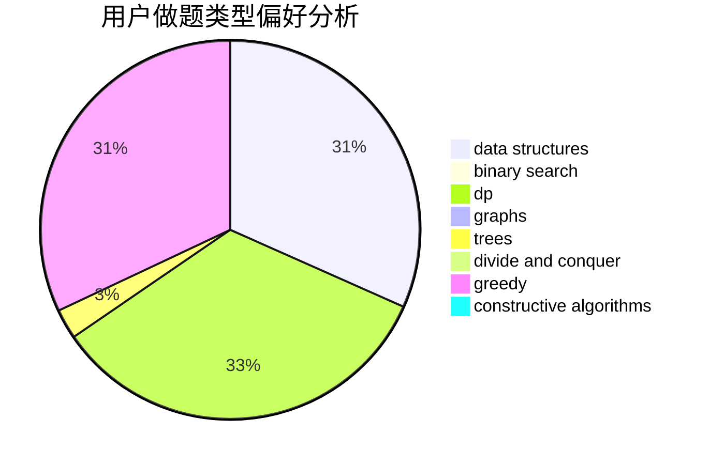
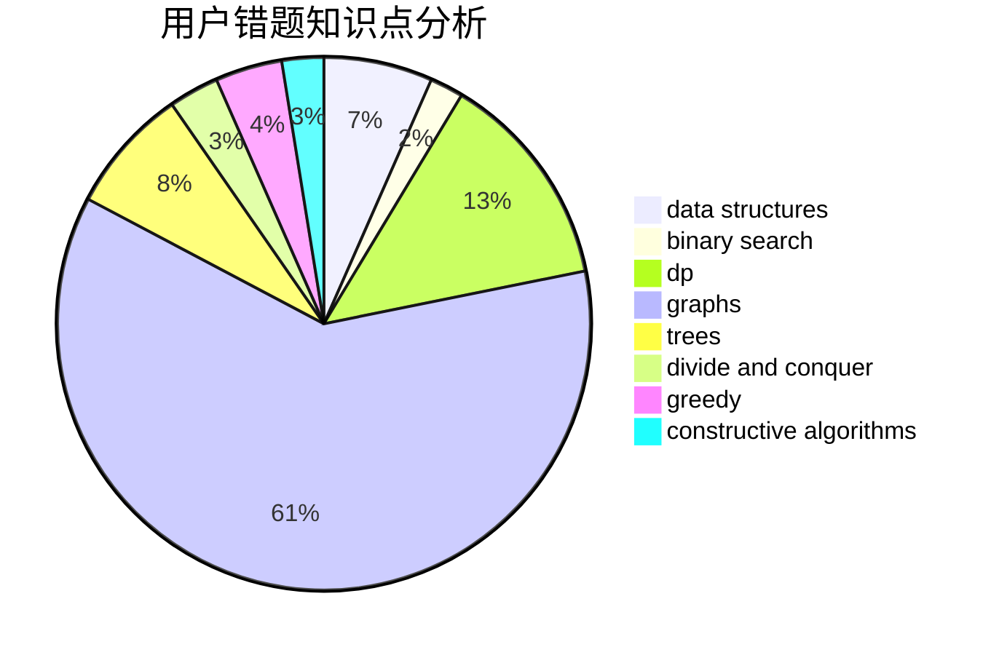

# likely

<!-- tabs:start -->

#### **用户提交结果分析**

#### **用户做题类型偏好分析**

#### **用户错题知识点分析**

<!-- tabs:end -->
# 推荐题目
[592C](https://codeforces.com/contest/592/problem/C)		math		  
[11962](https://codeforces.com/contest/1196/problem/2)		dsu,graphs,sortings,trees		  
[295B](https://codeforces.com/contest/295/problem/B)		dp,
                        graphs,
                        shortest paths		  
[898B](https://codeforces.com/contest/898/problem/B)		brute force,
                        implementation,
                        number theory		  
[936B](https://codeforces.com/contest/936/problem/B)		dfs and similar,
                        dp,
                        games,
                        graphs		  
[148E](https://codeforces.com/contest/148/problem/E)		dp		  
[523A](https://codeforces.com/contest/523/problem/A)		*special problem,
                        implementation		  
[630C](https://codeforces.com/contest/630/problem/C)		combinatorics,
                        math		  
[11412](https://codeforces.com/contest/1141/problem/2)		dsu,graphs,sortings,trees		  
[981E](https://codeforces.com/contest/981/problem/E)		bitmasks,
                        data structures,
                        divide and conquer,
                        dp		  
