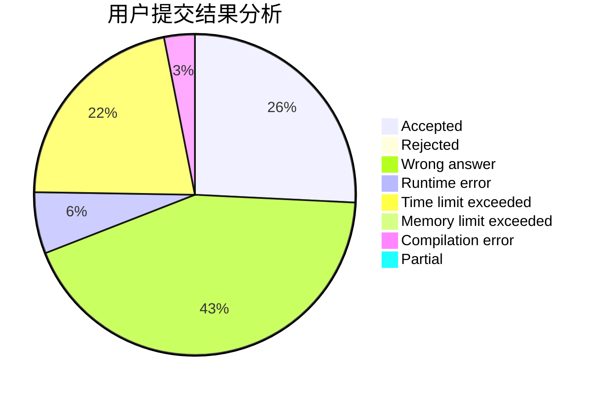
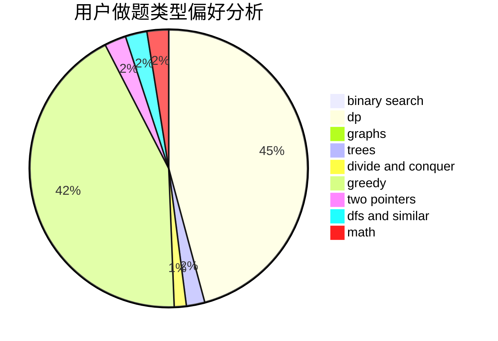

# likely

<!-- tabs:start -->

#### **用户提交结果分析**

#### **用户做题类型偏好分析**

<!-- tabs:end -->
# 推荐题目
[592C](https://codeforces.com/contest/592/problem/C)
[11962](https://codeforces.com/contest/1196/problem/2)
[295B](https://codeforces.com/contest/295/problem/B)
[898B](https://codeforces.com/contest/898/problem/B)
[936B](https://codeforces.com/contest/936/problem/B)
[148E](https://codeforces.com/contest/148/problem/E)
[523A](https://codeforces.com/contest/523/problem/A)
[630C](https://codeforces.com/contest/630/problem/C)
[11412](https://codeforces.com/contest/1141/problem/2)
[981E](https://codeforces.com/contest/981/problem/E)
