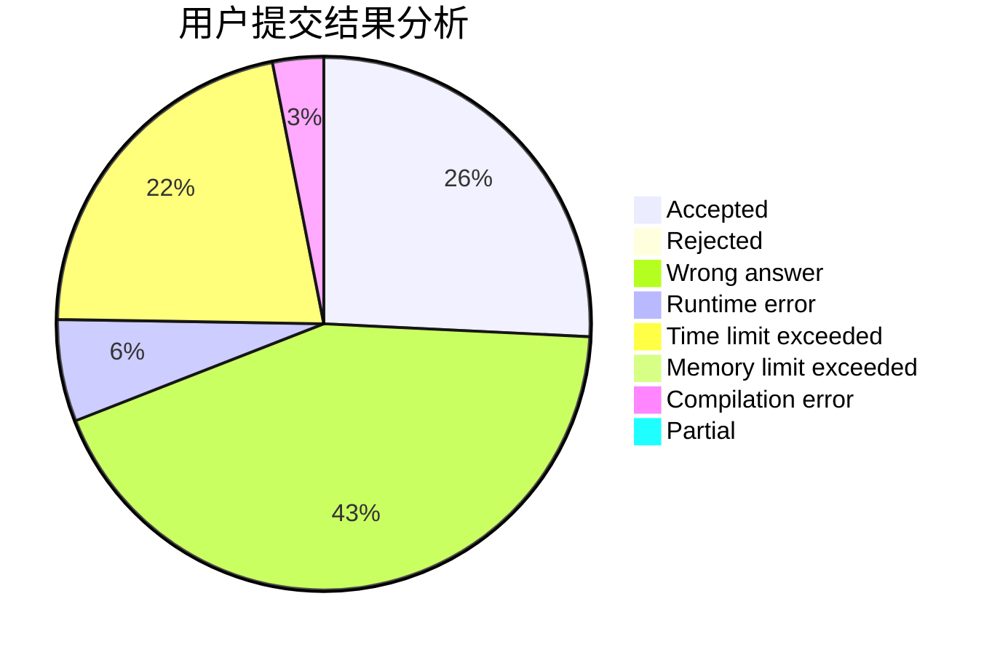
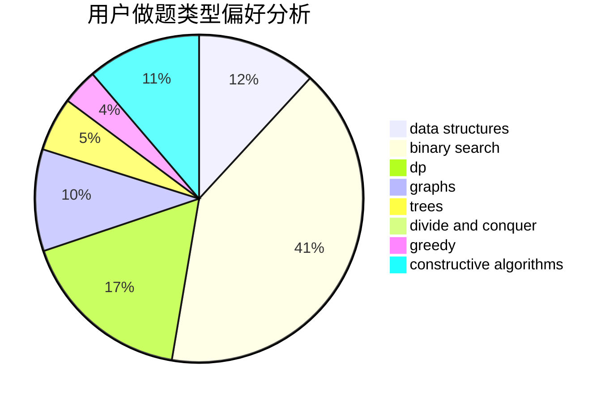
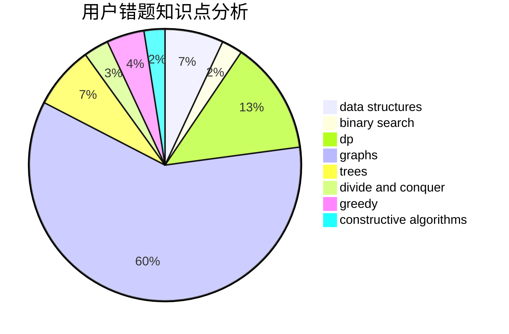

# likely

<!-- tabs:start -->

#### **用户提交结果分析**

#### **用户做题类型偏好分析**

#### **用户错题知识点分析**

<!-- tabs:end -->
# 推荐题目
[572A](https://codeforces.com/contest/572/problem/A)		sortings		  
[1190B](https://codeforces.com/contest/1190/problem/B)		games		  
[27C](https://codeforces.com/contest/27/problem/C)		constructive algorithms,
                        greedy		  
[877C](https://codeforces.com/contest/877/problem/C)		constructive algorithms		  
[916B](https://codeforces.com/contest/916/problem/B)		bitmasks,
                        greedy,
                        math		  
[1482B](https://codeforces.com/contest/1482/problem/B)		implementation,
                        math		  
[501C](https://codeforces.com/contest/501/problem/C)		constructive algorithms,
                        data structures,
                        greedy,
                        sortings,
                        trees		  
[611B](https://codeforces.com/contest/611/problem/B)		bitmasks,
                        brute force,
                        implementation		  
[1139E](https://codeforces.com/contest/1139/problem/E)		flows,
                        graph matchings,
                        graphs		  
[95A](https://codeforces.com/contest/95/problem/A)		implementation,
                        strings		  
