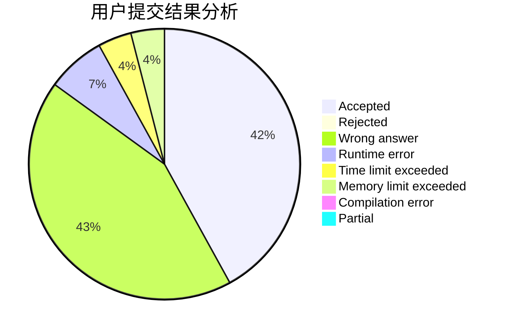
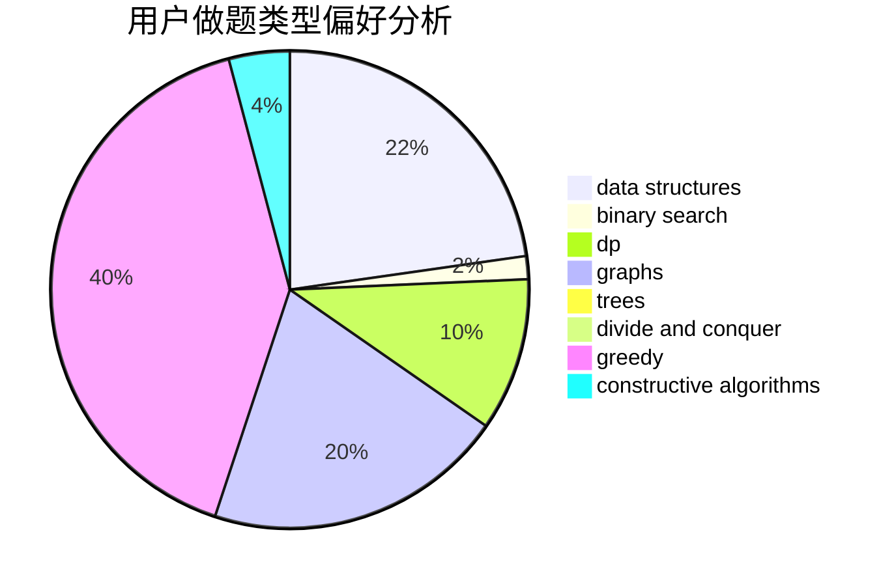
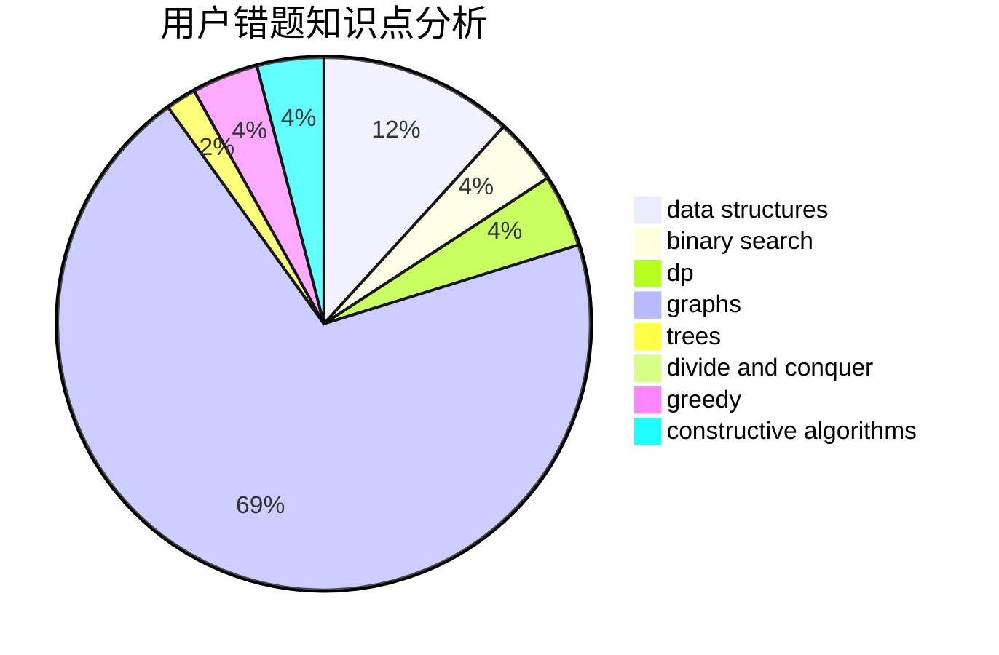

# lin_rany

<!-- tabs:start -->

#### **用户提交结果分析**

#### **用户做题类型偏好分析**

#### **用户错题知识点分析**

<!-- tabs:end -->
# 推荐题目
[1405D](https://codeforces.com/contest/1405/problem/D)		dsu,graphs,sortings,trees		  
[840A](https://codeforces.com/contest/840/problem/A)		combinatorics,
                        greedy,
                        math,
                        number theory,
                        sortings		  
[1340B](https://codeforces.com/contest/1340/problem/B)		bitmasks,
                        dp,
                        graphs,
                        greedy		  
[1277F](https://codeforces.com/contest/1277/problem/F)		dsu,graphs,sortings,trees		  
[1186D](https://codeforces.com/contest/1186/problem/D)		constructive algorithms,
                        greedy,
                        math		  
[13771](https://codeforces.com/contest/1377/problem/1)		dsu,graphs,sortings,trees		  
[1044D](https://codeforces.com/contest/1044/problem/D)		data structures,
                        dsu		  
[1042D](https://codeforces.com/contest/1042/problem/D)		data structures,
                        divide and conquer,
                        two pointers		  
[540A](https://codeforces.com/contest/540/problem/A)		implementation		  
[1055A](https://codeforces.com/contest/1055/problem/A)		graphs		  
