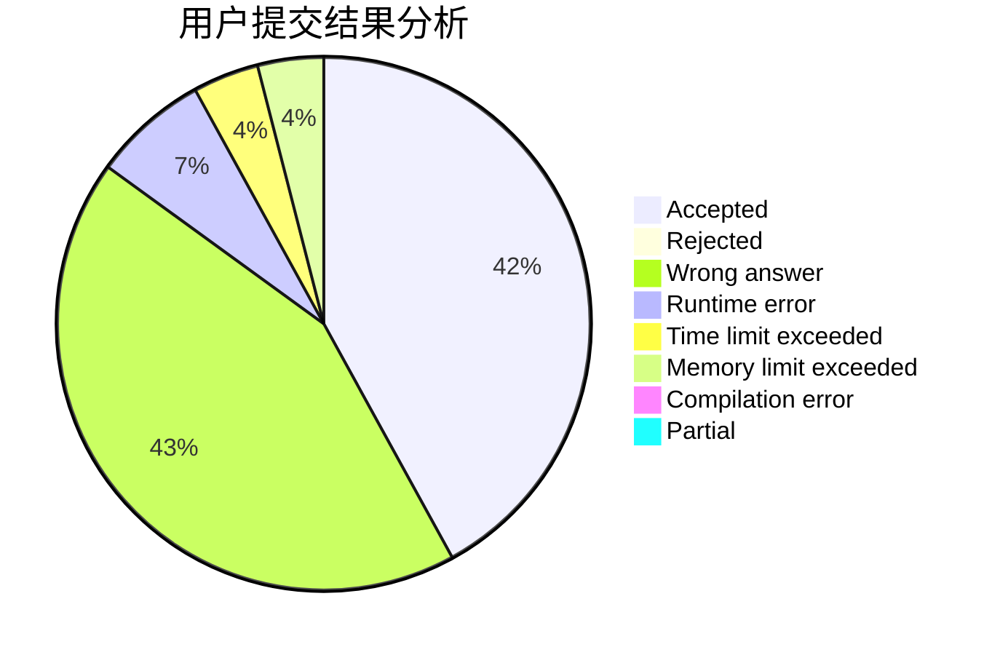
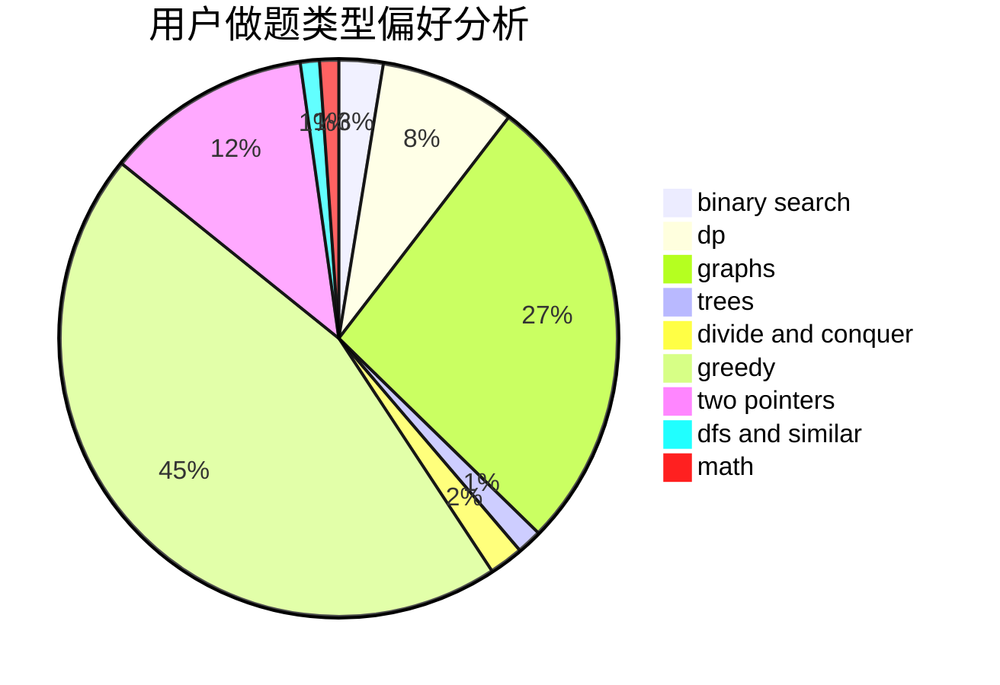

# lin_rany

<!-- tabs:start -->

#### **用户提交结果分析**

#### **用户做题类型偏好分析**

<!-- tabs:end -->
# 推荐题目
[1405D](https://codeforces.com/contest/1405/problem/D)
[840A](https://codeforces.com/contest/840/problem/A)
[1340B](https://codeforces.com/contest/1340/problem/B)
[1277F](https://codeforces.com/contest/1277/problem/F)
[1186D](https://codeforces.com/contest/1186/problem/D)
[13771](https://codeforces.com/contest/1377/problem/1)
[1044D](https://codeforces.com/contest/1044/problem/D)
[1042D](https://codeforces.com/contest/1042/problem/D)
[540A](https://codeforces.com/contest/540/problem/A)
[1055A](https://codeforces.com/contest/1055/problem/A)
