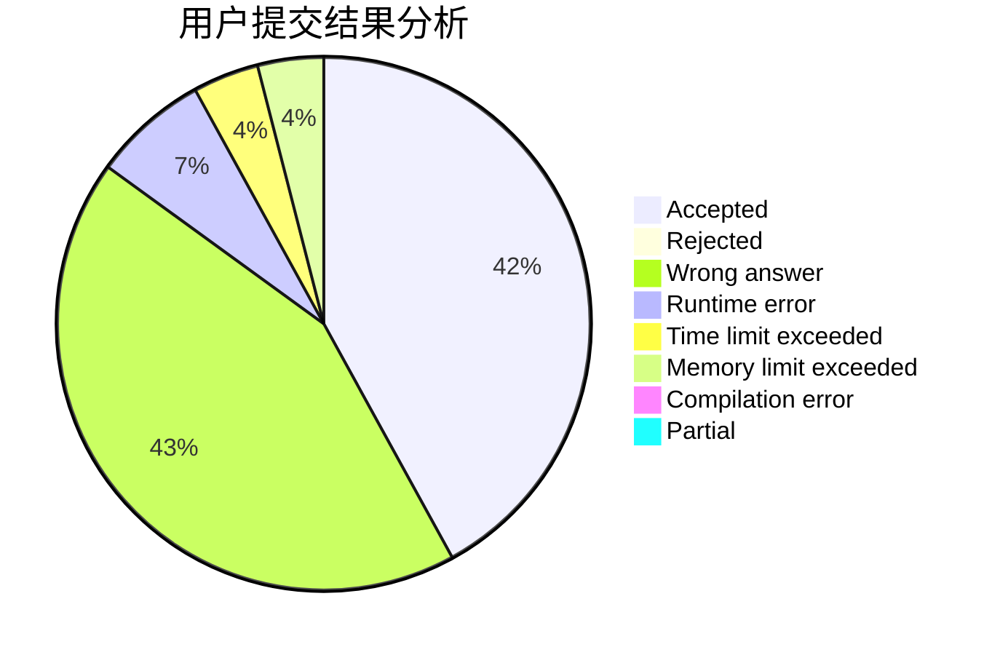
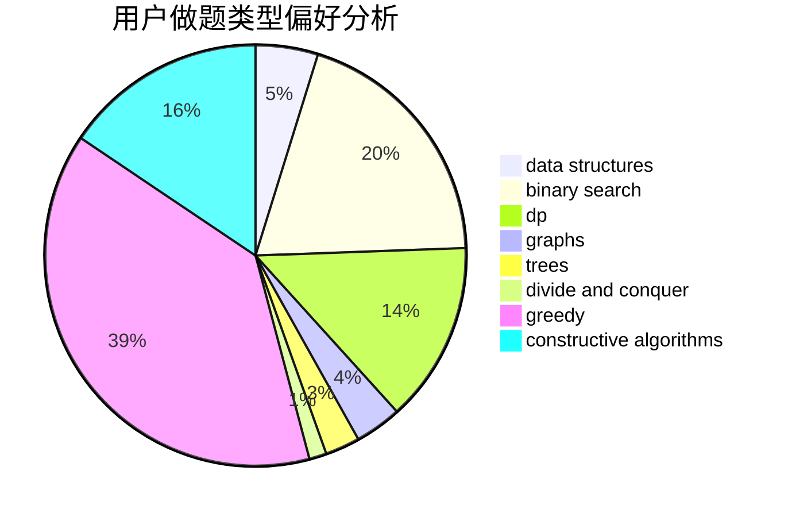
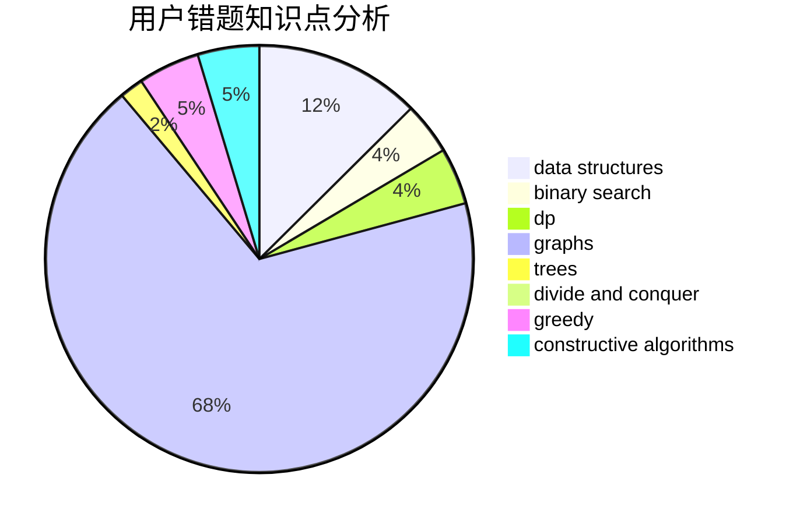

# lin_rany

<!-- tabs:start -->

#### **用户提交结果分析**

#### **用户做题类型偏好分析**

#### **用户错题知识点分析**

<!-- tabs:end -->
# 推荐题目
[1396E](https://codeforces.com/contest/1396/problem/E)		constructive algorithms,
                        dfs and similar,
                        trees		  
[820A](https://codeforces.com/contest/820/problem/A)		implementation		  
[1333C](https://codeforces.com/contest/1333/problem/C)		binary search,
                        data structures,
                        implementation,
                        two pointers		  
[1268E](https://codeforces.com/contest/1268/problem/E)		dp		  
[1183F](https://codeforces.com/contest/1183/problem/F)		brute force,
                        math,
                        sortings		  
[1369F](https://codeforces.com/contest/1369/problem/F)		dfs and similar,
                        dp,
                        games		  
[1043G](https://codeforces.com/contest/1043/problem/G)		data structures,
                        divide and conquer,
                        hashing,
                        string suffix structures,
                        strings		  
[1042A](https://codeforces.com/contest/1042/problem/A)		binary search,
                        implementation		  
[514C](https://codeforces.com/contest/514/problem/C)		binary search,
                        data structures,
                        hashing,
                        string suffix structures,
                        strings		  
[1054F](https://codeforces.com/contest/1054/problem/F)		flows,
                        graph matchings		  
