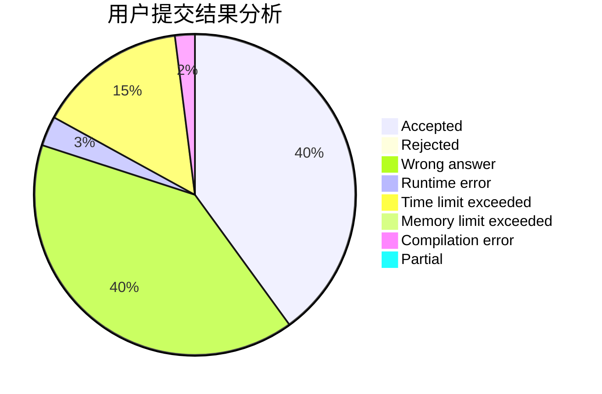
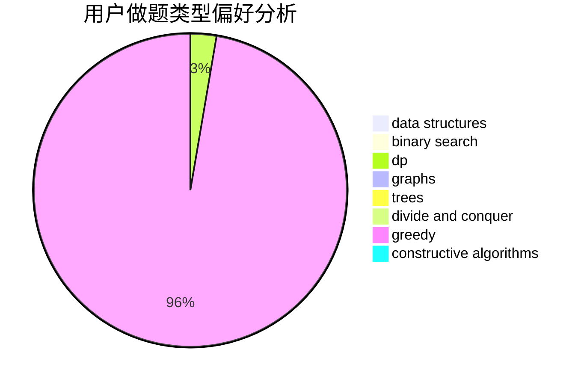

# BillDeng

<!-- tabs:start -->

#### **用户提交结果分析**

#### **用户做题类型偏好分析**

#### **用户错题知识点分析**

<!-- tabs:end -->
# 推荐题目
[533E](https://codeforces.com/contest/533/problem/E)		constructive algorithms,
                        dp,
                        greedy,
                        hashing,
                        strings,
                        two pointers		  
[261C](https://codeforces.com/contest/261/problem/C)		constructive algorithms,
                        dp,
                        math		  
[533B](https://codeforces.com/contest/533/problem/B)		dfs and similar,
                        dp,
                        graphs,
                        strings,
                        trees		  
[476E](https://codeforces.com/contest/476/problem/E)		dp,
                        strings		  
[533F](https://codeforces.com/contest/533/problem/F)		hashing,
                        string suffix structures,
                        strings		  
[533A](https://codeforces.com/contest/533/problem/A)		binary search,
                        data structures,
                        dfs and similar,
                        greedy,
                        trees		  
[533D](https://codeforces.com/contest/533/problem/D)		data structures,
                        dp		  
[1477F](https://codeforces.com/contest/1477/problem/F)		combinatorics,
                        fft,
                        math,
                        probabilities		  
[364B](https://codeforces.com/contest/364/problem/B)		dp,
                        greedy		  
[1447A](https://codeforces.com/contest/1447/problem/A)		constructive algorithms,
                        math		  
