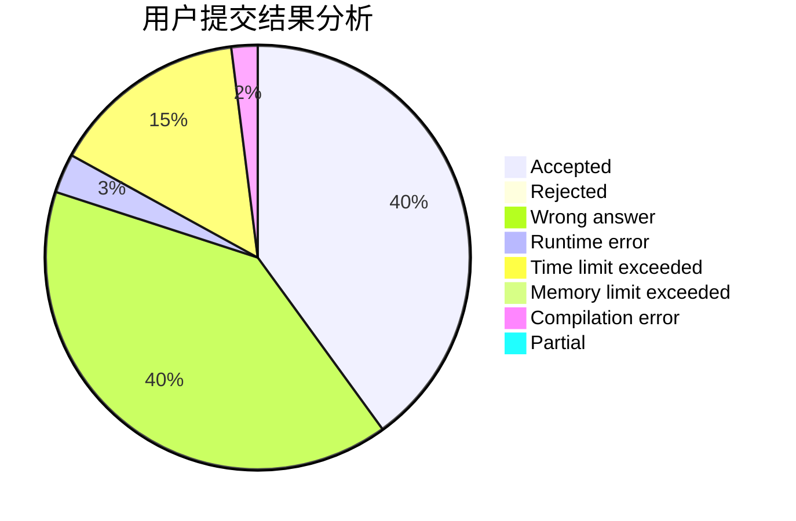
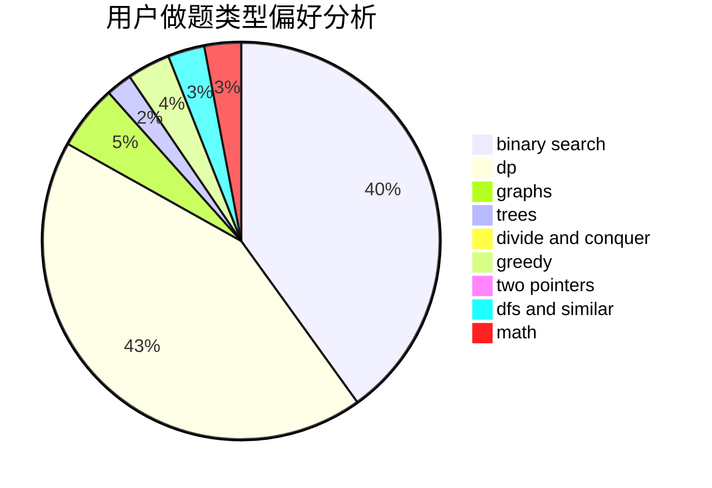

# BillDeng

<!-- tabs:start -->

#### **用户提交结果分析**

#### **用户做题类型偏好分析**

<!-- tabs:end -->
# 推荐题目
[555C](https://codeforces.com/contest/555/problem/C)
[27A](https://codeforces.com/contest/27/problem/A)
[554A](https://codeforces.com/contest/554/problem/A)
[496E](https://codeforces.com/contest/496/problem/E)
[555D](https://codeforces.com/contest/555/problem/D)
[553E](https://codeforces.com/contest/553/problem/E)
[555B](https://codeforces.com/contest/555/problem/B)
[1486D](https://codeforces.com/contest/1486/problem/D)
[38G](https://codeforces.com/contest/38/problem/G)
[1456C](https://codeforces.com/contest/1456/problem/C)
