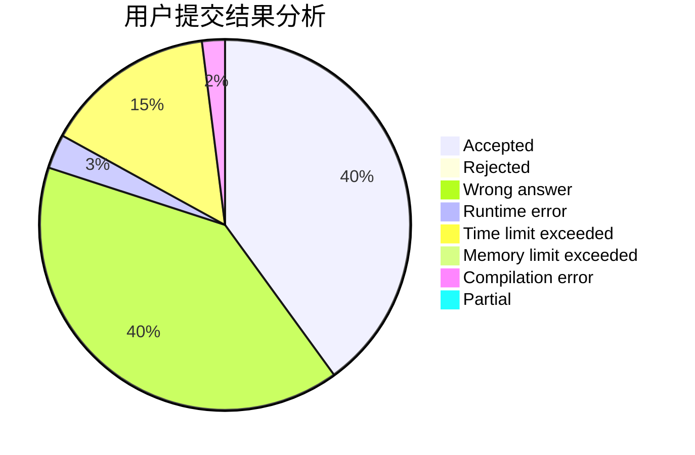
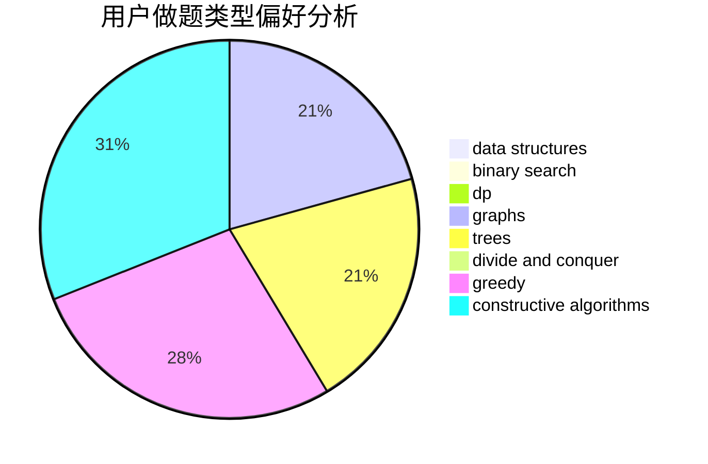

# BillDeng

<!-- tabs:start -->

#### **用户提交结果分析**

#### **用户做题类型偏好分析**

#### **用户错题知识点分析**

<!-- tabs:end -->
# 推荐题目
[555C](https://codeforces.com/contest/555/problem/C)		data structures		  
[27A](https://codeforces.com/contest/27/problem/A)		implementation,
                        sortings		  
[554A](https://codeforces.com/contest/554/problem/A)		brute force,
                        math,
                        strings		  
[496E](https://codeforces.com/contest/496/problem/E)		greedy,
                        sortings		  
[555D](https://codeforces.com/contest/555/problem/D)		binary search,
                        implementation,
                        math		  
[553E](https://codeforces.com/contest/553/problem/E)		dp,
                        fft,
                        graphs,
                        math,
                        probabilities		  
[555B](https://codeforces.com/contest/555/problem/B)		data structures,
                        greedy,
                        sortings		  
[1486D](https://codeforces.com/contest/1486/problem/D)		binary search,
                        data structures,
                        dp		  
[38G](https://codeforces.com/contest/38/problem/G)		data structures		  
[1456C](https://codeforces.com/contest/1456/problem/C)		dsu,graphs,sortings,trees		  
