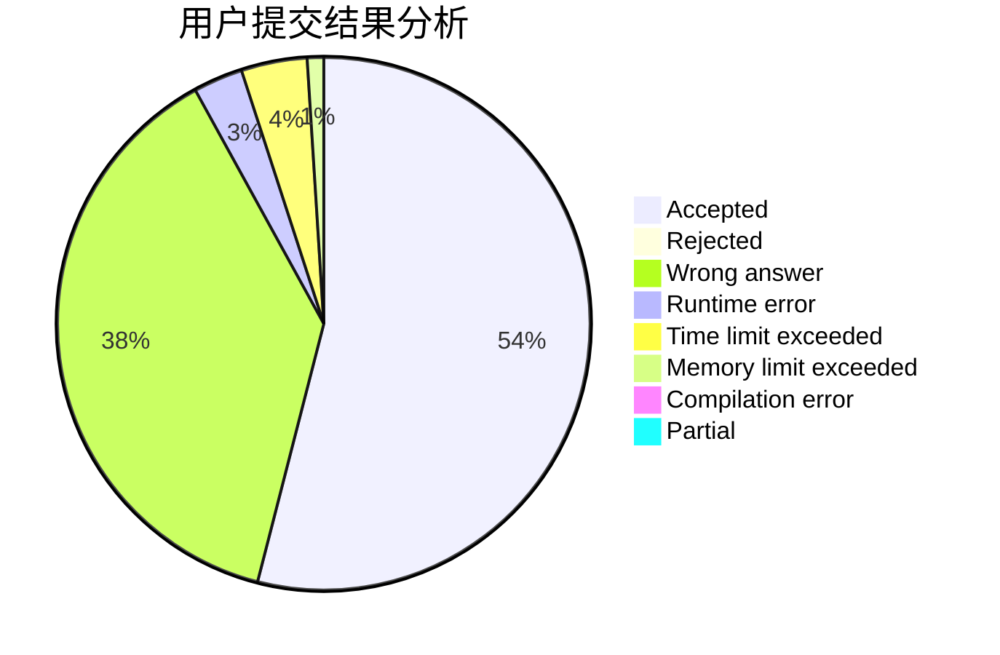
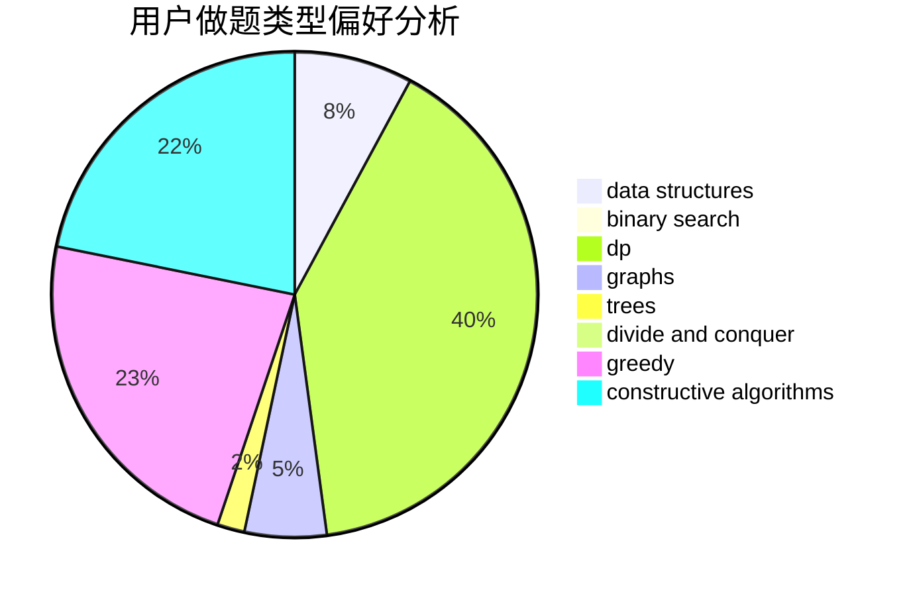

# linbinwu

<!-- tabs:start -->

#### **用户提交结果分析**

#### **用户做题类型偏好分析**

#### **用户错题知识点分析**

<!-- tabs:end -->
# 推荐题目
[677C](https://codeforces.com/contest/677/problem/C)		bitmasks,
                        combinatorics,
                        implementation,
                        strings		  
[1104C](https://codeforces.com/contest/1104/problem/C)		dsu,graphs,sortings,trees		  
[392A](https://codeforces.com/contest/392/problem/A)		math		  
[1062A](https://codeforces.com/contest/1062/problem/A)		greedy,
                        implementation		  
[100A](https://codeforces.com/contest/100/problem/A)		*special problem,
                        implementation		  
[868F](https://codeforces.com/contest/868/problem/F)		divide and conquer,
                        dp		  
[660D](https://codeforces.com/contest/660/problem/D)		geometry		  
[1111E](https://codeforces.com/contest/1111/problem/E)		data structures,
                        dfs and similar,
                        dp,
                        graphs,
                        trees		  
[1016E](https://codeforces.com/contest/1016/problem/E)		binary search,
                        geometry		  
[729C](https://codeforces.com/contest/729/problem/C)		binary search,
                        greedy,
                        sortings		  
