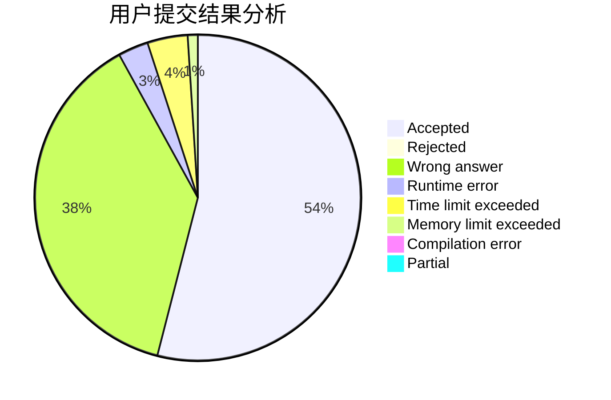
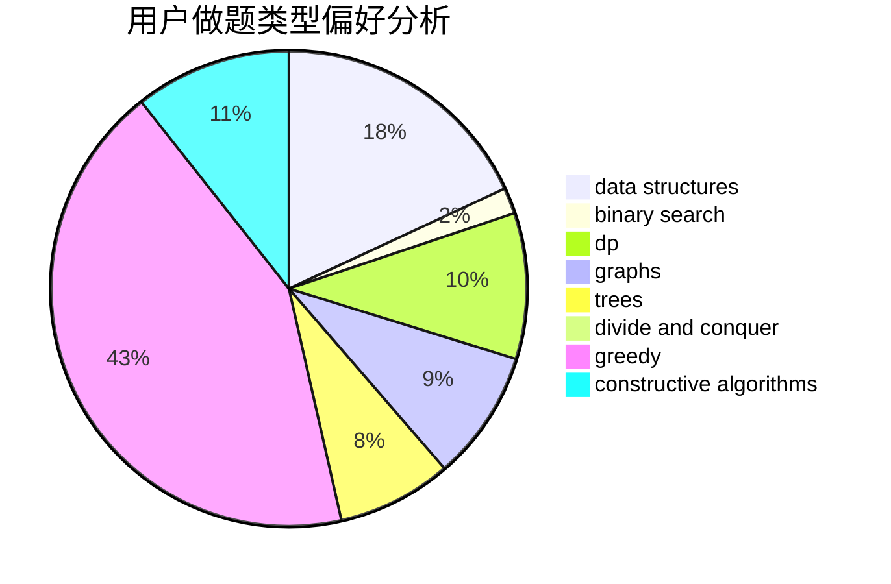

# linbinwu

<!-- tabs:start -->

#### **用户提交结果分析**

#### **用户做题类型偏好分析**

#### **用户错题知识点分析**

<!-- tabs:end -->
# 推荐题目
[653C](https://codeforces.com/contest/653/problem/C)		brute force,
                        implementation		  
[1103E](https://codeforces.com/contest/1103/problem/E)		fft,
                        math,
                        number theory		  
[364D](https://codeforces.com/contest/364/problem/D)		brute force,
                        math,
                        probabilities		  
[1061C](https://codeforces.com/contest/1061/problem/C)		data structures,
                        dp,
                        implementation,
                        math,
                        number theory		  
[1009E](https://codeforces.com/contest/1009/problem/E)		combinatorics,
                        math,
                        probabilities		  
[84C](https://codeforces.com/contest/84/problem/C)		binary search,
                        implementation		  
[630I](https://codeforces.com/contest/630/problem/I)		combinatorics,
                        math		  
[1111A](https://codeforces.com/contest/1111/problem/A)		implementation,
                        strings		  
[1016B](https://codeforces.com/contest/1016/problem/B)		brute force,
                        implementation		  
[709B](https://codeforces.com/contest/709/problem/B)		greedy,
                        implementation,
                        sortings		  
