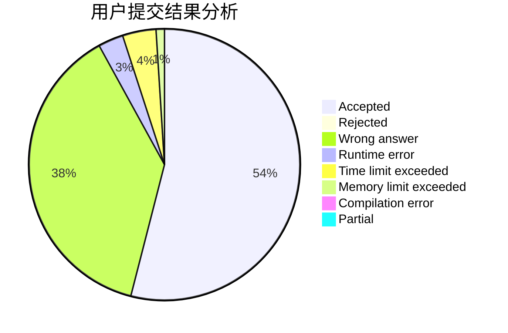
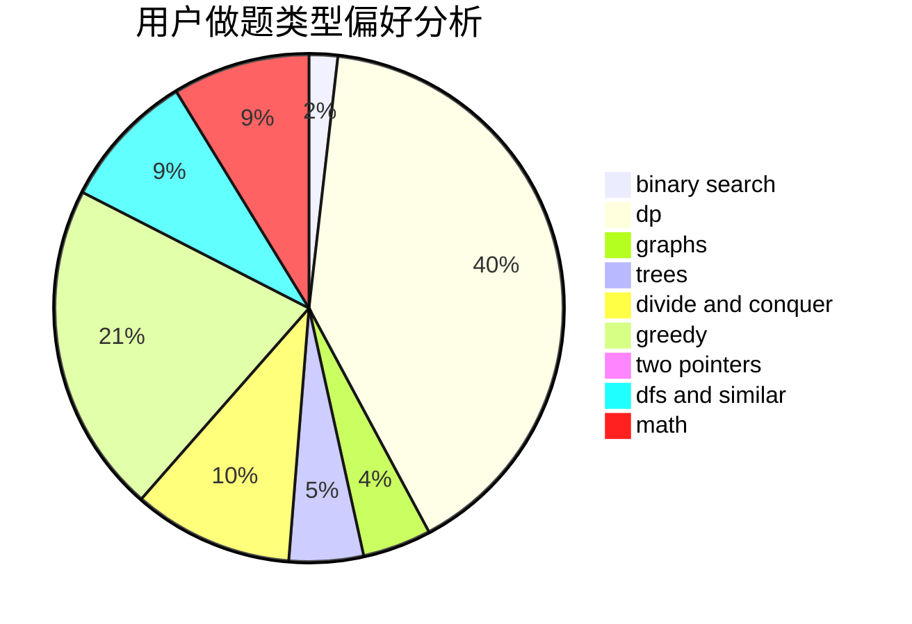

# linbinwu

<!-- tabs:start -->

#### **用户提交结果分析**

#### **用户做题类型偏好分析**

<!-- tabs:end -->
# 推荐题目
[677C](https://codeforces.com/contest/677/problem/C)
[1104C](https://codeforces.com/contest/1104/problem/C)
[392A](https://codeforces.com/contest/392/problem/A)
[1062A](https://codeforces.com/contest/1062/problem/A)
[100A](https://codeforces.com/contest/100/problem/A)
[868F](https://codeforces.com/contest/868/problem/F)
[660D](https://codeforces.com/contest/660/problem/D)
[1111E](https://codeforces.com/contest/1111/problem/E)
[1016E](https://codeforces.com/contest/1016/problem/E)
[729C](https://codeforces.com/contest/729/problem/C)
