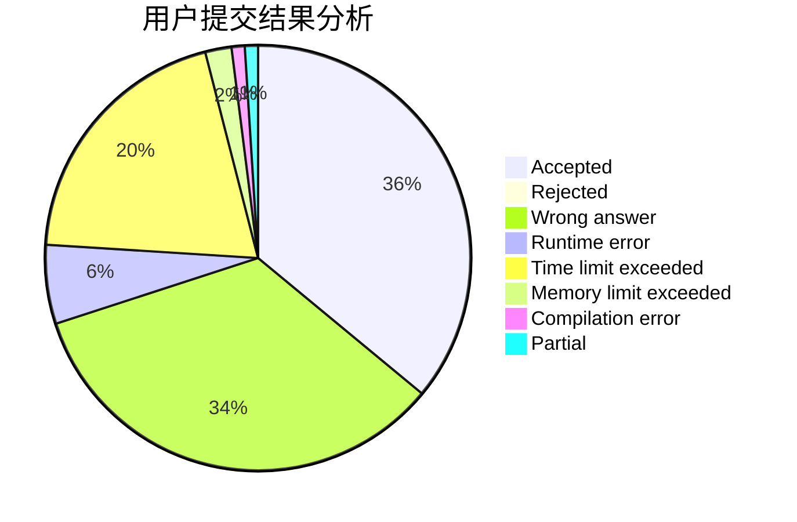
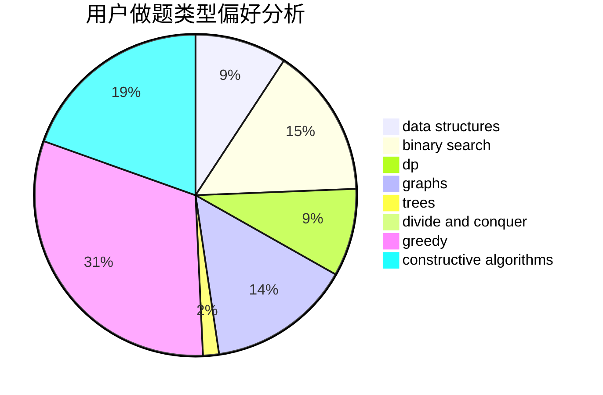
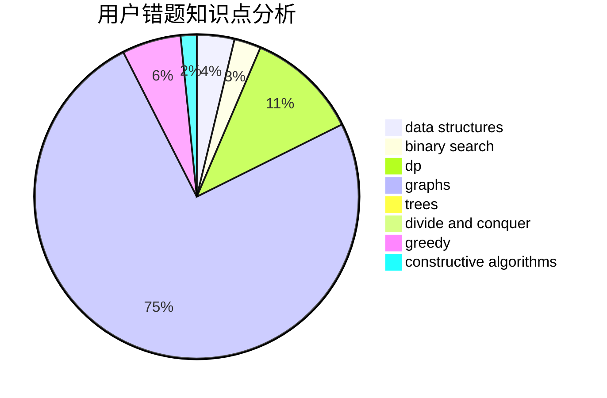

# lindongli2004

<!-- tabs:start -->

#### **用户提交结果分析**

#### **用户做题类型偏好分析**

#### **用户错题知识点分析**

<!-- tabs:end -->
# 推荐题目
[1162E](https://codeforces.com/contest/1162/problem/E)		dsu,graphs,sortings,trees		  
[477D](https://codeforces.com/contest/477/problem/D)		dp,
                        strings		  
[1143F](https://codeforces.com/contest/1143/problem/F)		dsu,graphs,sortings,trees		  
[611F](https://codeforces.com/contest/611/problem/F)		binary search,
                        implementation		  
[1034D](https://codeforces.com/contest/1034/problem/D)		binary search,
                        data structures,
                        two pointers		  
[1385F](https://codeforces.com/contest/1385/problem/F)		data structures,
                        greedy,
                        implementation,
                        trees		  
[158A](https://codeforces.com/contest/158/problem/A)		*special problem,
                        implementation		  
[1488H](https://codeforces.com/contest/1488/problem/H)		*special problem,
                        combinatorics,
                        data structures		  
[545B](https://codeforces.com/contest/545/problem/B)		greedy		  
[421B](https://codeforces.com/contest/421/problem/B)		dsu,graphs,sortings,trees		  
