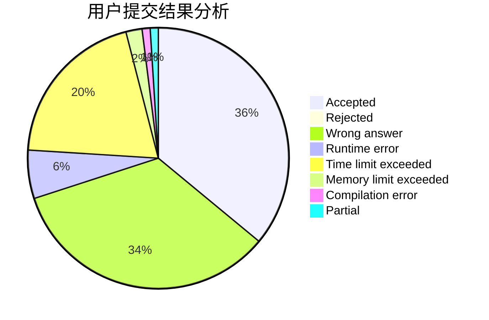
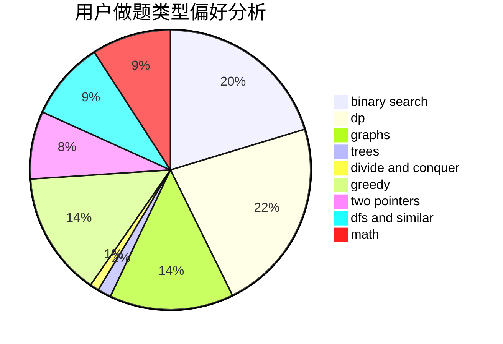

# lindongli2004

<!-- tabs:start -->

#### **用户提交结果分析**

#### **用户做题类型偏好分析**

<!-- tabs:end -->
# 推荐题目
[1164M](https://codeforces.com/contest/1164/problem/M)
[497D](https://codeforces.com/contest/497/problem/D)
[1146A](https://codeforces.com/contest/1146/problem/A)
[630J](https://codeforces.com/contest/630/problem/J)
[1036B](https://codeforces.com/contest/1036/problem/B)
[1395F](https://codeforces.com/contest/1395/problem/F)
[17C](https://codeforces.com/contest/17/problem/C)
[1496F](https://codeforces.com/contest/1496/problem/F)
[56B](https://codeforces.com/contest/56/problem/B)
[446D](https://codeforces.com/contest/446/problem/D)
