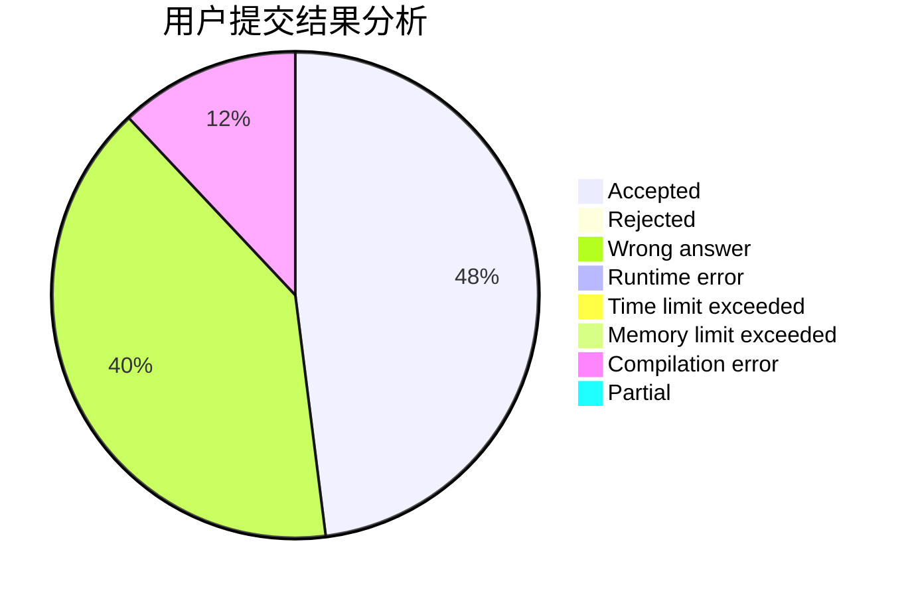
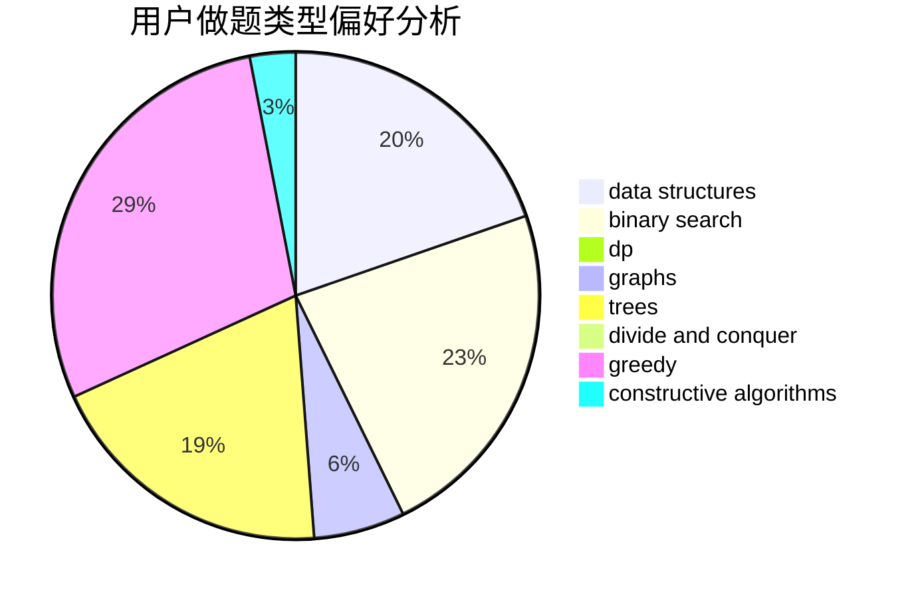
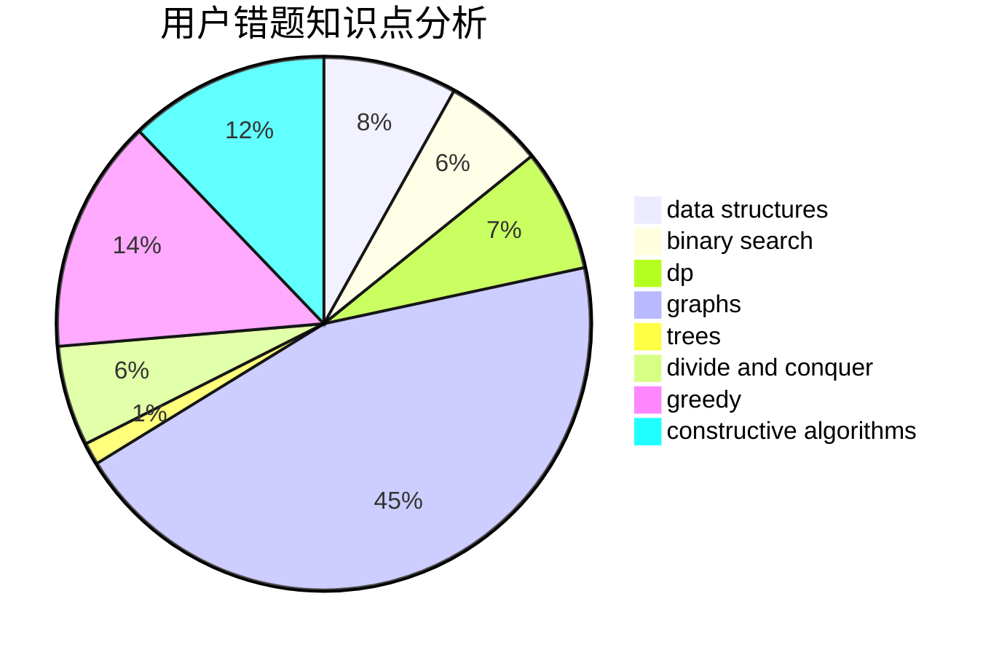

# lingyuqi

<!-- tabs:start -->

#### **用户提交结果分析**

#### **用户做题类型偏好分析**

#### **用户错题知识点分析**

<!-- tabs:end -->
# 推荐题目
[200C](https://codeforces.com/contest/200/problem/C)		brute force,
                        implementation		  
[166C](https://codeforces.com/contest/166/problem/C)		greedy,
                        math,
                        sortings		  
[30E](https://codeforces.com/contest/30/problem/E)		binary search,
                        constructive algorithms,
                        data structures,
                        greedy,
                        hashing,
                        strings		  
[1162C](https://codeforces.com/contest/1162/problem/C)		dsu,graphs,sortings,trees		  
[234A](https://codeforces.com/contest/234/problem/A)		implementation		  
[1104C](https://codeforces.com/contest/1104/problem/C)		dsu,graphs,sortings,trees		  
[1075A](https://codeforces.com/contest/1075/problem/A)		implementation,
                        math		  
[1196B](https://codeforces.com/contest/1196/problem/B)		constructive algorithms,
                        math		  
[386C](https://codeforces.com/contest/386/problem/C)		dp,
                        strings,
                        two pointers		  
[602A](https://codeforces.com/contest/602/problem/A)		brute force,
                        implementation		  
