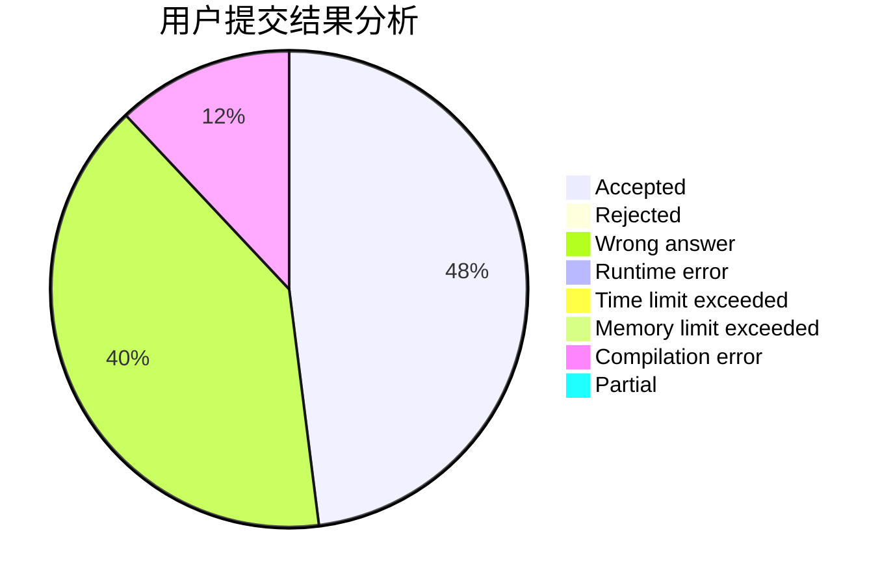
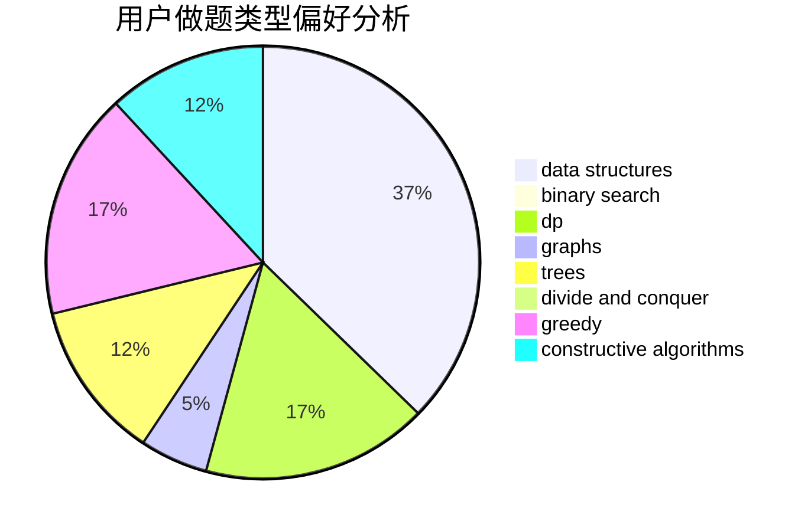
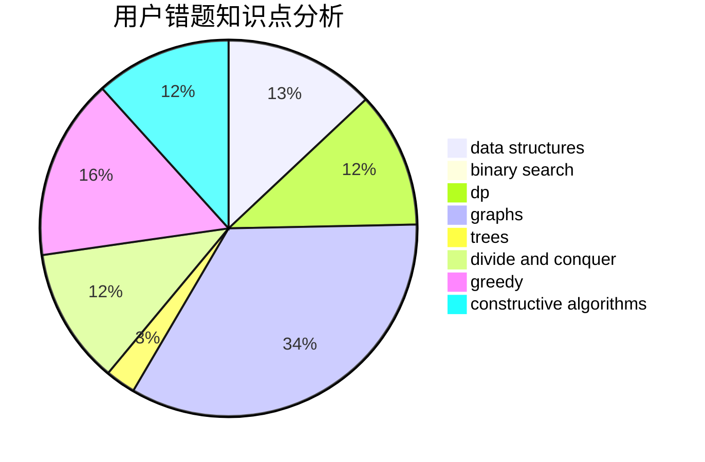

# lingyuqi

<!-- tabs:start -->

#### **用户提交结果分析**

#### **用户做题类型偏好分析**

#### **用户错题知识点分析**

<!-- tabs:end -->
# 推荐题目
[225E](https://codeforces.com/contest/225/problem/E)		math,
                        number theory		  
[193A](https://codeforces.com/contest/193/problem/A)		constructive algorithms,
                        graphs,
                        trees		  
[333E](https://codeforces.com/contest/333/problem/E)		binary search,
                        bitmasks,
                        brute force,
                        geometry,
                        sortings		  
[1164J](https://codeforces.com/contest/1164/problem/J)		dsu,graphs,sortings,trees		  
[255E](https://codeforces.com/contest/255/problem/E)		games,
                        implementation,
                        math		  
[1105A](https://codeforces.com/contest/1105/problem/A)		brute force,
                        implementation		  
[1076C](https://codeforces.com/contest/1076/problem/C)		binary search,
                        math		  
[11C](https://codeforces.com/contest/11/problem/C)		implementation		  
[416C](https://codeforces.com/contest/416/problem/C)		binary search,
                        dp,
                        greedy,
                        implementation		  
[621B](https://codeforces.com/contest/621/problem/B)		combinatorics,
                        implementation		  
