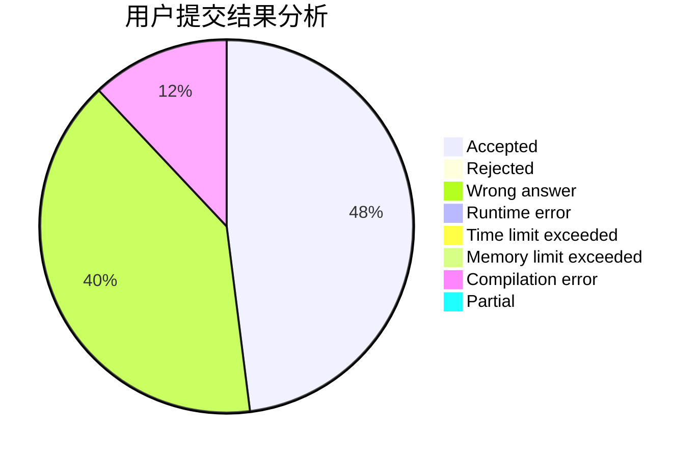
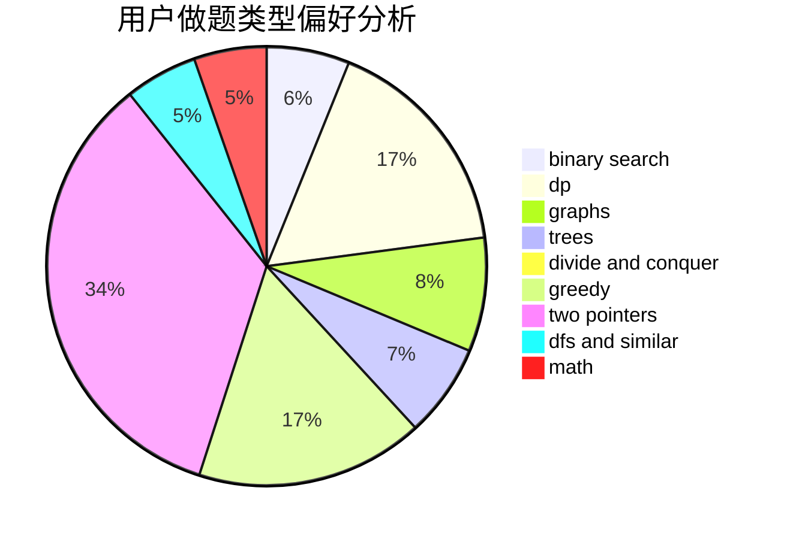

# lingyuqi

<!-- tabs:start -->

#### **用户提交结果分析**

#### **用户做题类型偏好分析**

<!-- tabs:end -->
# 推荐题目
[225E](https://codeforces.com/contest/225/problem/E)
[193A](https://codeforces.com/contest/193/problem/A)
[333E](https://codeforces.com/contest/333/problem/E)
[1164J](https://codeforces.com/contest/1164/problem/J)
[255E](https://codeforces.com/contest/255/problem/E)
[1105A](https://codeforces.com/contest/1105/problem/A)
[1076C](https://codeforces.com/contest/1076/problem/C)
[11C](https://codeforces.com/contest/11/problem/C)
[416C](https://codeforces.com/contest/416/problem/C)
[621B](https://codeforces.com/contest/621/problem/B)
