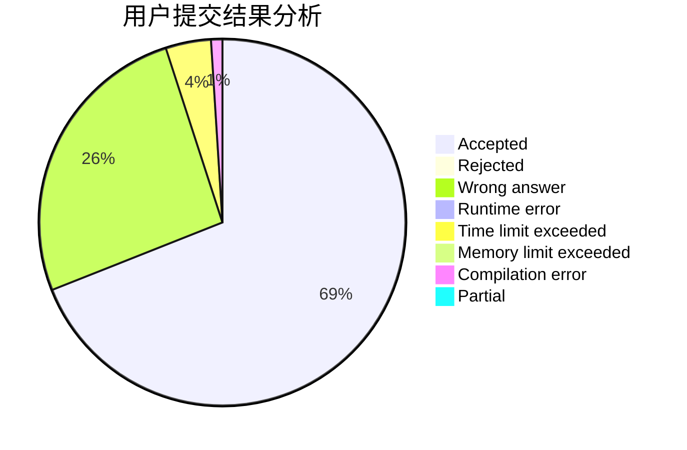
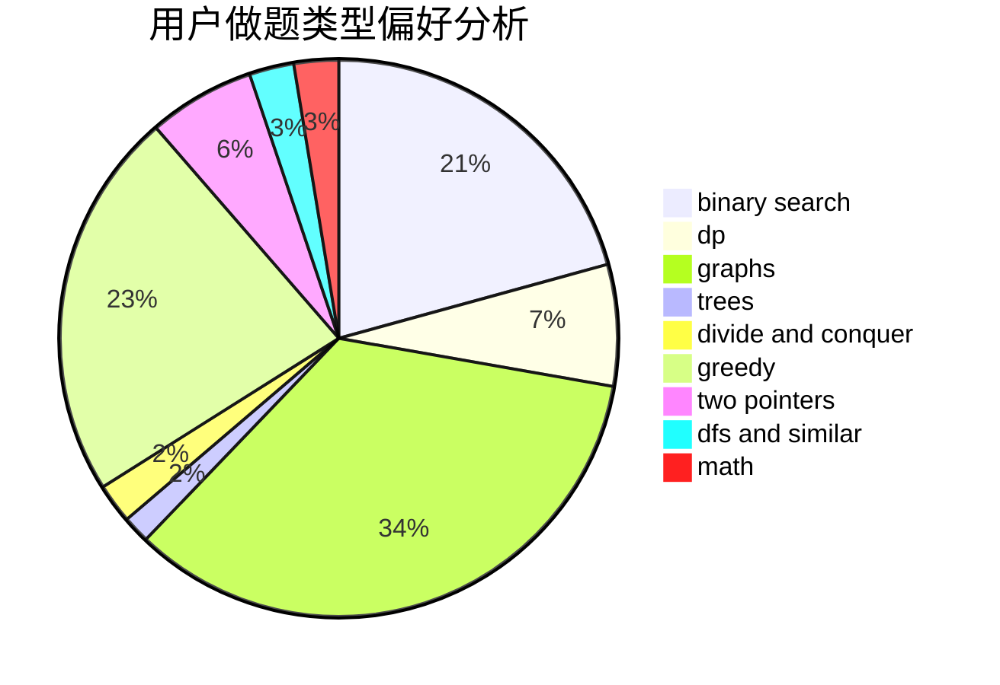

# liningyuan19

<!-- tabs:start -->

#### **用户提交结果分析**

#### **用户做题类型偏好分析**

<!-- tabs:end -->
# 推荐题目
[1404C](https://codeforces.com/contest/1404/problem/C)
[1261E](https://codeforces.com/contest/1261/problem/E)
[966C](https://codeforces.com/contest/966/problem/C)
[521A](https://codeforces.com/contest/521/problem/A)
[676C](https://codeforces.com/contest/676/problem/C)
[45G](https://codeforces.com/contest/45/problem/G)
[810A](https://codeforces.com/contest/810/problem/A)
[618A](https://codeforces.com/contest/618/problem/A)
[542D](https://codeforces.com/contest/542/problem/D)
[1020E](https://codeforces.com/contest/1020/problem/E)
