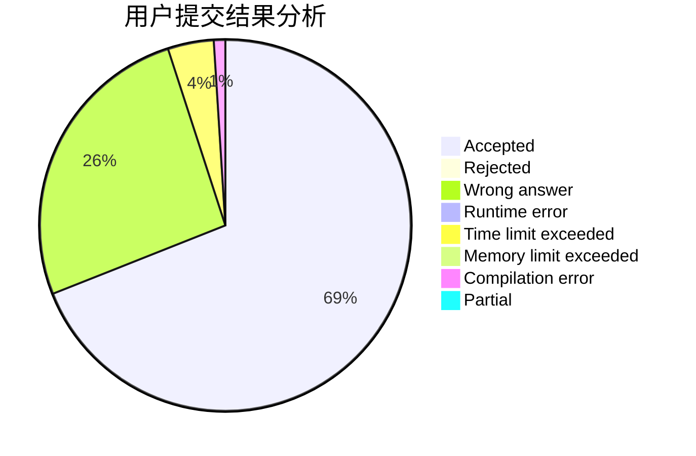
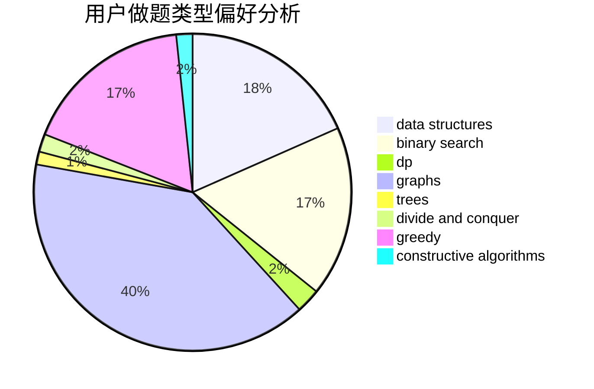
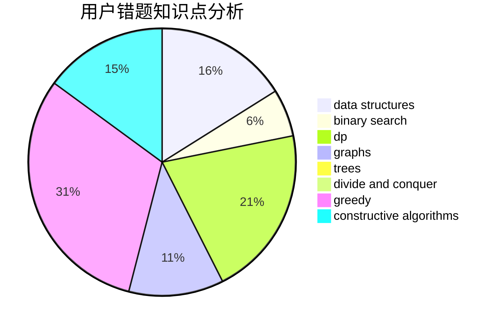

# liningyuan19

<!-- tabs:start -->

#### **用户提交结果分析**

#### **用户做题类型偏好分析**

#### **用户错题知识点分析**

<!-- tabs:end -->
# 推荐题目
[1404C](https://codeforces.com/contest/1404/problem/C)		binary search,
                        constructive algorithms,
                        data structures,
                        greedy,
                        two pointers		  
[1261E](https://codeforces.com/contest/1261/problem/E)		dsu,graphs,sortings,trees		  
[966C](https://codeforces.com/contest/966/problem/C)		dsu,graphs,sortings,trees		  
[521A](https://codeforces.com/contest/521/problem/A)		dsu,graphs,sortings,trees		  
[676C](https://codeforces.com/contest/676/problem/C)		binary search,
                        dp,
                        strings,
                        two pointers		  
[45G](https://codeforces.com/contest/45/problem/G)		number theory		  
[810A](https://codeforces.com/contest/810/problem/A)		implementation,
                        math		  
[618A](https://codeforces.com/contest/618/problem/A)		implementation		  
[542D](https://codeforces.com/contest/542/problem/D)		dfs and similar,
                        dp,
                        hashing,
                        math,
                        number theory		  
[1020E](https://codeforces.com/contest/1020/problem/E)		dsu,graphs,sortings,trees		  
