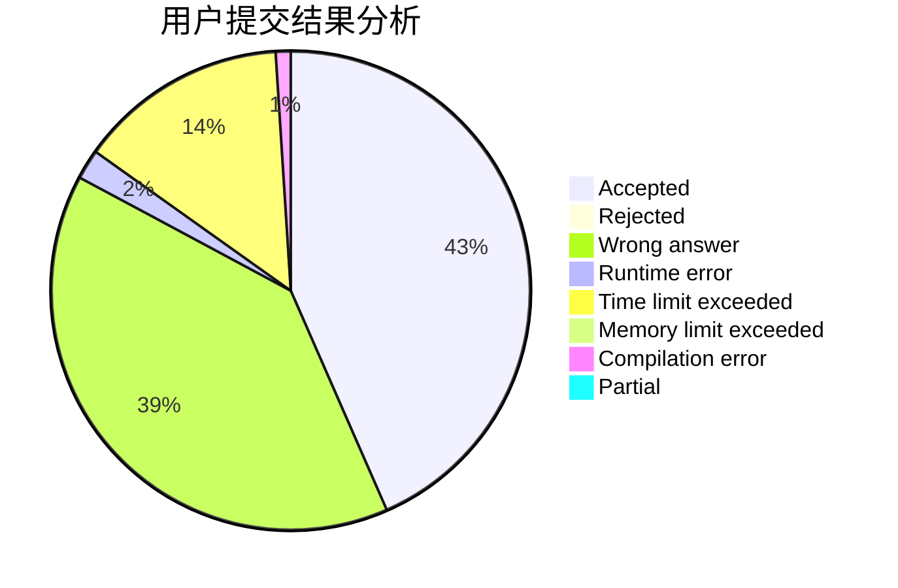
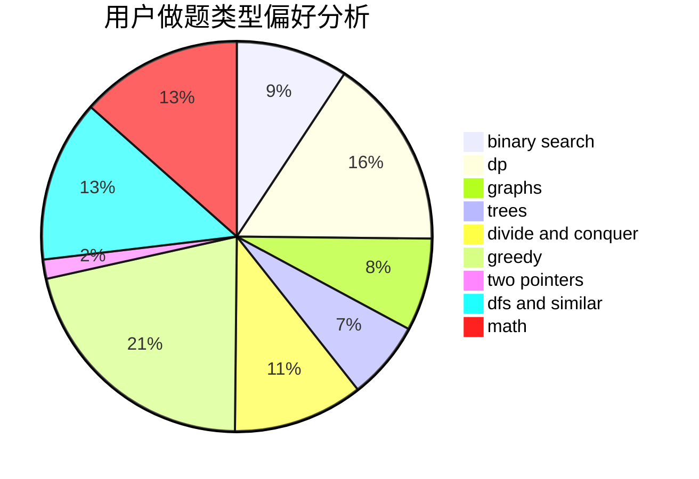

# linkfqy

<!-- tabs:start -->

#### **用户提交结果分析**

#### **用户做题类型偏好分析**

<!-- tabs:end -->
# 推荐题目
[1345C](https://codeforces.com/contest/1345/problem/C)
[1486E](https://codeforces.com/contest/1486/problem/E)
[1490D](https://codeforces.com/contest/1490/problem/D)
[725A](https://codeforces.com/contest/725/problem/A)
[1091H](https://codeforces.com/contest/1091/problem/H)
[437A](https://codeforces.com/contest/437/problem/A)
[512A](https://codeforces.com/contest/512/problem/A)
[1075A](https://codeforces.com/contest/1075/problem/A)
[668C](https://codeforces.com/contest/668/problem/C)
[1040D](https://codeforces.com/contest/1040/problem/D)
