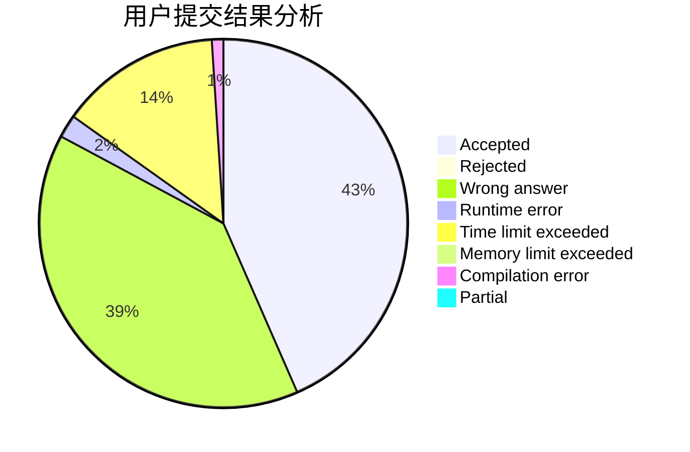
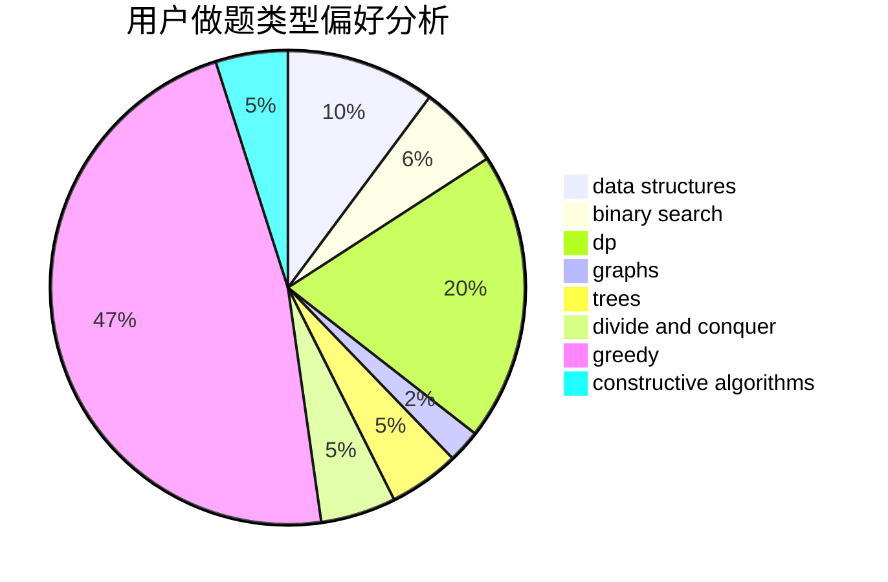

# linkfqy

<!-- tabs:start -->

#### **用户提交结果分析**

#### **用户做题类型偏好分析**

#### **用户错题知识点分析**

<!-- tabs:end -->
# 推荐题目
[1345C](https://codeforces.com/contest/1345/problem/C)		dsu,graphs,sortings,trees		  
[1486E](https://codeforces.com/contest/1486/problem/E)		binary search,
                        brute force,
                        constructive algorithms,
                        dp,
                        flows,
                        graphs,
                        shortest paths		  
[1490D](https://codeforces.com/contest/1490/problem/D)		dfs and similar,
                        divide and conquer,
                        implementation		  
[725A](https://codeforces.com/contest/725/problem/A)		implementation		  
[1091H](https://codeforces.com/contest/1091/problem/H)		games		  
[437A](https://codeforces.com/contest/437/problem/A)		implementation		  
[512A](https://codeforces.com/contest/512/problem/A)		dsu,graphs,sortings,trees		  
[1075A](https://codeforces.com/contest/1075/problem/A)		implementation,
                        math		  
[668C](https://codeforces.com/contest/668/problem/C)		dsu,graphs,sortings,trees		  
[1040D](https://codeforces.com/contest/1040/problem/D)		dsu,graphs,sortings,trees		  
