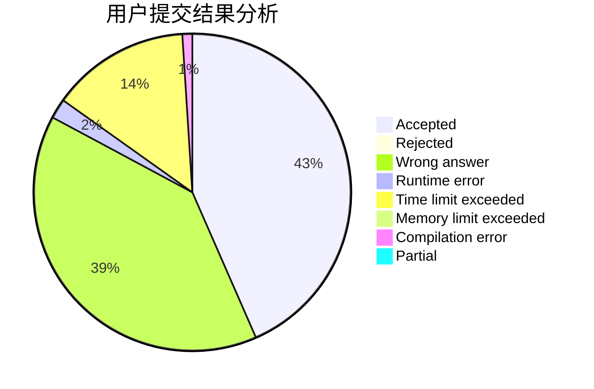
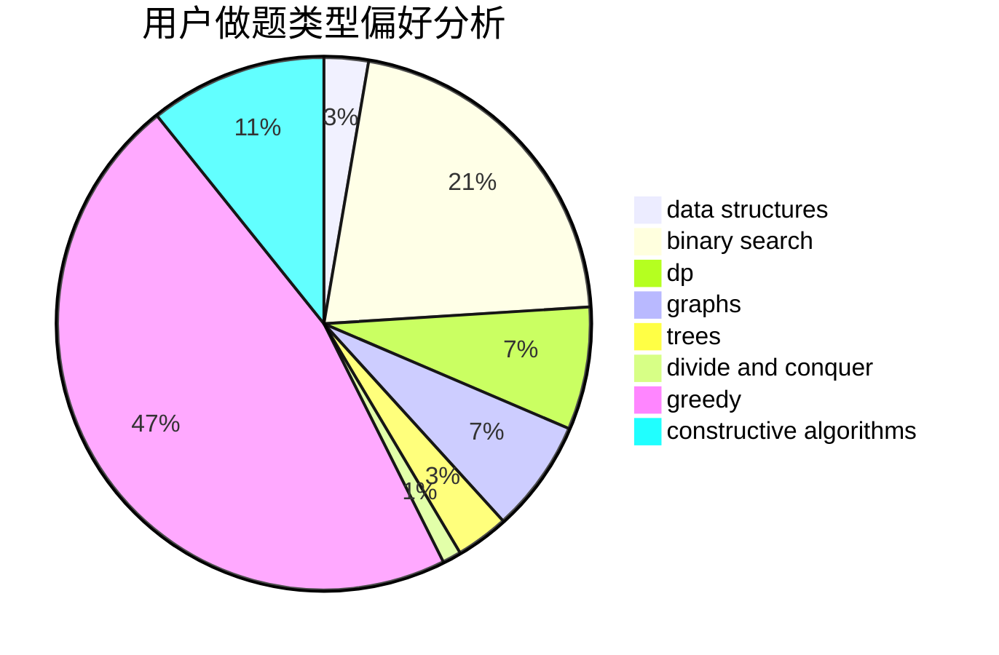
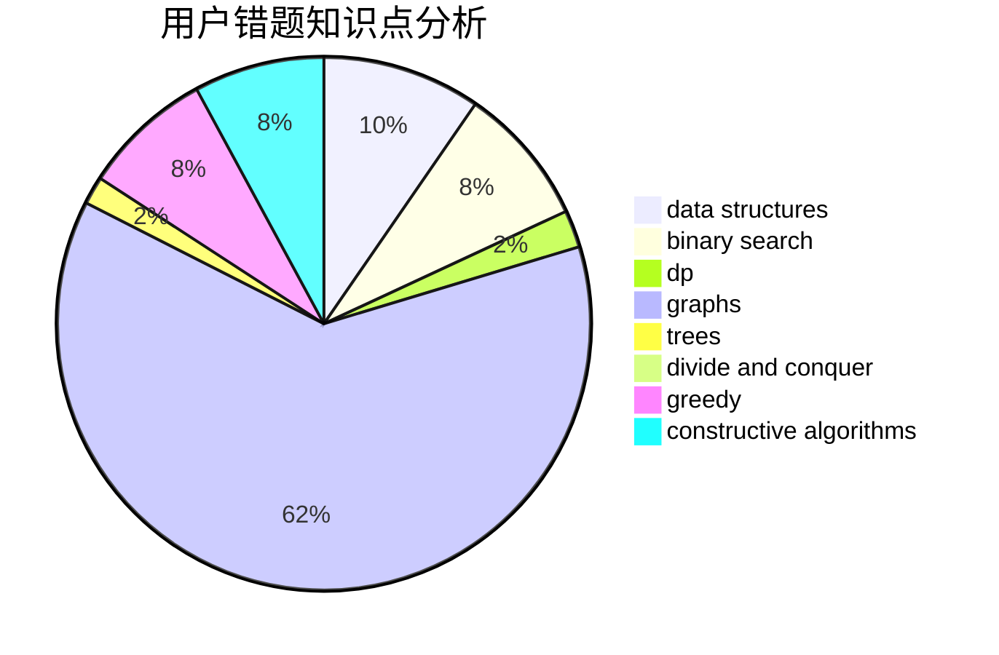

# linkfqy

<!-- tabs:start -->

#### **用户提交结果分析**

#### **用户做题类型偏好分析**

#### **用户错题知识点分析**

<!-- tabs:end -->
# 推荐题目
[1338B](https://codeforces.com/contest/1338/problem/B)		bitmasks,
                        constructive algorithms,
                        dfs and similar,
                        greedy,
                        math,
                        trees		  
[1478A](https://codeforces.com/contest/1478/problem/A)		brute force,
                        greedy		  
[1482F](https://codeforces.com/contest/1482/problem/F)		graphs,
                        shortest paths		  
[706D](https://codeforces.com/contest/706/problem/D)		binary search,
                        bitmasks,
                        data structures,
                        trees		  
[1091E](https://codeforces.com/contest/1091/problem/E)		binary search,
                        data structures,
                        graphs,
                        greedy,
                        implementation,
                        math,
                        sortings		  
[409G](https://codeforces.com/contest/409/problem/G)		*special problem,
                        geometry		  
[491B](https://codeforces.com/contest/491/problem/B)		greedy,
                        math		  
[1074A](https://codeforces.com/contest/1074/problem/A)		dsu,graphs,sortings,trees		  
[638C](https://codeforces.com/contest/638/problem/C)		*special problem,
                        dfs and similar,
                        graphs,
                        greedy,
                        trees		  
[103E](https://codeforces.com/contest/103/problem/E)		flows,
                        graph matchings		  
