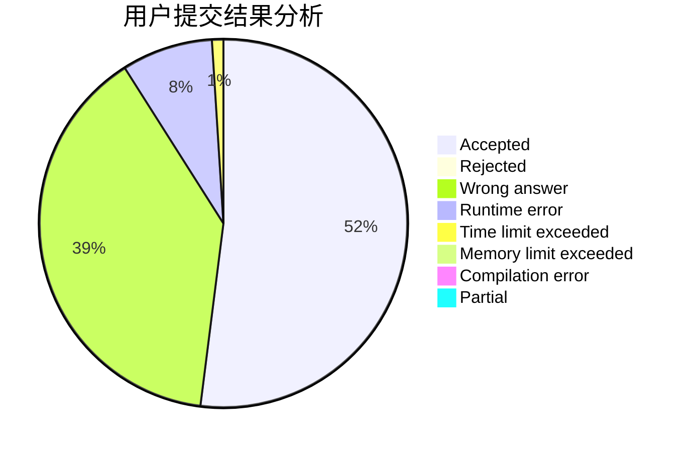
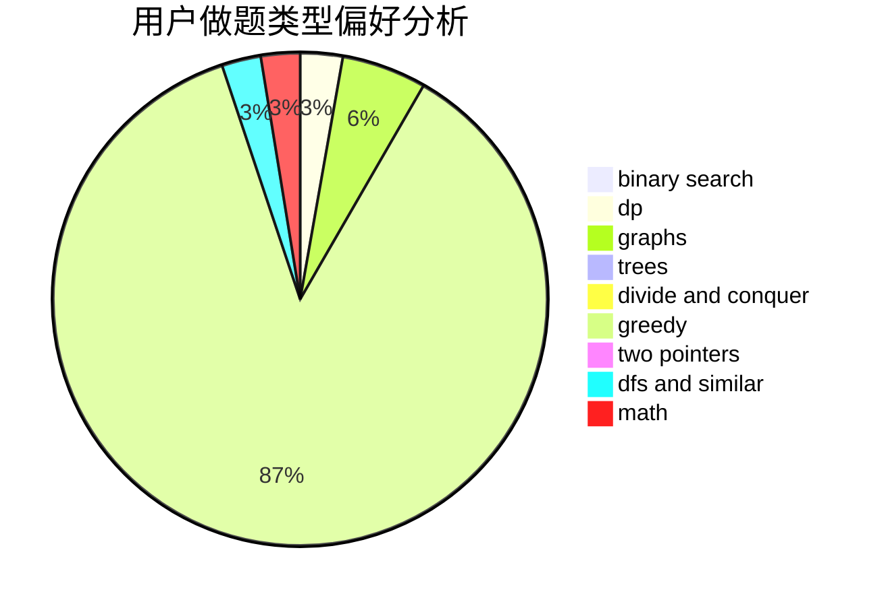

# linxilinxi

<!-- tabs:start -->

#### **用户提交结果分析**

#### **用户做题类型偏好分析**

<!-- tabs:end -->
# 推荐题目
[364C](https://codeforces.com/contest/364/problem/C)
[212A](https://codeforces.com/contest/212/problem/A)
[1162E](https://codeforces.com/contest/1162/problem/E)
[218B](https://codeforces.com/contest/218/problem/B)
[864D](https://codeforces.com/contest/864/problem/D)
[280D](https://codeforces.com/contest/280/problem/D)
[597C](https://codeforces.com/contest/597/problem/C)
[1180D](https://codeforces.com/contest/1180/problem/D)
[1145C](https://codeforces.com/contest/1145/problem/C)
[266A](https://codeforces.com/contest/266/problem/A)
