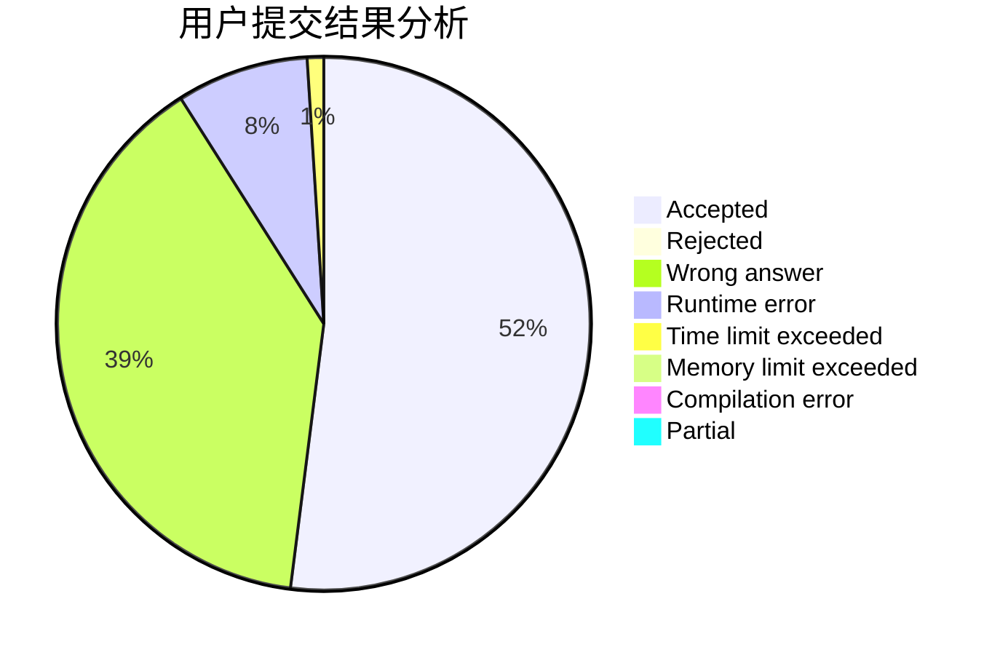
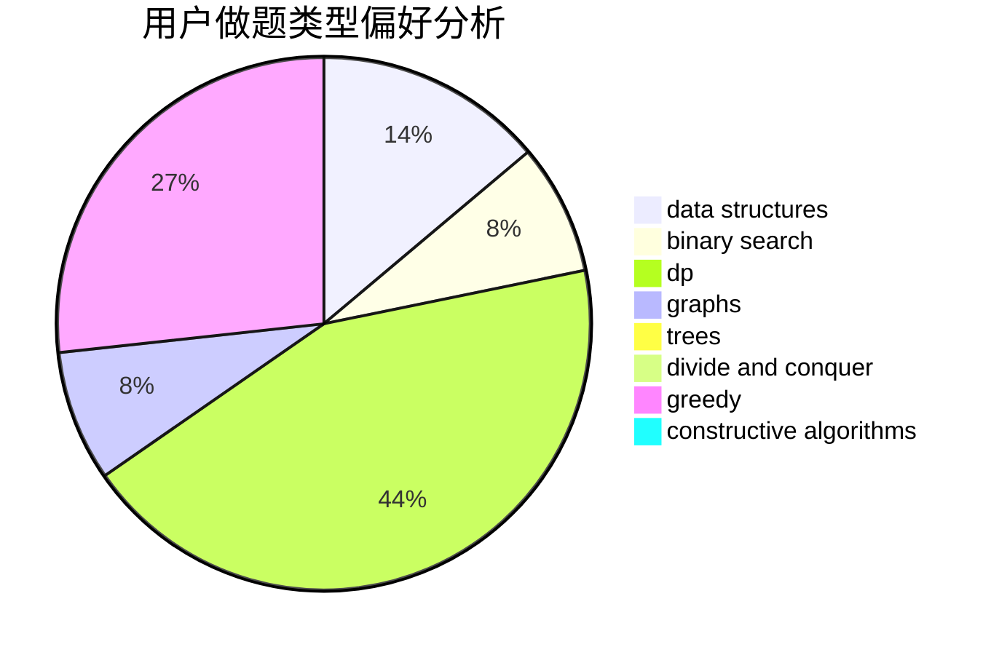
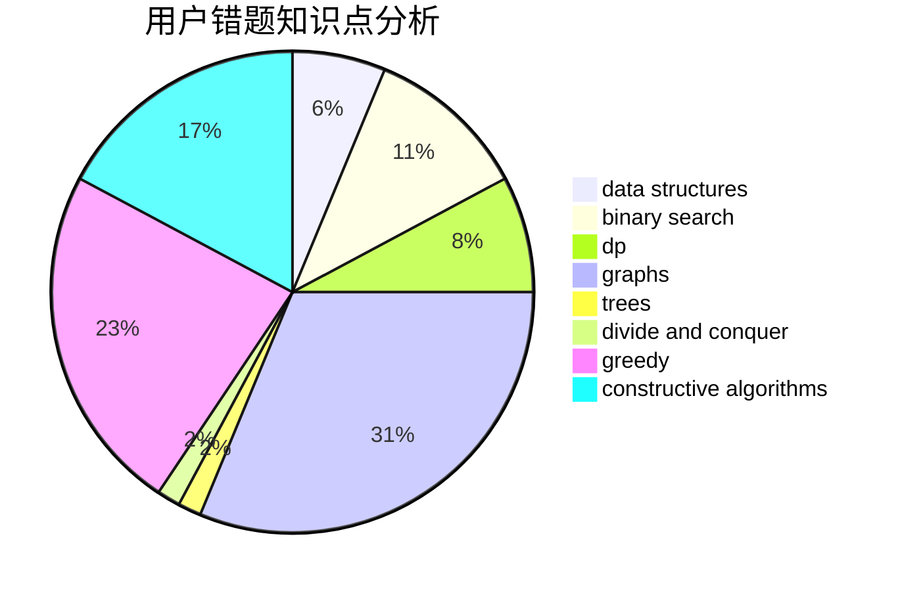

# linxilinxi

<!-- tabs:start -->

#### **用户提交结果分析**

#### **用户做题类型偏好分析**

#### **用户错题知识点分析**

<!-- tabs:end -->
# 推荐题目
[338D](https://codeforces.com/contest/338/problem/D)		chinese remainder theorem,
                        math,
                        number theory		  
[186C](https://codeforces.com/contest/186/problem/C)		dsu,graphs,sortings,trees		  
[115A](https://codeforces.com/contest/115/problem/A)		dfs and similar,
                        graphs,
                        trees		  
[195B](https://codeforces.com/contest/195/problem/B)		data structures,
                        implementation,
                        math		  
[846B](https://codeforces.com/contest/846/problem/B)		brute force,
                        greedy		  
[264D](https://codeforces.com/contest/264/problem/D)		dp,
                        two pointers		  
[575H](https://codeforces.com/contest/575/problem/H)		combinatorics,
                        number theory		  
[1178E](https://codeforces.com/contest/1178/problem/E)		brute force,
                        constructive algorithms,
                        greedy,
                        strings		  
[1143C](https://codeforces.com/contest/1143/problem/C)		dfs and similar,
                        trees		  
[245A](https://codeforces.com/contest/245/problem/A)		implementation		  
