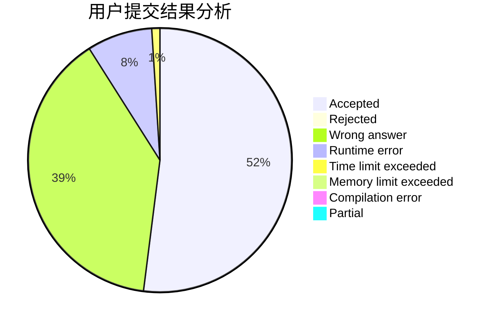
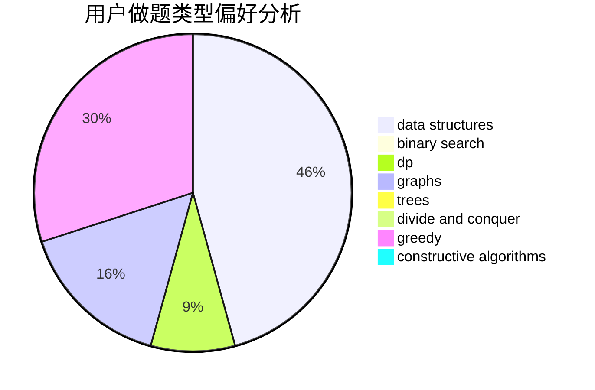
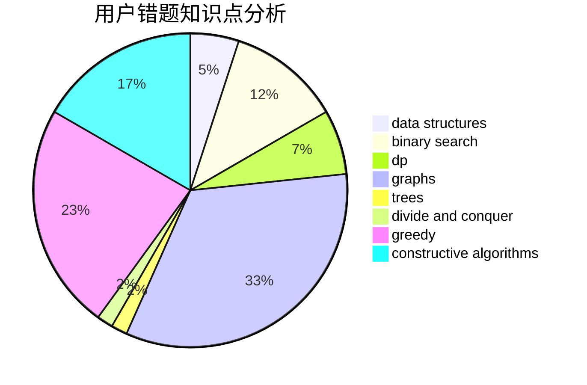

# linxilinxi

<!-- tabs:start -->

#### **用户提交结果分析**

#### **用户做题类型偏好分析**

#### **用户错题知识点分析**

<!-- tabs:end -->
# 推荐题目
[364C](https://codeforces.com/contest/364/problem/C)		brute force,
                        number theory		  
[212A](https://codeforces.com/contest/212/problem/A)		flows,
                        graphs		  
[1162E](https://codeforces.com/contest/1162/problem/E)		dsu,graphs,sortings,trees		  
[218B](https://codeforces.com/contest/218/problem/B)		implementation		  
[864D](https://codeforces.com/contest/864/problem/D)		greedy,
                        implementation,
                        math		  
[280D](https://codeforces.com/contest/280/problem/D)		data structures,
                        flows,
                        graphs,
                        implementation		  
[597C](https://codeforces.com/contest/597/problem/C)		data structures,
                        dp		  
[1180D](https://codeforces.com/contest/1180/problem/D)		dsu,graphs,sortings,trees		  
[1145C](https://codeforces.com/contest/1145/problem/C)		bitmasks,
                        brute force		  
[266A](https://codeforces.com/contest/266/problem/A)		implementation		  
