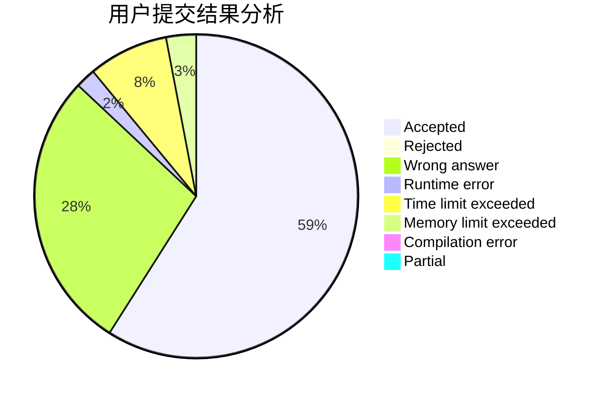
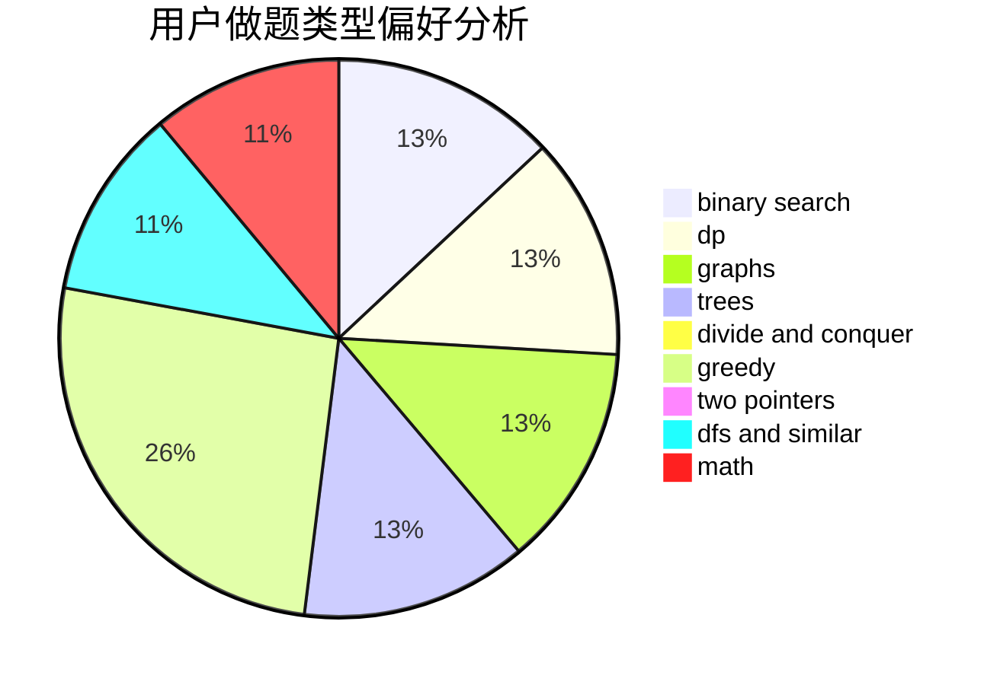

# liouzhou_101

<!-- tabs:start -->

#### **用户提交结果分析**

#### **用户做题类型偏好分析**

<!-- tabs:end -->
# 推荐题目
[1426F](https://codeforces.com/contest/1426/problem/F)
[993E](https://codeforces.com/contest/993/problem/E)
[1384A](https://codeforces.com/contest/1384/problem/A)
[1290F](https://codeforces.com/contest/1290/problem/F)
[738D](https://codeforces.com/contest/738/problem/D)
[603C](https://codeforces.com/contest/603/problem/C)
[608B](https://codeforces.com/contest/608/problem/B)
[1044B](https://codeforces.com/contest/1044/problem/B)
[975E](https://codeforces.com/contest/975/problem/E)
[871E](https://codeforces.com/contest/871/problem/E)
