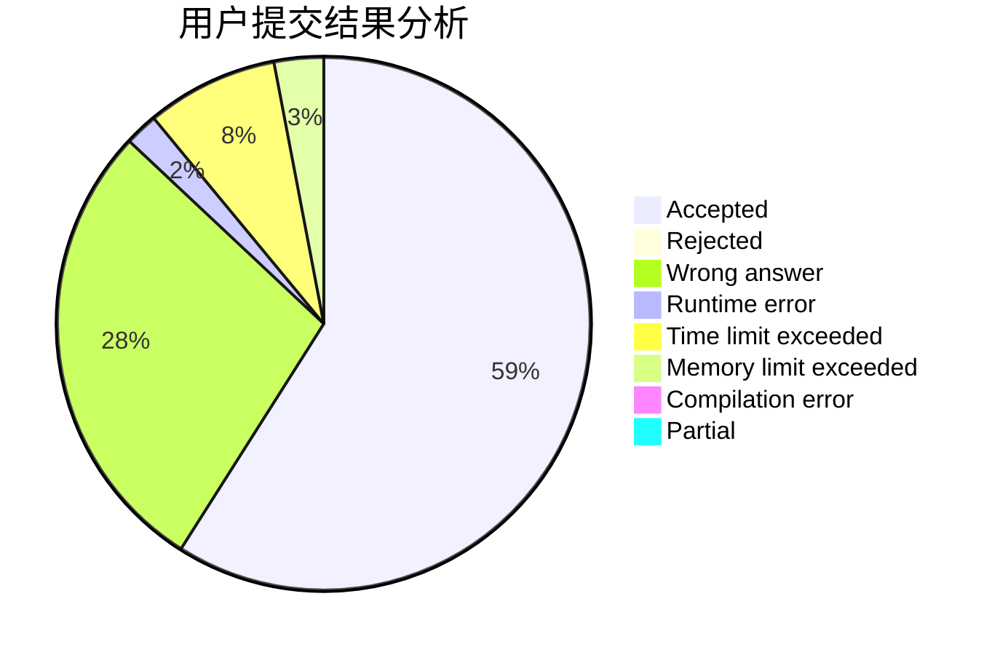
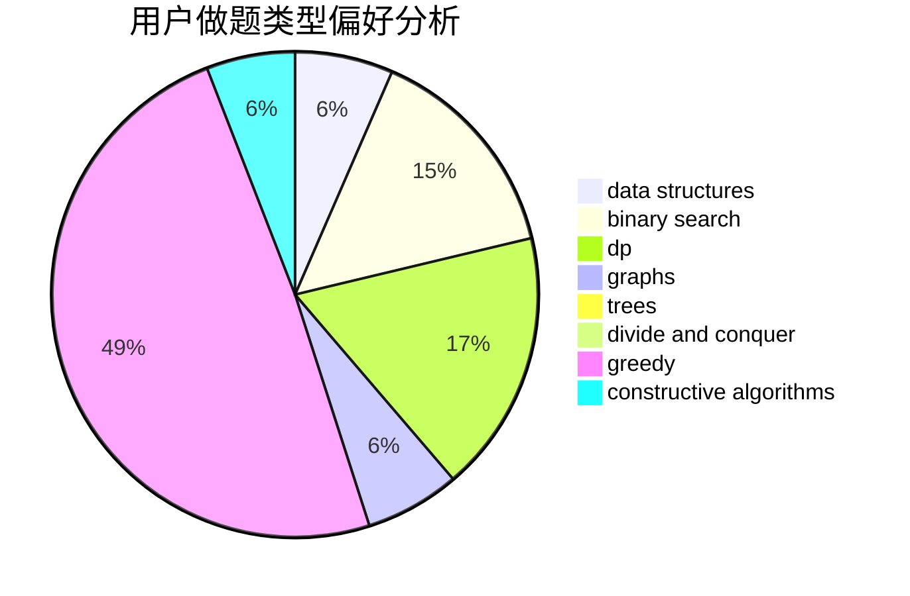
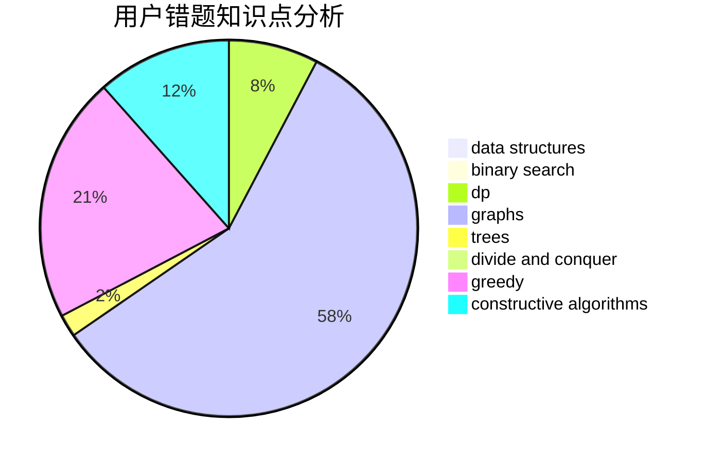

# liouzhou_101

<!-- tabs:start -->

#### **用户提交结果分析**

#### **用户做题类型偏好分析**

#### **用户错题知识点分析**

<!-- tabs:end -->
# 推荐题目
[1419B](https://codeforces.com/contest/1419/problem/B)		brute force,
                        constructive algorithms,
                        greedy,
                        implementation,
                        math		  
[979E](https://codeforces.com/contest/979/problem/E)		dp		  
[1375C](https://codeforces.com/contest/1375/problem/C)		constructive algorithms,
                        data structures,
                        greedy		  
[1283F](https://codeforces.com/contest/1283/problem/F)		constructive algorithms,
                        greedy,
                        trees		  
[721B](https://codeforces.com/contest/721/problem/B)		implementation,
                        math,
                        sortings,
                        strings		  
[582C](https://codeforces.com/contest/582/problem/C)		number theory		  
[587F](https://codeforces.com/contest/587/problem/F)		data structures,
                        strings		  
[1043F](https://codeforces.com/contest/1043/problem/F)		bitmasks,
                        combinatorics,
                        dp,
                        math,
                        number theory,
                        shortest paths		  
[952F](https://codeforces.com/contest/952/problem/F)		nan		  
[853C](https://codeforces.com/contest/853/problem/C)		data structures		  
