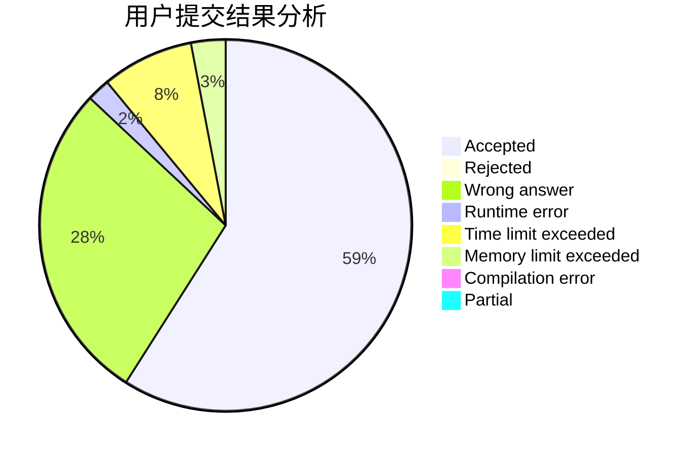
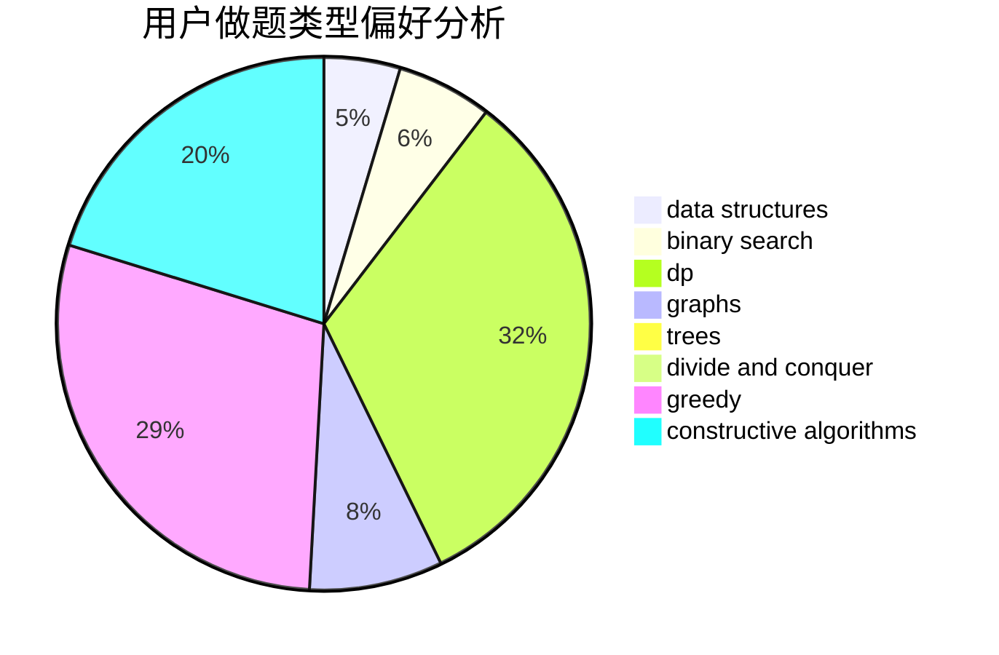
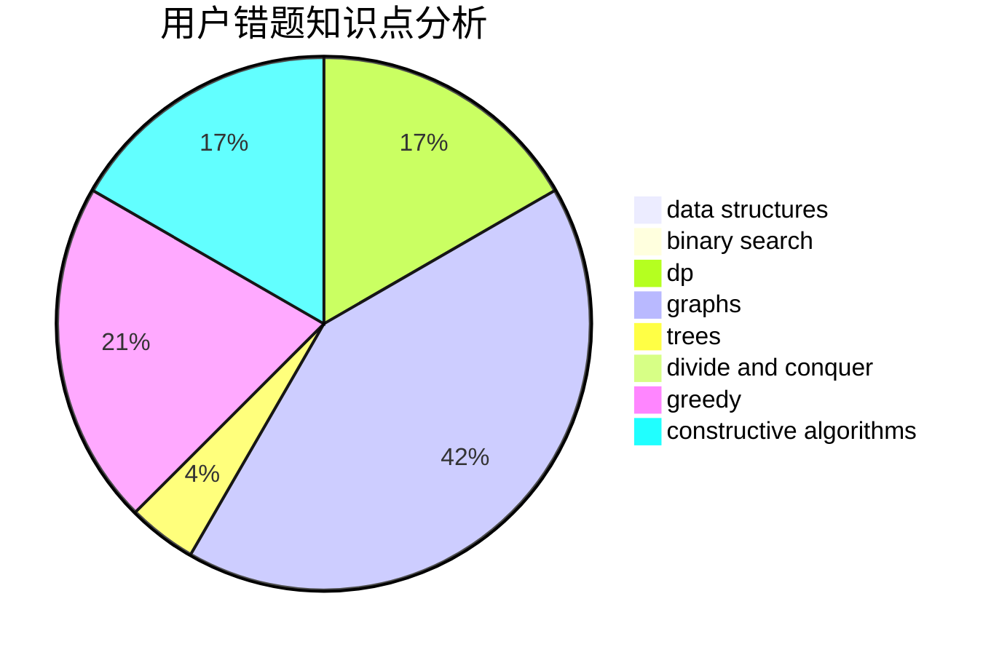

# liouzhou_101

<!-- tabs:start -->

#### **用户提交结果分析**

#### **用户做题类型偏好分析**

#### **用户错题知识点分析**

<!-- tabs:end -->
# 推荐题目
[1426F](https://codeforces.com/contest/1426/problem/F)		combinatorics,
                        dp,
                        strings		  
[993E](https://codeforces.com/contest/993/problem/E)		chinese remainder theorem,
                        fft,
                        math		  
[1384A](https://codeforces.com/contest/1384/problem/A)		constructive algorithms,
                        greedy,
                        strings		  
[1290F](https://codeforces.com/contest/1290/problem/F)		dp		  
[738D](https://codeforces.com/contest/738/problem/D)		dsu,graphs,sortings,trees		  
[603C](https://codeforces.com/contest/603/problem/C)		games,
                        math		  
[608B](https://codeforces.com/contest/608/problem/B)		combinatorics,
                        strings		  
[1044B](https://codeforces.com/contest/1044/problem/B)		dfs and similar,
                        interactive,
                        trees		  
[975E](https://codeforces.com/contest/975/problem/E)		geometry		  
[871E](https://codeforces.com/contest/871/problem/E)		graphs,
                        greedy,
                        trees		  
