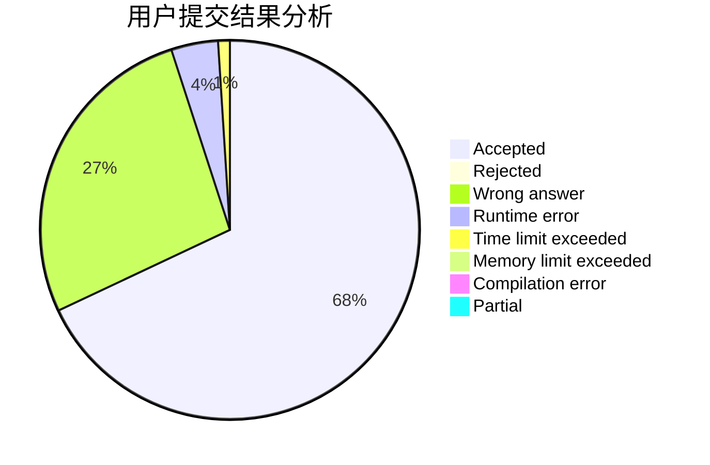
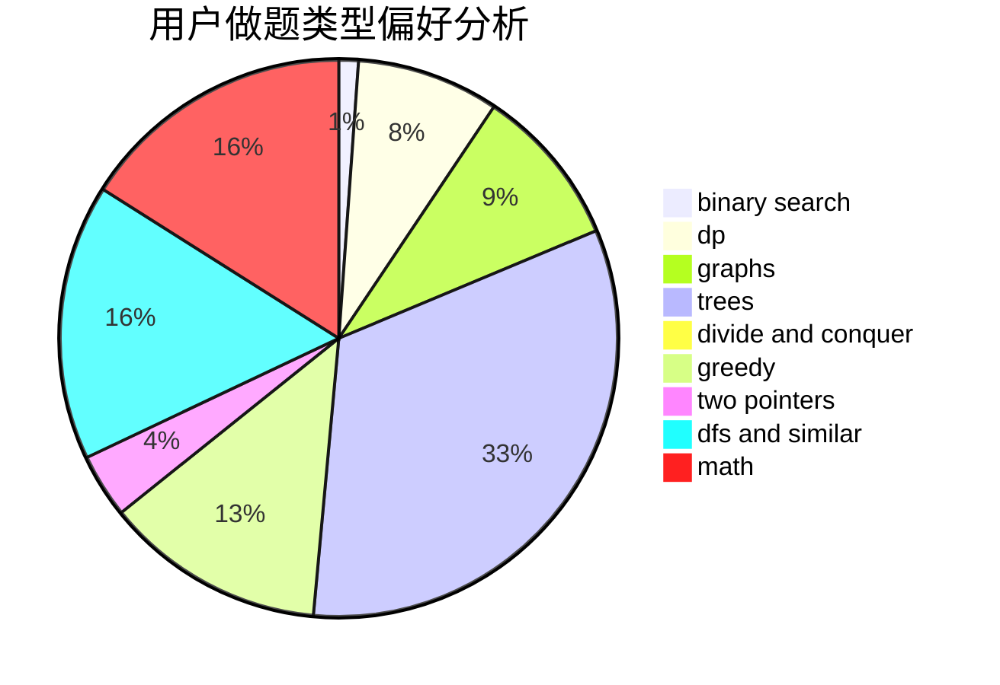

# lipeiyuan

<!-- tabs:start -->

#### **用户提交结果分析**

#### **用户做题类型偏好分析**

<!-- tabs:end -->
# 推荐题目
[3912](https://codeforces.com/contest/391/problem/2)
[1297A](https://codeforces.com/contest/1297/problem/A)
[11851](https://codeforces.com/contest/1185/problem/1)
[903B](https://codeforces.com/contest/903/problem/B)
[1111A](https://codeforces.com/contest/1111/problem/A)
[380B](https://codeforces.com/contest/380/problem/B)
[1109A](https://codeforces.com/contest/1109/problem/A)
[260A](https://codeforces.com/contest/260/problem/A)
[740A](https://codeforces.com/contest/740/problem/A)
[318B](https://codeforces.com/contest/318/problem/B)
