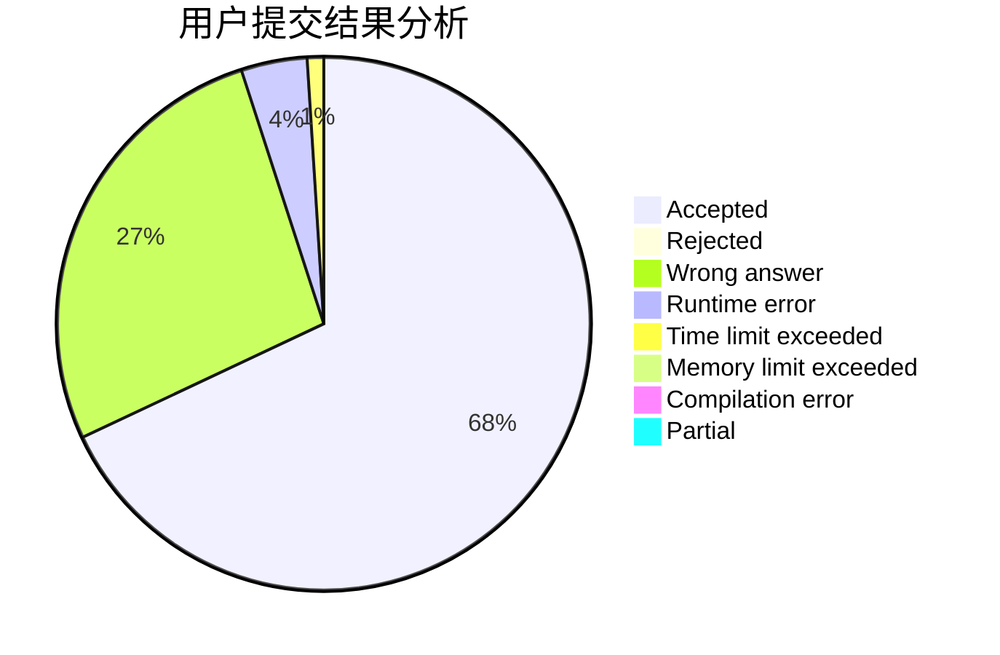
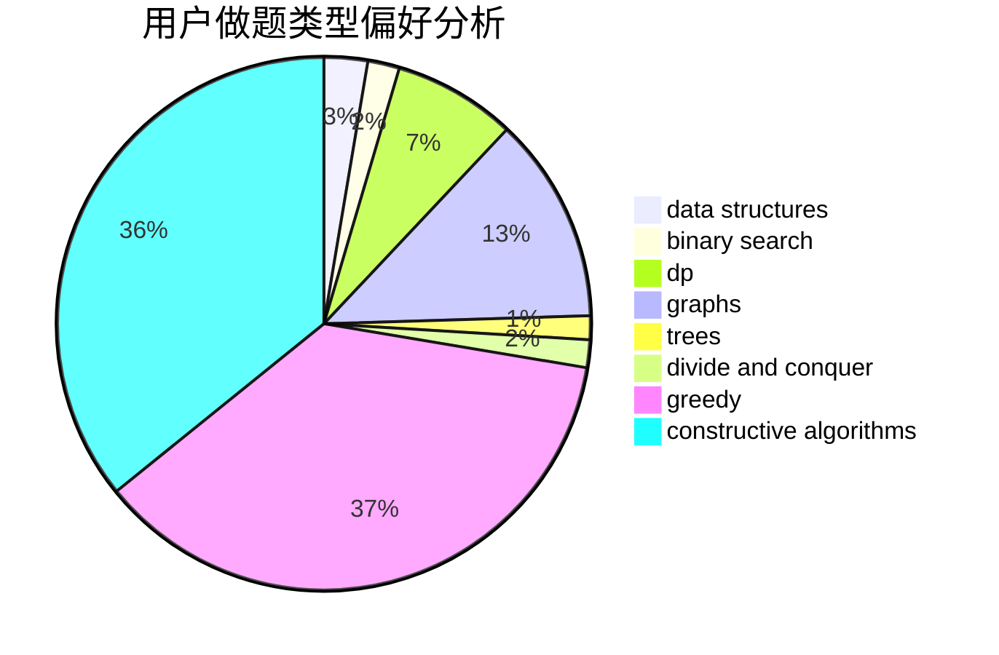
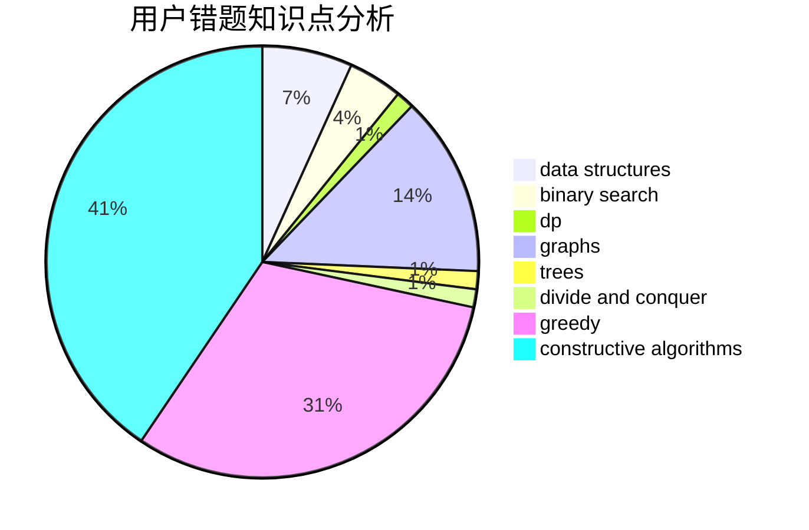

# lipeiyuan

<!-- tabs:start -->

#### **用户提交结果分析**

#### **用户做题类型偏好分析**

#### **用户错题知识点分析**

<!-- tabs:end -->
# 推荐题目
[364C](https://codeforces.com/contest/364/problem/C)		brute force,
                        number theory		  
[1290D](https://codeforces.com/contest/1290/problem/D)		constructive algorithms,
                        graphs,
                        interactive		  
[1182C](https://codeforces.com/contest/1182/problem/C)		data structures,
                        greedy,
                        strings		  
[884F](https://codeforces.com/contest/884/problem/F)		flows,
                        graphs,
                        greedy		  
[1110F](https://codeforces.com/contest/1110/problem/F)		data structures,
                        trees		  
[354C](https://codeforces.com/contest/354/problem/C)		brute force,
                        dp,
                        number theory		  
[1108E1](https://codeforces.com/contest/1108E/problem/1)		brute force,
                        greedy,
                        implementation		  
[238D](https://codeforces.com/contest/238/problem/D)		data structures,
                        implementation		  
[723B](https://codeforces.com/contest/723/problem/B)		expression parsing,
                        implementation,
                        strings		  
[2C](https://codeforces.com/contest/2/problem/C)		geometry		  
