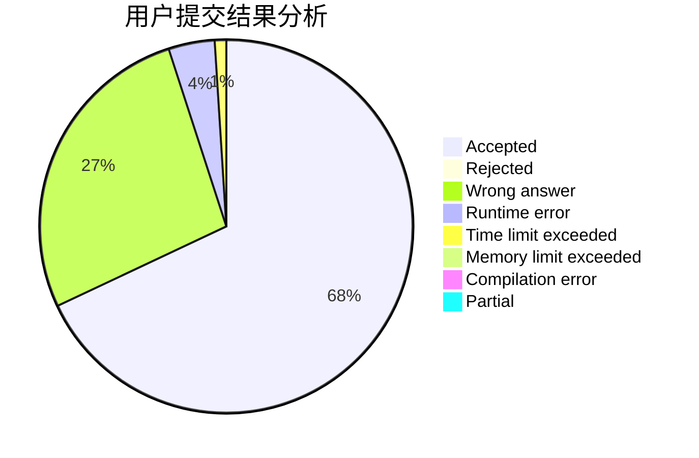
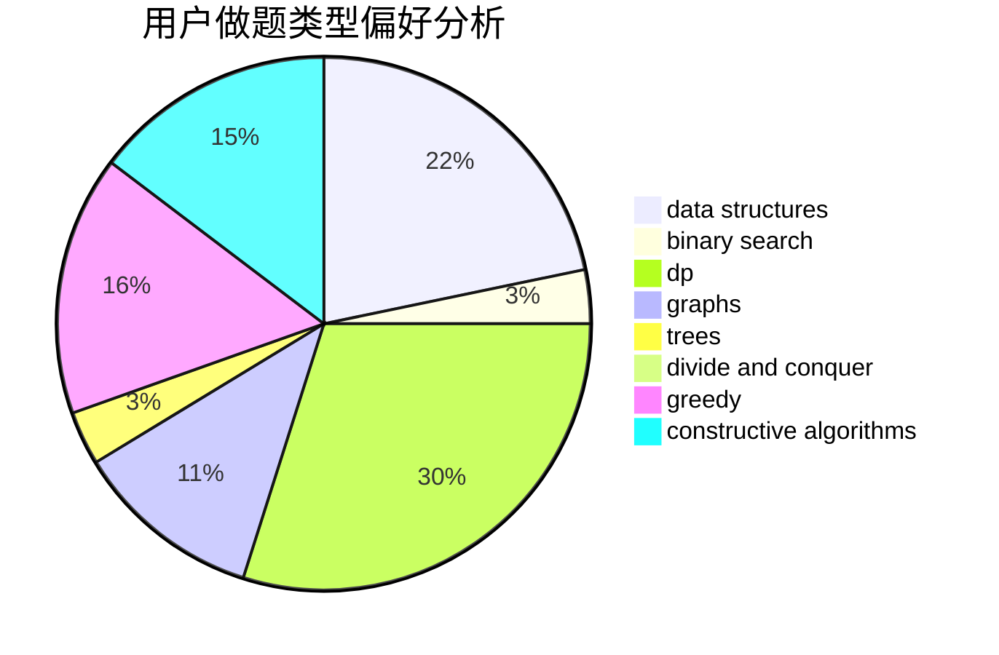
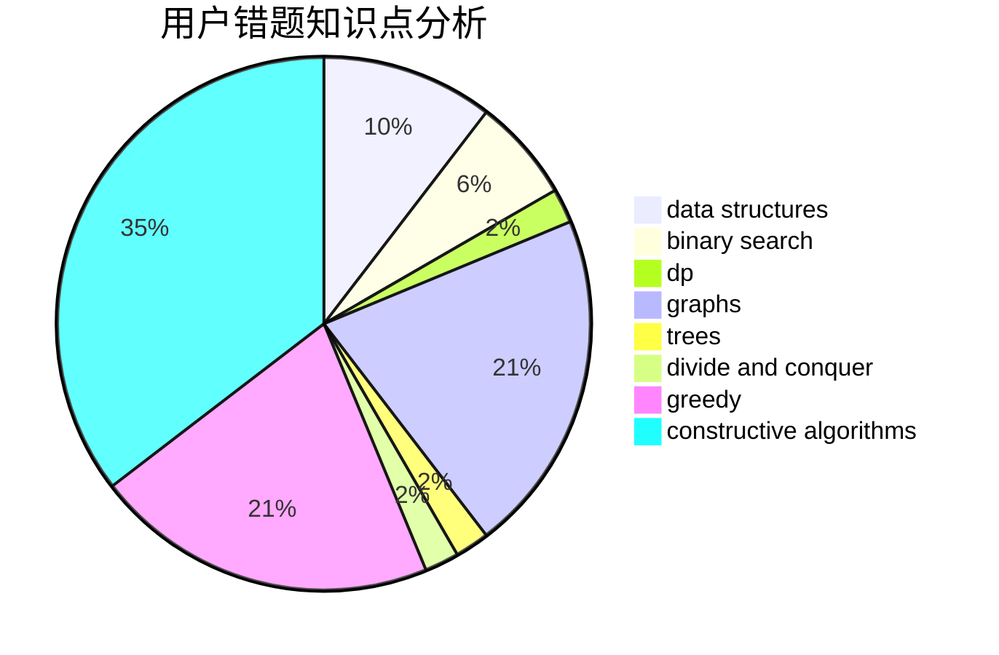

# lipeiyuan

<!-- tabs:start -->

#### **用户提交结果分析**

#### **用户做题类型偏好分析**

#### **用户错题知识点分析**

<!-- tabs:end -->
# 推荐题目
[3912](https://codeforces.com/contest/391/problem/2)		dsu,graphs,sortings,trees		  
[1297A](https://codeforces.com/contest/1297/problem/A)		*special problem,
                        implementation		  
[11851](https://codeforces.com/contest/1185/problem/1)		dsu,graphs,sortings,trees		  
[903B](https://codeforces.com/contest/903/problem/B)		greedy,
                        implementation		  
[1111A](https://codeforces.com/contest/1111/problem/A)		implementation,
                        strings		  
[380B](https://codeforces.com/contest/380/problem/B)		graphs,
                        implementation		  
[1109A](https://codeforces.com/contest/1109/problem/A)		dp,
                        implementation		  
[260A](https://codeforces.com/contest/260/problem/A)		implementation,
                        math		  
[740A](https://codeforces.com/contest/740/problem/A)		brute force,
                        implementation		  
[318B](https://codeforces.com/contest/318/problem/B)		implementation,
                        strings,
                        two pointers		  
