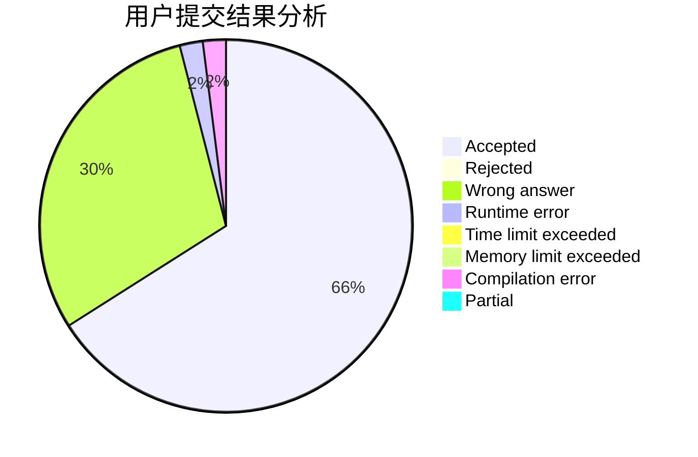
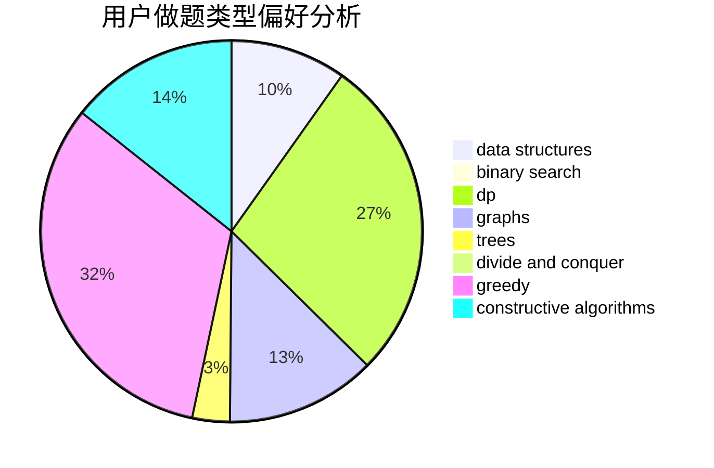
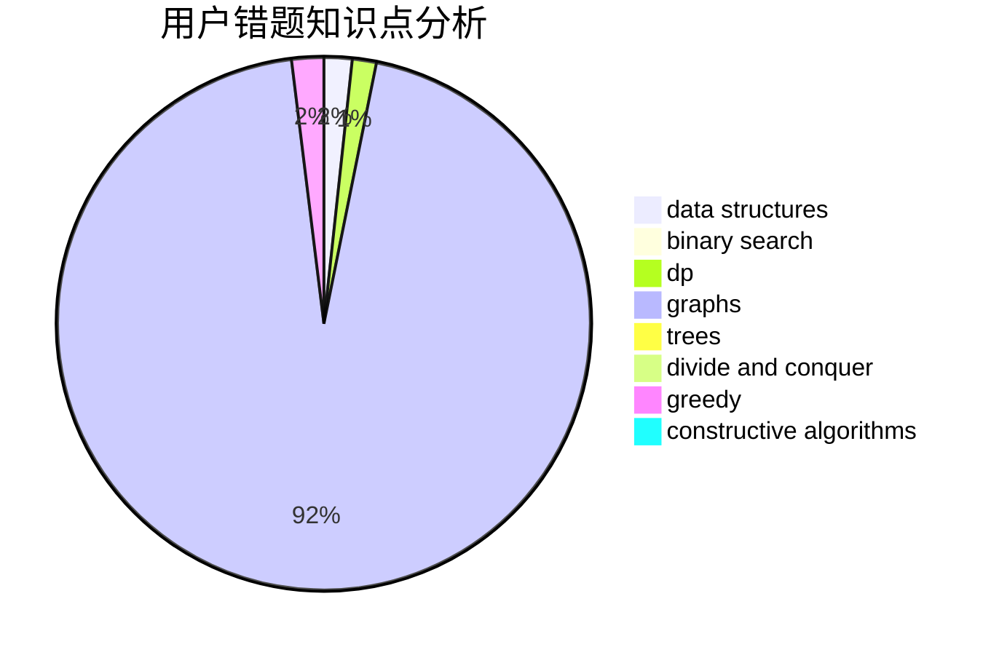

# litangxingxing

<!-- tabs:start -->

#### **用户提交结果分析**

#### **用户做题类型偏好分析**

#### **用户错题知识点分析**

<!-- tabs:end -->
# 推荐题目
[1392B](https://codeforces.com/contest/1392/problem/B)		implementation,
                        math		  
[870A](https://codeforces.com/contest/870/problem/A)		brute force,
                        implementation		  
[1214E](https://codeforces.com/contest/1214/problem/E)		constructive algorithms,
                        graphs,
                        math,
                        sortings,
                        trees		  
[1009E](https://codeforces.com/contest/1009/problem/E)		combinatorics,
                        math,
                        probabilities		  
[45G](https://codeforces.com/contest/45/problem/G)		number theory		  
[725B](https://codeforces.com/contest/725/problem/B)		implementation,
                        math		  
[1424M](https://codeforces.com/contest/1424/problem/M)		graphs,
                        sortings		  
[807C](https://codeforces.com/contest/807/problem/C)		dsu,graphs,sortings,trees		  
[284E](https://codeforces.com/contest/284/problem/E)		dsu,graphs,sortings,trees		  
[317A](https://codeforces.com/contest/317/problem/A)		brute force		  
