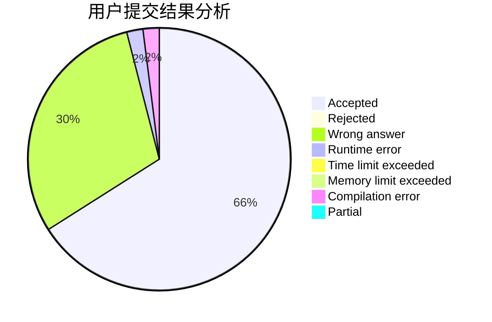
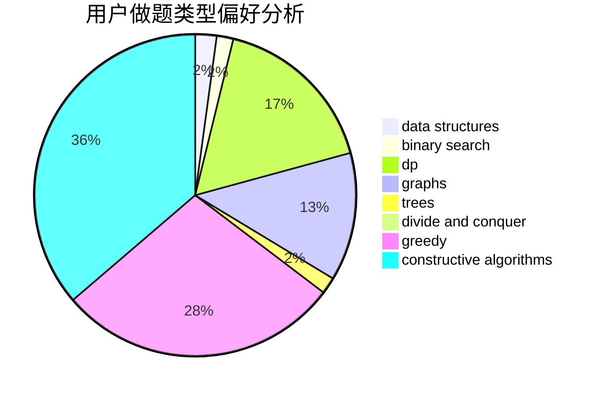
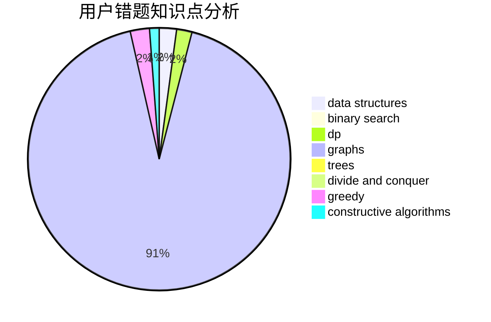

# litangxingxing

<!-- tabs:start -->

#### **用户提交结果分析**

#### **用户做题类型偏好分析**

#### **用户错题知识点分析**

<!-- tabs:end -->
# 推荐题目
[1381E](https://codeforces.com/contest/1381/problem/E)		geometry,
                        math,
                        sortings		  
[851D](https://codeforces.com/contest/851/problem/D)		dsu,graphs,sortings,trees		  
[1209A](https://codeforces.com/contest/1209/problem/A)		greedy,
                        implementation,
                        math		  
[1009B](https://codeforces.com/contest/1009/problem/B)		greedy,
                        implementation		  
[438B](https://codeforces.com/contest/438/problem/B)		dsu,graphs,sortings,trees		  
[706E](https://codeforces.com/contest/706/problem/E)		data structures,
                        implementation		  
[1417C](https://codeforces.com/contest/1417/problem/C)		dsu,graphs,sortings,trees		  
[791E](https://codeforces.com/contest/791/problem/E)		dsu,graphs,sortings,trees		  
[269B](https://codeforces.com/contest/269/problem/B)		dp		  
[29B](https://codeforces.com/contest/29/problem/B)		implementation		  
