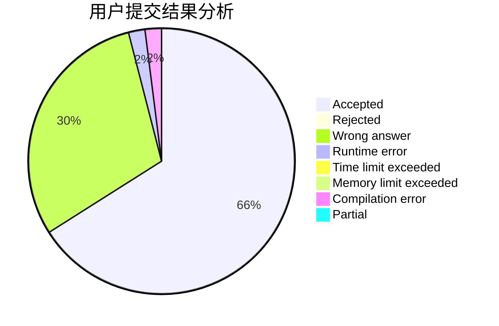
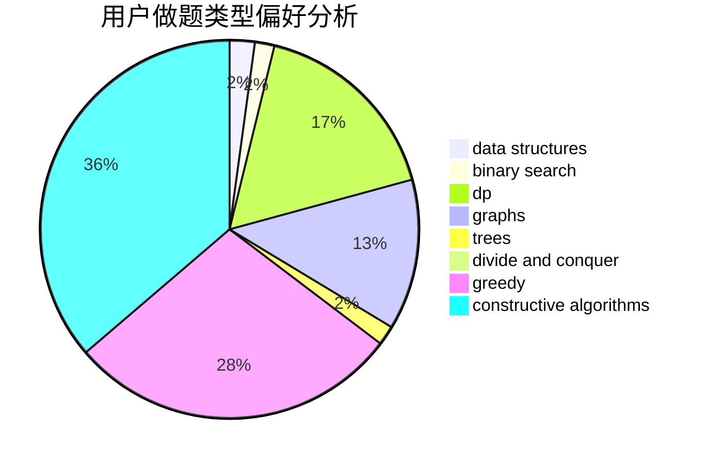
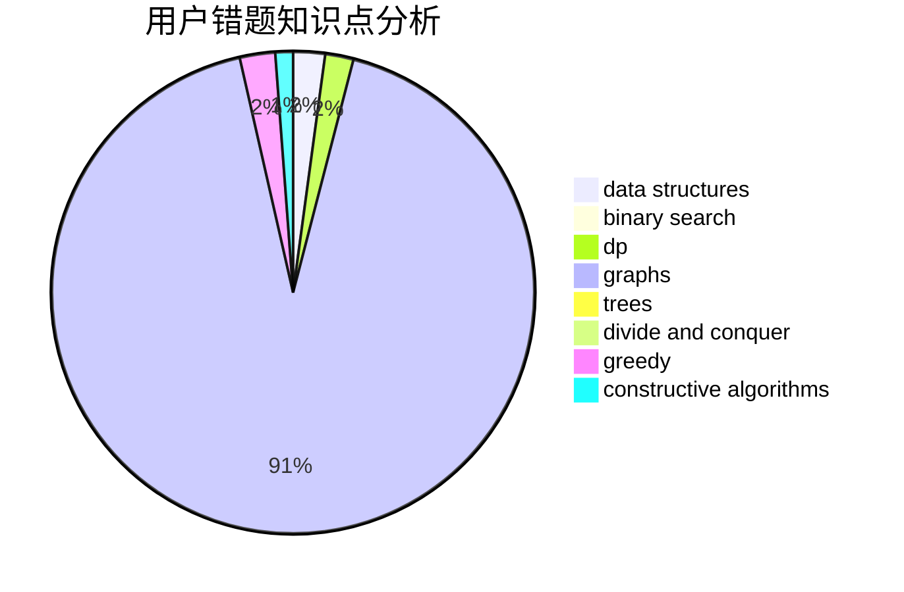

# litangxingxing
<!-- tabs:start -->
#### **用户提交结果分析**

#### **用户做题类型偏好分析**

#### **用户错题知识点分析**

<!-- tabs:end -->
# 推荐题目
[The Robot](http://codeforces.com/problemset/problem/1468/K)		brute force,
                        implementation		  
[Ithea Plays With Chtholly](http://codeforces.com/problemset/problem/896/B)		binary search,
                        constructive algorithms,
                        games,
                        greedy,
                        interactive		  
[k-Amazing Numbers](https://codeforces.com/contest/1417/problem/C)		binary search,
                        data structures,
                        implementation,
                        two pointers		  
[The Child and Zoo](https://codeforces.com/contest/438/problem/B)		dsu,
                        sortings		  
[Wojtek and Card Tricks](https://codeforces.com/contest/1229/problem/D)		math		  
[Michael and Charging Stations](http://codeforces.com/problemset/problem/853/D)		binary search,
                        dp,
                        greedy		  
[Good String](http://codeforces.com/problemset/problem/1165/C)		greedy		  
[Berland Bingo](http://codeforces.com/problemset/problem/370/B)		implementation		  
[Bear and Company](https://codeforces.com/contest/791/problem/E)		dp		  
[Reorder the Array](https://codeforces.com/contest/1008/problem/C)		combinatorics,
                        data structures,
                        math,
                        sortings,
                        two pointers		  
<!-- tabs:start -->
#### **data structures**
[The Robot](https://codeforces.com/contest/1417/problem/C)		binary search,
                        data structures,
                        implementation,
                        two pointers		  
[Ithea Plays With Chtholly](https://codeforces.com/contest/1008/problem/C)		combinatorics,
                        data structures,
                        math,
                        sortings,
                        two pointers		  
[k-Amazing Numbers](http://codeforces.com/problemset/problem/212/D)		binary search,
                        data structures,
                        dsu		  
[The Child and Zoo](http://codeforces.com/problemset/problem/379/F)		data structures,
                        divide and conquer,
                        trees		  
[Wojtek and Card Tricks](http://codeforces.com/problemset/problem/706/E)		data structures,
                        implementation		  
[Michael and Charging Stations](http://codeforces.com/problemset/problem/1490/G)		binary search,
                        data structures,
                        math		  
[Good String](http://codeforces.com/problemset/problem/568/E)		data structures,
                        dp		  
[Berland Bingo](http://codeforces.com/problemset/problem/870/F)		data structures,
                        number theory		  
[Bear and Company](http://codeforces.com/problemset/problem/1492/C)		binary search,
                        data structures,
                        dp,
                        greedy,
                        two pointers		  
[Reorder the Array](http://codeforces.com/problemset/problem/1490/G)		binary search,
                        data structures,
                        math		  
#### **binary search**
[The Robot](http://codeforces.com/problemset/problem/896/B)		binary search,
                        constructive algorithms,
                        games,
                        greedy,
                        interactive		  
[Ithea Plays With Chtholly](https://codeforces.com/contest/1417/problem/C)		binary search,
                        data structures,
                        implementation,
                        two pointers		  
[k-Amazing Numbers](http://codeforces.com/problemset/problem/853/D)		binary search,
                        dp,
                        greedy		  
[The Child and Zoo](http://codeforces.com/problemset/problem/212/D)		binary search,
                        data structures,
                        dsu		  
[Wojtek and Card Tricks](http://codeforces.com/problemset/problem/1490/G)		binary search,
                        data structures,
                        math		  
[Michael and Charging Stations](http://codeforces.com/problemset/problem/1129/E)		binary search,
                        interactive,
                        trees		  
[Good String](http://codeforces.com/problemset/problem/1492/C)		binary search,
                        data structures,
                        dp,
                        greedy,
                        two pointers		  
[Berland Bingo](http://codeforces.com/problemset/problem/1463/D)		binary search,
                        constructive algorithms,
                        greedy,
                        two pointers		  
[Bear and Company](http://codeforces.com/problemset/problem/1490/G)		binary search,
                        data structures,
                        math		  
[Reorder the Array](http://codeforces.com/problemset/problem/1479/D)		binary search,
                        bitmasks,
                        brute force,
                        data structures,
                        probabilities,
                        trees		  
#### **dp**
[The Robot](http://codeforces.com/problemset/problem/853/D)		binary search,
                        dp,
                        greedy		  
[Ithea Plays With Chtholly](https://codeforces.com/contest/791/problem/E)		dp		  
[k-Amazing Numbers](https://codeforces.com/contest/1262/problem/F1)		dp		  
[The Child and Zoo](http://codeforces.com/problemset/problem/269/B)		dp		  
[Wojtek and Card Tricks](http://codeforces.com/problemset/problem/1093/F)		dp		  
[Michael and Charging Stations](https://codeforces.com/contest/816/problem/E)		brute force,
                        dp,
                        trees		  
[Good String](http://codeforces.com/problemset/problem/568/E)		data structures,
                        dp		  
[Berland Bingo](http://codeforces.com/problemset/problem/1492/C)		binary search,
                        data structures,
                        dp,
                        greedy,
                        two pointers		  
[Bear and Company](https://codeforces.com/contest/1457/problem/C)		brute force,
                        dp,
                        implementation		  
[Reorder the Array](http://codeforces.com/problemset/problem/1491/C)		brute force,
                        data structures,
                        dp,
                        greedy,
                        implementation		  
#### **graph**
[The Robot](http://codeforces.com/problemset/problem/387/D)		graph matchings		  
[Ithea Plays With Chtholly](http://codeforces.com/problemset/problem/1495/C)		constructive algorithms,
                        graphs		  
[k-Amazing Numbers](http://codeforces.com/problemset/problem/1487/C)		brute force,
                        constructive algorithms,
                        dfs and similar,
                        graphs,
                        greedy,
                        implementation,
                        math		  
[The Child and Zoo](http://codeforces.com/problemset/problem/1437/C)		dp,
                        flows,
                        graph matchings,
                        greedy,
                        math,
                        sortings		  
[Wojtek and Card Tricks](http://codeforces.com/problemset/problem/1470/D)		constructive algorithms,
                        dfs and similar,
                        graph matchings,
                        graphs,
                        greedy		  
[Michael and Charging Stations](http://codeforces.com/problemset/problem/1476/C)		dp,
                        graphs,
                        greedy		  
[Good String](http://codeforces.com/problemset/problem/1304/D)		constructive algorithms,
                        graphs,
                        greedy,
                        two pointers		  
[Berland Bingo](http://codeforces.com/problemset/problem/1475/C)		combinatorics,
                        graphs,
                        math		  
[Bear and Company](http://codeforces.com/problemset/problem/553/E)		dp,
                        fft,
                        graphs,
                        math,
                        probabilities		  
[Reorder the Array](http://codeforces.com/problemset/problem/1495/C)		constructive algorithms,
                        graphs		  
#### **trees**
[The Robot](http://codeforces.com/problemset/problem/379/F)		data structures,
                        divide and conquer,
                        trees		  
[Ithea Plays With Chtholly](https://codeforces.com/contest/816/problem/E)		brute force,
                        dp,
                        trees		  
[k-Amazing Numbers](http://codeforces.com/problemset/problem/1129/E)		binary search,
                        interactive,
                        trees		  
[The Child and Zoo](http://codeforces.com/problemset/problem/1479/D)		binary search,
                        bitmasks,
                        brute force,
                        data structures,
                        probabilities,
                        trees		  
[Wojtek and Card Tricks](http://codeforces.com/problemset/problem/1511/C)		brute force,
                        data structures,
                        implementation,
                        trees		  
[Michael and Charging Stations](http://codeforces.com/problemset/problem/1499/F)		combinatorics,
                        dfs and similar,
                        dp,
                        trees		  
[Good String](http://codeforces.com/problemset/problem/1491/E)		brute force,
                        dfs and similar,
                        divide and conquer,
                        number theory,
                        trees		  
[Berland Bingo](http://codeforces.com/problemset/problem/1466/D)		data structures,
                        greedy,
                        sortings,
                        trees		  
[Bear and Company](http://codeforces.com/problemset/problem/1495/D)		combinatorics,
                        dfs and similar,
                        graphs,
                        math,
                        shortest paths,
                        trees		  
[Reorder the Array](http://codeforces.com/problemset/problem/1303/G)		data structures,
                        divide and conquer,
                        geometry,
                        trees		  
#### **divide and conquer**
[The Robot](http://codeforces.com/problemset/problem/379/F)		data structures,
                        divide and conquer,
                        trees		  
[Ithea Plays With Chtholly](http://codeforces.com/problemset/problem/1461/D)		binary search,
                        brute force,
                        data structures,
                        divide and conquer,
                        implementation,
                        sortings		  
[k-Amazing Numbers](http://codeforces.com/problemset/problem/1466/G)		combinatorics,
                        divide and conquer,
                        hashing,
                        math,
                        string suffix structures,
                        strings		  
[The Child and Zoo](http://codeforces.com/problemset/problem/1490/D)		dfs and similar,
                        divide and conquer,
                        implementation		  
[Wojtek and Card Tricks](https://codeforces.com/contest/1483/problem/C)		data structures,
                        divide and conquer,
                        dp		  
[Michael and Charging Stations](http://codeforces.com/problemset/problem/1491/E)		brute force,
                        dfs and similar,
                        divide and conquer,
                        number theory,
                        trees		  
[Good String](http://codeforces.com/problemset/problem/1303/G)		data structures,
                        divide and conquer,
                        geometry,
                        trees		  
[Berland Bingo](http://codeforces.com/problemset/problem/1494/D)		constructive algorithms,
                        data structures,
                        dfs and similar,
                        divide and conquer,
                        dsu,
                        greedy,
                        sortings,
                        trees		  
[Bear and Company](http://codeforces.com/problemset/problem/1482/E)		data structures,
                        divide and conquer,
                        dp		  
[Reorder the Array](http://codeforces.com/problemset/problem/566/C)		dfs and similar,
                        divide and conquer,
                        trees		  
#### **greedy**
[The Robot](http://codeforces.com/problemset/problem/896/B)		binary search,
                        constructive algorithms,
                        games,
                        greedy,
                        interactive		  
[Ithea Plays With Chtholly](http://codeforces.com/problemset/problem/853/D)		binary search,
                        dp,
                        greedy		  
[k-Amazing Numbers](http://codeforces.com/problemset/problem/1165/C)		greedy		  
[The Child and Zoo](http://codeforces.com/problemset/problem/1009/B)		greedy,
                        implementation		  
[Wojtek and Card Tricks](http://codeforces.com/problemset/problem/1415/B)		brute force,
                        brute force,
                        greedy		  
[Michael and Charging Stations](http://codeforces.com/problemset/problem/1209/A)		greedy,
                        implementation,
                        math		  
[Good String](http://codeforces.com/problemset/problem/1488/B)		*special problem,
                        greedy		  
[Berland Bingo](http://codeforces.com/problemset/problem/1492/C)		binary search,
                        data structures,
                        dp,
                        greedy,
                        two pointers		  
[Bear and Company](https://codeforces.com/contest/1496/problem/C)		geometry,
                        greedy,
                        math,
                        sortings		  
[Reorder the Array](http://codeforces.com/problemset/problem/1493/A)		constructive algorithms,
                        greedy		  
#### **constructive algorithms**
[The Robot](http://codeforces.com/problemset/problem/896/B)		binary search,
                        constructive algorithms,
                        games,
                        greedy,
                        interactive		  
[Ithea Plays With Chtholly](https://codeforces.com/contest/795/problem/D)		*special problem,
                        constructive algorithms,
                        sortings		  
[k-Amazing Numbers](http://codeforces.com/problemset/problem/1118/C)		constructive algorithms,
                        implementation		  
[The Child and Zoo](http://codeforces.com/problemset/problem/854/B)		constructive algorithms,
                        math		  
[Wojtek and Card Tricks](http://codeforces.com/problemset/problem/1495/C)		constructive algorithms,
                        graphs		  
[Michael and Charging Stations](http://codeforces.com/problemset/problem/1493/A)		constructive algorithms,
                        greedy		  
[Good String](http://codeforces.com/problemset/problem/1463/D)		binary search,
                        constructive algorithms,
                        greedy,
                        two pointers		  
[Berland Bingo](https://codeforces.com/contest/1456/problem/B)		bitmasks,
                        brute force,
                        constructive algorithms		  
[Bear and Company](http://codeforces.com/problemset/problem/1492/D)		bitmasks,
                        constructive algorithms,
                        greedy,
                        math		  
[Reorder the Array](https://codeforces.com/contest/1504/problem/D)		constructive algorithms,
                        games,
                        interactive		  
#### **sortings**
[The Robot](https://codeforces.com/contest/438/problem/B)		dsu,
                        sortings		  
[Ithea Plays With Chtholly](https://codeforces.com/contest/1008/problem/C)		combinatorics,
                        data structures,
                        math,
                        sortings,
                        two pointers		  
[k-Amazing Numbers](https://codeforces.com/contest/795/problem/D)		*special problem,
                        constructive algorithms,
                        sortings		  
[The Child and Zoo](http://codeforces.com/problemset/problem/1381/E)		geometry,
                        math,
                        sortings		  
[Wojtek and Card Tricks](http://codeforces.com/problemset/problem/141/A)		implementation,
                        sortings,
                        strings		  
[Michael and Charging Stations](https://codeforces.com/contest/1496/problem/C)		geometry,
                        greedy,
                        math,
                        sortings		  
[Good String](http://codeforces.com/problemset/problem/1495/A)		geometry,
                        greedy,
                        math,
                        sortings		  
[Berland Bingo](http://codeforces.com/problemset/problem/1497/A)		brute force,
                        data structures,
                        greedy,
                        sortings		  
[Bear and Company](http://codeforces.com/problemset/problem/1427/A)		math,
                        sortings		  
[Reorder the Array](http://codeforces.com/problemset/problem/1461/D)		binary search,
                        brute force,
                        data structures,
                        divide and conquer,
                        implementation,
                        sortings		  
<!-- tabs:end -->
